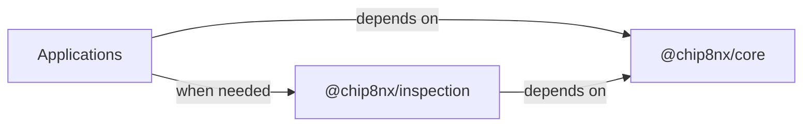
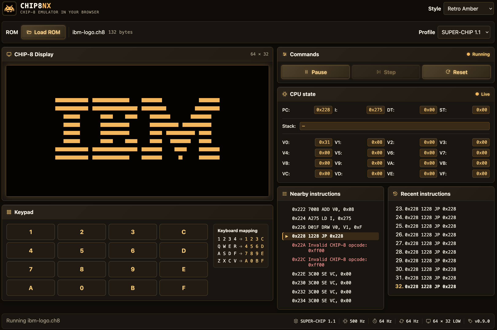

# Chip8NX

`Chip8NX = CHIP-8 + N(ext) / e(X)tensible`

A modular, profile-driven CHIP-8 emulator in TypeScript.

Chip8NX is a CHIP-8 emulator/interpreter built as a hands-on exercise in TypeScript, object-oriented design, emulator architecture, testing, and software engineering.

The project supports accurate **Classic CHIP-8** behavior and **CHIP-48 2.25** through explicit machine profiles, while keeping reusable emulator semantics separate from host-specific applications and inspection tooling.

## Status

### Current release: `v0.8.0` — CHIP-8 Profiles / Variant Foundation

`v0.8.0` extends Chip8NX from a single Classic machine target to an explicit multi-profile architecture.

`v0.8.0` provides two built-in historical profiles:

```text
Classic CHIP-8
CHIP-48 2.25
```

`Chip8Profile` describes the complete emulated machine, including architectural characteristics such as memory, display, timing, and font placement together with compatibility-sensitive instruction and display semantics.

Current modeled compatibility dimensions include:

- shift-source behavior;
- `Fx55` / `Fx65` index-register updates;
- `Bnnn` jump-offset behavior;
- `VF` handling for logic operations;
- sprite overflow behavior;
- sprite draw timing.

The Web host exposes Classic CHIP-8 and CHIP-48 2.25 through a profile selector. Changing the profile while a ROM is loaded creates a fresh machine session using the retained ROM, while Reset keeps the currently selected profile.

Compatibility is independently exercised with Gulrak's Variant Detection Test v1.4. The same ROM is run under both built-in profiles and checked against separate stable framebuffer results.

The profile model remains deliberately declarative: profiles contain machine characteristics and semantic choices, while applications remain responsible for object composition and host/runtime policy.

### Previous release: `v0.7.0` — Web Inspection Workbench

`v0.7.0` turns the browser host into Chip8NX's first interactive inspection workbench while preserving the separation between machine semantics, passive inspection tooling, and host-specific presentation.

The Web application now composes `@chip8nx/core` with `@chip8nx/inspection` to provide three complementary read-only views of the machine:

```text
CPU state
    → what the processor contains now

Nearby instructions
    → how bytes around the current program counter decode

Recent instructions
    → what CPU instruction attempts actually occurred
```

Nearby disassembly is best-effort at the Web application boundary: neighboring addresses are inspected independently, so undecodable bytes remain visible without turning passive inspection into an emulator failure.

Execution observation likewise remains passive. Successful and failed CPU attempts can be retained and presented, including the actual post-failure CPU state, while inspection itself does not decide when execution pauses or resumes.

The Web host also now provides a responsive play-and-inspection workspace with compact execution controls, explicit physical-keyboard mapping, persistent Retro Green, Retro Amber, and Dark appearance themes, and theme-aware framebuffer presentation.

The Classic CHIP-8 Core remains at the `v0.2.0` conformance baseline, with intentional coverage for the complete Classic opcode set and the project's current external conformance suite:

- IBM Logo;
- original corax89 opcode test;
- Timendus Corax+;
- Timendus Flags;
- Timendus Quirks in Classic CHIP-8 mode;
- Timendus Keypad.

`0mmm` is recognized and decoded but intentionally rejected because it transfers execution to native CDP1802 code outside the generic CHIP-8 virtual machine.

Additional Classic conformance remains useful when it provides new behavioral evidence, but it no longer blocks feature development.

## Goals

This project is intended both as an emulator and as a learning exercise.

The main goals are to:

- build a solid foundation in TypeScript;
- practice object-oriented and modular software design;
- understand the CHIP-8 architecture and instruction set;
- model CHIP-8 variants and quirks explicitly when multiple behaviors genuinely need to coexist;
- keep components independently testable and replaceable;
- use external conformance ROMs as behavioral acceptance tests;
- support multiple host applications without coupling the emulator core to a specific UI or platform.

## Architecture

Chip8NX separates reusable machine semantics, passive inspection tooling, and host-specific application concerns.



The arrows represent dependency direction.

`@chip8nx/core` owns the emulated machine: machine profiles and compatibility semantics, machine state and capabilities, initialization, CPU execution, runtime orchestration, scheduling, and the minimal CPU-observation contract.

Within Core, one instruction attempt follows the canonical path:

```text
Memory → Cpu → Decoder → Instruction → InstructionExecutor → ExecutionContext
```

`Cpu` owns fetch/decode/execute sequencing. `InstructionExecutor` applies typed instruction semantics through the focused state and capability components grouped by `ExecutionContext`, using the compatibility selected by the active machine profile.

Compatibility configuration is not stored in `ExecutionContext`: it configures components during composition rather than acting as mutable machine state or an execution capability.

`@chip8nx/inspection` builds only on Core's public API and provides passive tooling:

```text
instruction formatting
disassembly
bounded instruction-trace history
trace formatting
```

Core does not depend on Inspection.

Applications are the composition roots. They construct Core components, choose host adapters, optionally compose Inspection tools, and own platform-specific concerns such as rendering, audio presentation, keyboard adaptation, filesystem access, terminal or DOM interaction, and lifecycle integration.

This keeps the reusable responsibilities distinct:

```text
Core
    → what the machine is and what happened

Inspection
    → how machine semantics and observations can be inspected

Applications
    → how the machine is hosted and presented
```

For diagrams and more detail, see [Architecture](./docs/architecture/README.md).

## Quick start

### Requirements

- Deno 2.x

### Check the project

```bash
deno task check
```

This performs TypeScript checking, formatting validation, and linting.

### Run unit and integration tests

```bash
deno task test
```

Third-party conformance ROMs are intentionally not included in the repository, so conformance tests remain separate from the default test task.

### Run conformance tests

After installing the required external ROM fixtures as documented in [`packages/core/tests/conformance/README.md`](./packages/core/tests/conformance/README.md):

```bash
deno task test:conformance
```

### Run the CI contract locally

```bash
deno task ci
```

### Run the terminal application

```bash
deno task terminal <rom-path>
```

The terminal host presents the 64×32 Classic framebuffer using Unicode block characters with a retro green presentation and accepts the conventional CHIP-8 keyboard mapping.

To run the same emulator with line-oriented instruction tracing:

```bash
deno task terminal --trace <rom-path>
```

Trace mode keeps keyboard input and emulated execution active while disabling the Terminal's alternate-screen framebuffer presentation so trace lines can use stdout cleanly.

Press `Escape` to exit. `Ctrl+C` remains available as an alternative exit path.

### Compare terminal composition levels

The terminal application provides the first Chip8NX composition case study.

The same terminal host is available as three runnable examples:

```text
apps/terminal/examples/01-components.ts
apps/terminal/examples/02-standard-compositions.ts
apps/terminal/examples/03-standard-host.ts
```

The model has now been evaluated against the Web host and remains a terminal-specific composition model rather than a mandatory project-wide framework. See [Terminal composition levels](./docs/guides/terminal-composition-levels.md) and [Host composition evaluation](./docs/architecture/composition-evaluation.md).

### Run the Web application

Start the Vite development server:

```bash
deno task web
```

Open the URL reported by Vite in a browser, load a CHIP-8 ROM file, and the Web host will initialize and run it.

The Web host provides:

- selectable Classic CHIP-8 and CHIP-48 2.25 machine profiles;
- Canvas framebuffer presentation;
- physical and virtual CHIP-8 keyboard input;
- Start/Pause, Step, and Reset execution controls;
- Web Audio sound presentation;
- live CPU-state inspection;
- best-effort nearby disassembly around the current program counter;
- bounded recent instruction-attempt history;
- responsive desktop and narrow-screen layouts;
- persistent Retro Green, Retro Amber, and Dark appearance themes.



_Chip8NX Web Inspection Workbench running the IBM Logo ROM._

To verify the production Web build:

```bash
deno task web:build
```

### Disassemble a ROM

The disassembler CLI provides an exploratory linear view of a CHIP-8 ROM:

```bash
deno task disassemble <rom-path>
```

For example:

```bash
deno task disassemble packages/core/tests/conformance/roms/test_opcode.ch8
```

Output contains the source address, opcode word, and decoded Classic CHIP-8 instruction:

```text
0x200  124E  JP 0x24E
0x202  EAAC  UNKNOWN
0x204  AAEA  LD I, 0xAEA
```

Unsupported words are reported as `UNKNOWN` and traversal continues. The CLI performs a linear sweep and does not attempt to distinguish executable code from embedded data. A word that decodes successfully may therefore still represent sprite, table, string, or other non-executable data.

See [Disassembling CHIP-8 programs](./docs/guides/disassembling-programs.md).

### Generate API documentation

```bash
deno task docs:build
```

Generated API documentation is written to:

```text
build/docs/api/
```

The generated API reference covers the public entrypoints of both `@chip8nx/core` and `@chip8nx/inspection`.

### Check public API documentation

```bash
deno task docs:check
```

## Repository structure

```text
Chip8NX/
├── packages/
│   ├── core/
│   │   ├── mod.ts
│   │   └── src/
│   └── inspection/
│       ├── mod.ts
│       └── src/
├── apps/
│   ├── terminal/
│   ├── web/
│   └── disassembler/
├── docs/
├── build/
└── deno.json
```

### `packages/core`

`@chip8nx/core` contains the reusable CHIP-8 machine.

Its responsibilities include:

- machine profiles and initialization;
- focused machine state and capability boundaries;
- opcode decoding and typed instruction semantics;
- CPU execution;
- runtime scheduling and timing;
- timers and vertical blank;
- display-buffer state;
- keyboard, font, and random-number capability seams;
- the minimal CPU instruction-observation contract.

Core does not depend on host-specific presentation or passive Inspection tooling.

### `packages/inspection`

`@chip8nx/inspection` contains host-independent passive tools built on Core's public API.

Its current responsibilities include:

- CHIP-8 instruction formatting;
- strict disassembly;
- bounded instruction-trace history;
- human-readable trace formatting;
- CPU-state-change trace decoration.

Inspection does not control execution and does not own host-specific output.

### `apps/terminal`

The Terminal application is a host composition case study.

It uses Core for emulation and may compose Inspection formatters for optional line-oriented trace output.

Terminal-specific rendering, keyboard adaptation, CLI options, and output policy remain application-owned.

### `apps/web`

The Web application hosts the CHIP-8 machine in a browser.

It composes both reusable packages:

```text
@chip8nx/core
    machine execution
    runtime and scheduling
    authoritative CPU observation

@chip8nx/inspection
    instruction formatting
    nearby disassembly
    bounded trace history
    trace formatting
```

The application owns the browser-specific policy around those capabilities: machine-profile selection, profile-appropriate instruction formatting, Canvas rendering, audio presentation, keyboard adaptation, ROM loading, execution controls, inspection-window selection, responsive DOM presentation, appearance themes, and UI lifecycle.

Reset reinitializes the current session using its retained profile. Selecting a different profile creates a fresh session from the retained ROM image and preserves the host's previous running or paused state.

Passive inspection failures remain application-visible data rather than emulator failures. The Web inspector can therefore expose undecodable nearby bytes and failed CPU attempts without giving the Inspection package execution-control responsibility.

### `apps/disassembler`

The disassembler application is a command-line inspection tool.

It combines:

```text
Core
    Memory
    Decoder
    InvalidOpcodeError

Inspection
    Disassembler
    ClassicInstructionFormatter
```

The reusable Inspection disassembler is strict. The application adds tolerant whole-ROM exploration policy by catching invalid opcodes per instruction-sized word and continuing.

### `docs`

Long-form architecture, guides, reference material, and Architecture Decision Records.

Generated API documentation is written under:

```text
build/docs/api/
```

and is not committed to source control.

## Documentation

- [Documentation index](./docs/README.md)
- [Architecture](./docs/architecture/README.md)
- [Guides](./docs/guides/README.md)
- [Reference](./docs/reference/README.md)
- [Architecture Decision Records](./docs/decisions/README.md)

Source-level API behavior belongs close to TypeScript implementation in JSDoc. Project documentation explains how larger pieces collaborate and why major decisions were made.

## Milestone history

### `v0.0.1` — IBM Logo POC ✓

A real CHIP-8 ROM executes end-to-end and produces the expected framebuffer.

### `v0.1.0` — corax89 Opcode Conformance ✓

The original corax89 opcode test succeeds through the normal Chip8NX machine pipeline.

### `v0.2.0` — Classic CHIP-8 Baseline ✓

The Classic implementation passes the relevant Timendus Corax+, Flags, Quirks, and Keypad tests and has an explicit opcode-family coverage audit.

See [Classic CHIP-8 opcode coverage audit](./docs/reference/classic-opcode-audit.md).

### `v0.3.0` — Interactive Terminal Host ✓

The first complete Chip8NX host provides terminal framebuffer presentation, interactive keyboard input, clean terminal lifecycle management, and runnable examples demonstrating Level-1, Level-2, and Level-3 composition.

### `v0.4.0` — Interactive Web Host ✓

The second complete Chip8NX host provides browser ROM loading, Canvas framebuffer presentation, physical and virtual keyboard input, execution lifecycle controls, and Web Audio sound presentation.

The Web host also completes the second application-composition case study, validating the current Core host boundaries while keeping host-level composition application-specific.

### `v0.5.0` — Disassembly and Inspection ✓

Core gains a reusable read-only instruction-inspection path built on the existing typed decoder, together with a pluggable instruction-formatting boundary and a conventional Classic CHIP-8 formatter.

The release also adds a small command-line disassembler for exploratory whole-ROM inspection. Unsupported words are rendered as `UNKNOWN` without changing the strict Core range-disassembly contract. The implementation and application are documented through dedicated architecture and usage guides and validated against real CHIP-8 ROMs containing mixed code and data.

### `v0.6.0` — Tracing and Execution Observation ✓

Core gains optional structured observation of real CPU instruction attempts, including successful and failed attempts, before/after CPU state, observer-failure isolation, and preservation of the original execution error.

Trace formatting remains separate from observation, with conventional Classic trace formatting and composable CPU-state-change decoration. `InstructionTraceBuffer` adds bounded chronological history suitable for future inspection consumers.

The Terminal `--trace` mode provides the first external proof of concept while keeping output and host presentation outside Core.

Together with the `v0.5.0` disassembly boundary, this milestone establishes the reusable inspection foundation for future debugger and analysis tooling without prematurely adding breakpoints, execution control, event infrastructure, replay, or whole-machine tracing.

### `v0.7.0` — Web Inspection Workbench ✓

The Web host becomes Chip8NX's first interactive inspection workbench.

It composes the Core CPU-observation boundary with the extracted `@chip8nx/inspection` package to provide live CPU state, bounded best-effort disassembly around the current program counter, and recent successful or failed CPU instruction attempts.

The release also evolves the browser host into a responsive play-and-inspection workspace with unified Start/Pause control, compact ROM loading, explicit keyboard mapping, machine-state presentation, theme-aware command controls, and persistent Retro Green, Retro Amber, and Dark themes whose palettes also drive Canvas framebuffer presentation.

Inspection remains deliberately read-only: breakpoints, watchpoints, pause conditions, step-over/step-out behavior, memory editing, and other debugger execution-control semantics remain deferred until concrete reusable requirements emerge.

### `v0.8.0` — CHIP-8 Profiles / Variant Foundation ✓

Chip8NX evolves from a single Classic CHIP-8 target into a demonstrated multi-profile emulator architecture with built-in `CLASSIC_CHIP8_PROFILE` and `CHIP48_PROFILE` machine definitions.

`Chip8Profile` now describes the complete emulated machine, combining architectural characteristics with explicit compatibility-sensitive semantics for shift source, `Fx55` / `Fx65` index-register updates, `Bnnn` jump offsets, logic-operation `VF` behavior, sprite overflow, and sprite draw timing. CHIP-48 2.25 additionally demonstrates profile-specific font data and machine timing.

The Web host provides interactive Classic CHIP-8 / CHIP-48 2.25 profile selection, profile-appropriate instruction formatting, profile-preserving Reset behavior, and fresh machine-session composition when the selected historical target changes.

Compatibility is independently validated with Gulrak's Variant Detection Test v1.4, executing the same external ROM under both profiles and comparing each against its own stable framebuffer result.

The milestone establishes the variant foundation without introducing a generic quirk engine, strategy hierarchy, profile registry, or universal machine-session abstraction: new variation continues to be modeled only when concrete historical targets demonstrate the need.

## Future work

Post-`v0.8.0` development can proceed across areas such as:

- active debugger behavior built on the completed read-only Web inspection workbench, when concrete needs such as breakpoints, watchpoints, or richer stepping semantics are demonstrated;
- additional CHIP-8-family profiles when concrete targets demonstrate new architectural or compatibility requirements;
- richer memory or static-analysis inspection when concrete application workflows justify it;
- public reusable-package APIs and composition ergonomics when additional architectural evidence creates concrete pressure for change;
- desktop hosts;

The current CPU-observation boundary deliberately remains observational. Breakpoints, execution-control policy, observer fan-out, timestamps, replay, whole-machine snapshots, persistent trace formats, and richer history-query APIs should be introduced only when concrete debugger or analysis consumers demonstrate the need.

The current disassembler likewise remains a small inspection foundation rather than a full static-analysis system. Features such as control-flow analysis, code/data classification, labels, descriptions, and richer tolerant-disassembly models should be introduced only when concrete consumers justify them.

## References

The project is developed with reference to:

- CHIP-8 Variant Database / CHIP-8-KB — Classic CHIP-8;
- Matthew Mikolay's CHIP-8 technical reference;
- Tobias V. Langhoff's CHIP-8 emulator guide;
- corax89 CHIP-8 test ROM;
- Timendus CHIP-8 test suite.
- Gulrak / Cadmium Variant Detection Test.

Historical behavior is resolved against evidence appropriate to the selected machine profile rather than assuming one compatibility interpretation for every CHIP-8-family target.

## Versioning

The project follows Semantic Versioning.

During `0.x`:

- PATCH releases contain fixes, refactors, documentation improvements, and other changes that do not represent a new emulator capability milestone;
- MINOR releases represent meaningful capability or conformance milestones and may include breaking API changes;
- `1.0.0` will mark the first stable Classic CHIP-8 public API and agreed conformance contract.

See [CHANGELOG.md](./CHANGELOG.md) for release history.

## License

Chip8NX source code is licensed under the [MIT License](./LICENSE).

Third-party conformance ROMs and other external materials remain subject to their respective upstream licenses and are not covered by the Chip8NX MIT license. See [`THIRD_PARTY_NOTICES.md`](./THIRD_PARTY_NOTICES.md).
