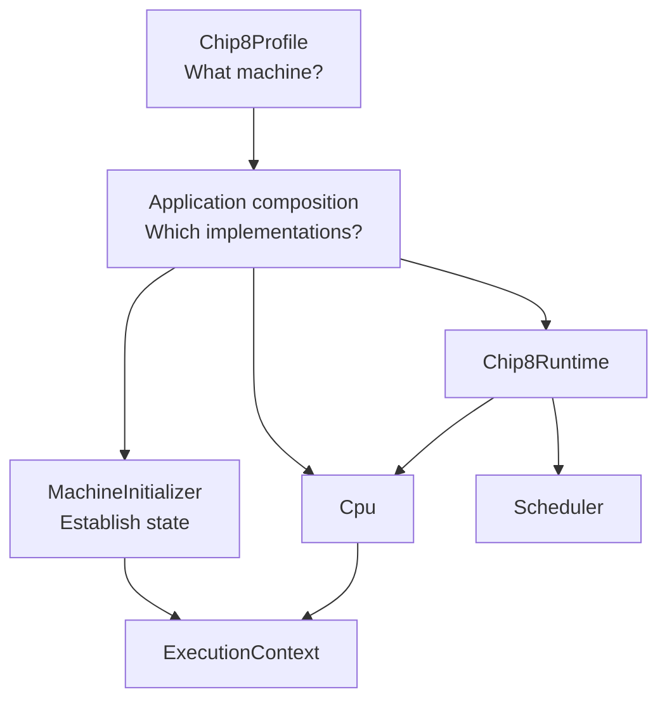

# Chip8NX

`Chip8NX = CHIP-8 + N(ext) / e(X)tensible`

A modular, profile-driven CHIP-8 emulator in TypeScript.

Chip8NX is a CHIP-8 emulator/interpreter built as a hands-on exercise in TypeScript, object-oriented design, emulator architecture, testing, and software engineering.

The project focuses first on accurate **Classic CHIP-8** behavior while keeping the architecture open to additional CHIP-8-family profiles and multiple host applications.

## Status

### Current release: `v0.5.0` — Disassembly and Inspection

`v0.5.0` adds the first reusable instruction-inspection capability to Chip8NX Core.

The new disassembly subsystem reads CHIP-8 instruction words from memory, reuses the existing typed `Decoder`, and delegates human-readable presentation through the pluggable `InstructionFormatter` boundary. Core includes a conventional `ClassicInstructionFormatter` and exposes both single-instruction inspection and strict known-range disassembly.

A small command-line application under `apps/disassembler` provides exploratory whole-ROM inspection. It performs a linear sweep of ROM words, prints supported Classic CHIP-8 instructions, reports unsupported words as `UNKNOWN`, and continues without claiming to distinguish executable code from embedded data.

The implementation establishes a reusable inspection boundary for later debugger, tracer, and analysis work without coupling those concerns to CPU execution or host presentation.

See [Disassembly architecture](./docs/architecture/disassembly.md) and [Disassembling CHIP-8 programs](./docs/guides/disassembling-programs.md).

The Classic CHIP-8 Core remains at the `v0.2.0` conformance baseline, with intentional coverage for the complete Classic opcode set and the project's current external conformance suite:

- IBM Logo;
- original corax89 opcode test;
- Timendus Corax+;
- Timendus Flags;
- Timendus Quirks in Classic CHIP-8 mode;
- Timendus Keypad.

`0mmm` is recognized and decoded but intentionally rejected because it transfers execution to native CDP1802 code outside the generic CHIP-8 virtual machine.

Additional Classic conformance remains useful when it provides new behavioral evidence, but it no longer blocks feature development.

## Goals

This project is intended both as an emulator and as a learning exercise.

The main goals are to:

- build a solid foundation in TypeScript;
- practice object-oriented and modular software design;
- understand the CHIP-8 architecture and instruction set;
- model CHIP-8 variants and quirks explicitly when multiple behaviors genuinely need to coexist;
- keep components independently testable and replaceable;
- use external conformance ROMs as behavioral acceptance tests;
- support multiple host applications without coupling the emulator core to a specific UI or platform.

## Architecture

Chip8NX separates machine definition, application composition, initialization, execution, and runtime orchestration.



A `Chip8Profile` describes the emulated machine, including memory layout, display geometry, display refresh frequency, timer frequency, and font placement.

The application selects concrete implementations and host adapters.

`MachineInitializer` validates and establishes machine state, reinstalls profile system data, resets transient state such as vertical-blank availability, and loads a program.

`Cpu` owns the fetch/decode/execute cycle.

`Chip8Runtime` coordinates CPU execution, CHIP-8 timer countdown, and emulated display-frame boundaries.

Host rendering remains outside Core. A terminal, browser, or desktop host observes `DisplayBuffer` without defining CHIP-8 display timing.

Core also exposes a read-only disassembly path for instruction inspection. `Disassembler` reuses the same typed `Decoder` used by CPU execution, while `InstructionFormatter` keeps human-readable presentation replaceable. Inspection remains independent of execution state and host presentation.

For diagrams and more detail, see [Architecture](./docs/architecture/README.md).

## Quick start

### Requirements

- Deno 2.x

### Check the project

```bash
deno task check
```

This performs TypeScript checking, formatting validation, and linting.

### Run unit and integration tests

```bash
deno task test
```

Third-party conformance ROMs are intentionally not included in the repository, so conformance tests remain separate from the default test task.

### Run conformance tests

After installing the required external ROM fixtures as documented in [`packages/core/tests/conformance/README.md`](./packages/core/tests/conformance/README.md):

```bash
deno task test:conformance
```

### Run the CI contract locally

```bash
deno task ci
```

### Run the terminal application

```bash
deno task terminal <rom-path>
```

The terminal host presents the 64×32 Classic framebuffer using Unicode block characters with a retro green presentation and accepts the conventional CHIP-8 keyboard mapping.

Press `Escape` to exit. `Ctrl+C` remains available as an alternative exit path.

### Compare terminal composition levels

The terminal application provides the first Chip8NX composition case study.

The same terminal host is available as three runnable examples:

```text
apps/terminal/examples/01-components.ts
apps/terminal/examples/02-standard-compositions.ts
apps/terminal/examples/03-standard-host.ts
```

The model has now been evaluated against the Web host and remains a terminal-specific composition model rather than a mandatory project-wide framework.

See [Terminal composition levels](./docs/guides/terminal-composition-levels.md) and [Host composition evaluation](./docs/architecture/composition-evaluation.md).

### Run the Web application

Start the Vite development server:

```bash
deno task web
```

Open the URL reported by Vite in a browser, select a CHIP-8 ROM file, and the Web host will load and run it.

The Web host provides Canvas framebuffer rendering, physical and virtual keyboard input, execution controls, and Web Audio sound presentation.

To verify the production Web build:

```bash
deno task web:build
```

### Disassemble a ROM

The disassembler CLI provides an exploratory linear view of a CHIP-8 ROM:

```bash
deno task disassemble <rom-path>
```

For example:

```bash
deno task disassemble packages/core/tests/conformance/roms/test_opcode.ch8
```

Output contains the source address, opcode word, and decoded Classic CHIP-8 instruction:

```text
0x200  124E  JP 0x24E
0x202  EAAC  UNKNOWN
0x204  AAEA  LD I, 0xAEA
```

Unsupported words are reported as `UNKNOWN` and traversal continues.

The CLI performs a linear sweep and does not attempt to distinguish executable code from embedded data. A word that decodes successfully may therefore still represent sprite, table, string, or other non-executable data.

See [Disassembling CHIP-8 programs](./docs/guides/disassembling-programs.md).

### Generate API documentation

```bash
deno task docs:build
```

Generated API documentation is written to:

```text
build/docs/api/
```

### Check public API documentation

```bash
deno task docs:check
```

## Repository structure

```text
.
├── packages/
│   └── core/
│       ├── mod.ts
│       ├── src/
│       └── tests/
│
├── apps/
│   ├── disassembler/
│   ├── terminal/
│   └── web/
├── docs/
├── CHANGELOG.md
├── LICENSE
├── README.md
├── THIRD_PARTY_NOTICES.md
└── deno.json
```

### `packages/core`

The reusable **Chip8NX Core** package (`@chip8nx/core`).

It contains machine components, profiles, CPU execution, initialization, runtime orchestration, scheduling, disassembly and instruction-inspection capabilities, and Core tests.

Its intended public API is exposed through:

```text
packages/core/mod.ts
```

### `apps/disassembler`

A small command-line consumer of the Core disassembly API.

It reads a CHIP-8 ROM, performs an exploratory two-byte linear sweep, prints supported Classic CHIP-8 instructions, reports unsupported words as `UNKNOWN`, and continues through the remainder of the file.

The application deliberately owns filesystem access, command-line arguments, output formatting, and tolerant traversal policy rather than pushing those concerns into Core.

### `apps/terminal`

The first concrete Chip8NX host application.

It adapts the reusable Core to terminal-specific presentation and input while keeping terminal concerns out of the emulator package.

The terminal application also serves as the completed first case study for three composition depths:

1. individual components;
2. standard subsystem compositions;
3. a ready-to-use standard terminal host.

The three levels use the same underlying components and demonstrate how convenience can reduce assembly burden without removing the manual, fully customizable path.

### `apps/web`

The second concrete Chip8NX host application.

It adapts the same reusable Core to browser-specific presentation, input, audio, and application lifecycle concerns.

The current Web host includes Canvas rendering, physical and virtual keyboard input, execution controls, ROM loading, and Web Audio sound presentation.

It also serves as the second composition case study used to evaluate which architectural patterns belong in Core and which should remain host-specific.

### `docs`

Long-form architecture, guides, reference material, and Architecture Decision Records.

## Documentation

- [Documentation index](./docs/README.md)
- [Architecture](./docs/architecture/README.md)
- [Guides](./docs/guides/README.md)
- [Reference](./docs/reference/README.md)
- [Architecture Decision Records](./docs/decisions/README.md)

Source-level API behavior belongs close to TypeScript implementation in JSDoc. Project documentation explains how larger pieces collaborate and why major decisions were made.

## Classic conformance baseline

### `v0.0.1` — IBM Logo POC ✓

A real CHIP-8 ROM executes end-to-end and produces the expected framebuffer.

### `v0.1.0` — corax89 Opcode Conformance ✓

The original corax89 opcode test succeeds through the normal Chip8NX machine pipeline.

### `v0.2.0` — Classic CHIP-8 Baseline ✓

The Classic implementation passes the relevant Timendus Corax+, Flags, Quirks, and Keypad tests and has an explicit opcode-family coverage audit.

See [Classic CHIP-8 opcode coverage audit](./docs/reference/classic-opcode-audit.md).

### `v0.3.0` — Interactive Terminal Host ✓

The first complete Chip8NX host provides terminal framebuffer presentation, interactive keyboard input, clean terminal lifecycle management, and runnable examples demonstrating Level-1, Level-2, and Level-3 composition.

### `v0.4.0` — Interactive Web Host ✓

The second complete Chip8NX host provides browser ROM loading, Canvas framebuffer presentation, physical and virtual keyboard input, execution lifecycle controls, and Web Audio sound presentation.

The Web host also completes the second application-composition case study, validating the current Core host boundaries while keeping host-level composition application-specific.

### `v0.5.0` — Disassembly and Inspection ✓

Core gains a reusable read-only instruction-inspection path built on the existing typed decoder, together with a pluggable instruction-formatting boundary and a conventional Classic CHIP-8 formatter.

The release also adds a small command-line disassembler for exploratory whole-ROM inspection. Unsupported words are rendered as `UNKNOWN` without changing the strict Core range-disassembly contract.

The implementation and application are documented through dedicated architecture and usage guides and validated against real CHIP-8 ROMs containing mixed code and data.

## Future work

Post-`v0.5.0` development can proceed across areas such as:

- richer debugger, tracer, and inspection tooling built on the completed disassembly boundary;
- Web-host refinement where interactive debugging or other new use cases justify it;
- public Core API and composition ergonomics when additional architectural evidence creates concrete pressure for change;
- desktop hosts;
- additional CHIP-8-family profiles when the project is ready to model variant differences explicitly.

The current disassembler intentionally remains a small foundation rather than a full static-analysis system. Features such as control-flow analysis, code/data classification, labels, descriptions, and richer tolerant-disassembly models should be introduced only when concrete consumers justify them.

## References

The project is developed with reference to:

- CHIP-8 Variant Database / CHIP-8-KB — Classic CHIP-8;
- Matthew Mikolay's CHIP-8 technical reference;
- Tobias V. Langhoff's CHIP-8 emulator guide;
- corax89 CHIP-8 test ROM;
- Timendus CHIP-8 test suite.

When references disagree, Classic CHIP-8 behavior is currently resolved primarily against the Classic CHIP-8 variant documentation.

## Versioning

The project follows Semantic Versioning.

During `0.x`:

- PATCH releases contain fixes, refactors, documentation improvements, and other changes that do not represent a new emulator capability milestone;
- MINOR releases represent meaningful capability or conformance milestones and may include breaking API changes;
- `1.0.0` will mark the first stable Classic CHIP-8 public API and agreed conformance contract.

See [CHANGELOG.md](./CHANGELOG.md) for release history.

## License

Chip8NX source code is licensed under the [MIT License](./LICENSE).

Third-party conformance ROMs and other external materials remain subject to their respective upstream licenses and are not covered by the Chip8NX MIT license. See [`THIRD_PARTY_NOTICES.md`](./THIRD_PARTY_NOTICES.md).
