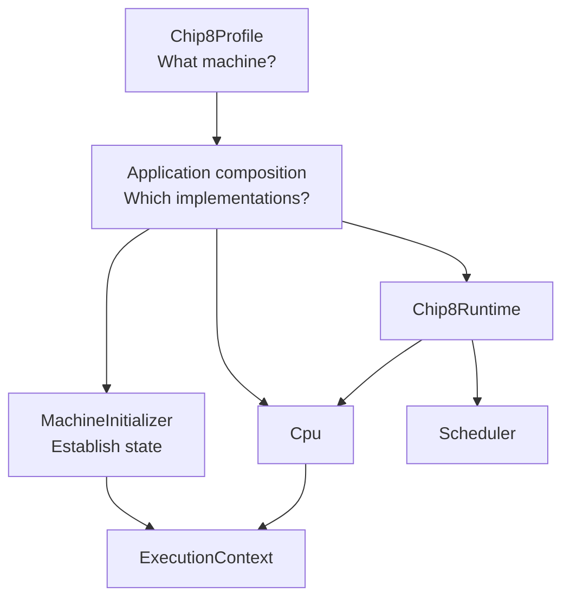

# Chip8NX

`Chip8NX = CHIP-8 + N(ext) / e(X)tensible`

A modular, profile-driven CHIP-8 emulator in TypeScript.

Chip8NX is a CHIP-8 emulator/interpreter built as a hands-on exercise in TypeScript, object-oriented design, emulator architecture, testing, and software engineering.

The project focuses first on accurate **Classic CHIP-8** behavior while keeping the architecture open to additional CHIP-8-family profiles and multiple host applications.

## Status

**Current release: `v0.3.0` — Interactive Terminal Host**

`v0.3.0` adds the first complete Chip8NX host application: an interactive terminal frontend with framebuffer presentation, keyboard input, clean terminal lifecycle management, and three documented composition levels.

The terminal application also completes the first case study for layered composition. That design will be tested again with a substantially different host before it is considered for broader use in the reusable Core.

The Classic CHIP-8 Core remains at the `v0.2.0` conformance baseline, with intentional coverage for the complete Classic opcode set and the project's current external conformance suite:

- IBM Logo;
- original corax89 opcode test;
- Timendus Corax+;
- Timendus Flags;
- Timendus Quirks in Classic CHIP-8 mode;
- Timendus Keypad.

`0mmm` is recognized and decoded but intentionally rejected because it transfers execution to native CDP1802 code outside the generic CHIP-8 virtual machine.

Current development is moving toward a web host while preserving the terminal application as the completed first-host reference implementation.

**`v0.2.0` — Classic CHIP-8 Baseline**

The Classic core now has intentional coverage for the complete Classic opcode set and passes the project's current external conformance baseline:

- IBM Logo;
- Original corax89 opcode test;
- Timendus Corax+;
- Timendus Flags;
- Timendus Quirks in Classic CHIP-8 mode;
- Timendus Keypad.

`0mmm` is recognized and decoded but intentionally rejected because it transfers execution to native CDP1802 code outside the generic CHIP-8 virtual machine.

Additional Classic conformance remains useful when it provides new behavioral evidence, but it no longer blocks feature development.

Current post-`v0.2.0` development is focused on the first real host application: an interactive terminal frontend with rendering, keyboard input, and a layered-composition case study.

## Goals

This project is intended both as an emulator and as a learning exercise.

The main goals are to:

- build a solid foundation in TypeScript;
- practice object-oriented and modular software design;
- understand the CHIP-8 architecture and instruction set;
- model CHIP-8 variants and quirks explicitly when multiple behaviors genuinely need to coexist;
- keep components independently testable and replaceable;
- use external conformance ROMs as behavioral acceptance tests;
- support multiple host applications without coupling the emulator core to a specific UI or platform.

## Architecture

Chip8NX separates machine definition, application composition, initialization, execution, and runtime orchestration.



A `Chip8Profile` describes the emulated machine, including memory layout, display geometry, display refresh frequency, timer frequency, and font placement.

The application selects concrete implementations and host adapters.

`MachineInitializer` validates and establishes machine state, reinstalls profile system data, resets transient state such as vertical-blank availability, and loads a program.

`Cpu` owns the fetch/decode/execute cycle.

`Chip8Runtime` coordinates CPU execution, CHIP-8 timer countdown, and emulated display-frame boundaries.

Host rendering remains outside Core. A terminal, browser, or desktop host observes `DisplayBuffer` without defining CHIP-8 display timing.

For diagrams and more detail, see [Architecture](./docs/architecture/README.md).

## Quick start

### Requirements

- Deno 2.x

### Check the project

```bash
deno task check
```

This performs TypeScript checking, formatting validation, and linting.

### Run unit and integration tests

```bash
deno task test
```

Third-party conformance ROMs are intentionally not included in the repository, so conformance tests remain separate from the default test task.

### Run conformance tests

After installing the required external ROM fixtures as documented in [`packages/core/tests/conformance/README.md`](./packages/core/tests/conformance/README.md):

```bash
deno task test:conformance
```

### Run the CI contract locally

```bash
deno task ci
```

### Run the terminal application

```bash
deno task terminal <rom-path>
```

The terminal host presents the 64×32 Classic framebuffer using Unicode block characters with a retro green presentation and accepts the conventional CHIP-8 keyboard mapping.

Press `Escape` to exit. `Ctrl+C` remains available as an alternative exit path.

### Compare terminal composition levels

The terminal application is also being used as a case study for layered composition.

The same terminal host is available as three runnable examples:

```text
apps/terminal/examples/01-components.ts
apps/terminal/examples/02-standard-compositions.ts
apps/terminal/examples/03-standard-host.ts
```

See [Terminal composition levels](./docs/guides/terminal-composition-levels.md).

### Generate API documentation

```bash
deno task docs:build
```

Generated API documentation is written to:

```text
build/docs/api/
```

### Check public API documentation

```bash
deno task docs:check
```

## Repository structure

```text
.
├── packages/
│   └── core/
│       ├── mod.ts
│       ├── src/
│       └── tests/
│
├── apps/
│   └── terminal/
├── docs/
├── CHANGELOG.md
├── LICENSE
├── README.md
├── THIRD_PARTY_NOTICES.md
└── deno.json
```

### `packages/core`

The reusable **Chip8NX Core** package (`@chip8nx/core`).

It contains machine components, profiles, CPU execution, initialization, runtime orchestration, scheduling, and Core tests.

Its intended public API is exposed through:

```text
packages/core/mod.ts
```

### `apps/terminal`

The first concrete Chip8NX host application.

It adapts the reusable Core to terminal-specific presentation and input while keeping terminal concerns out of the emulator package.

The terminal application also serves as the completed first case study for three composition depths:

1. individual components;
2. standard subsystem compositions;
3. a ready-to-use standard terminal host.

The three levels use the same underlying components and demonstrate how convenience can reduce assembly burden without removing the manual, fully customizable path.

### `docs`

Long-form architecture, guides, reference material, and Architecture Decision Records.

## Documentation

- [Documentation index](./docs/README.md)
- [Architecture](./docs/architecture/README.md)
- [Guides](./docs/guides/README.md)
- [Reference](./docs/reference/README.md)
- [Architecture Decision Records](./docs/decisions/README.md)

Source-level API behavior belongs close to TypeScript implementation in JSDoc. Project documentation explains how larger pieces collaborate and why major decisions were made.

## Classic conformance baseline

### `v0.0.1` — IBM Logo POC ✓

A real CHIP-8 ROM executes end-to-end and produces the expected framebuffer.

### `v0.1.0` — corax89 Opcode Conformance ✓

The original corax89 opcode test succeeds through the normal Chip8NX machine pipeline.

### `v0.2.0` — Classic CHIP-8 Baseline ✓

The Classic implementation passes the relevant Timendus Corax+, Flags, Quirks, and Keypad tests and has an explicit opcode-family coverage audit.

See [Classic CHIP-8 opcode coverage audit](./docs/reference/classic-opcode-audit.md).

### `v0.3.0` — Interactive Terminal Host ✓

The first complete Chip8NX host provides terminal framebuffer presentation, interactive keyboard input, clean terminal lifecycle management, and runnable examples demonstrating Level-1, Level-2, and Level-3 composition.

## Future work

Post-`v0.3.0` development can proceed across areas such as:

- a web host used as a second application and architectural case study;
- evaluation of layered composition across multiple host environments;
- public Core API and composition ergonomics after additional architectural evidence;
- desktop hosts;
- debugging and inspection tooling;
- sound integration in host environments where it provides a useful implementation model;
- additional CHIP-8-family profiles when the project is ready to model variant differences explicitly.

## References

The project is developed with reference to:

- CHIP-8 Variant Database / CHIP-8-KB — Classic CHIP-8;
- Matthew Mikolay's CHIP-8 technical reference;
- Tobias V. Langhoff's CHIP-8 emulator guide;
- corax89 CHIP-8 test ROM;
- Timendus CHIP-8 test suite.

When references disagree, Classic CHIP-8 behavior is currently resolved primarily against the Classic CHIP-8 variant documentation.

## Versioning

The project follows Semantic Versioning.

During `0.x`:

- PATCH releases contain fixes, refactors, documentation improvements, and other changes that do not represent a new emulator capability milestone;
- MINOR releases represent meaningful capability or conformance milestones and may include breaking API changes;
- `1.0.0` will mark the first stable Classic CHIP-8 public API and agreed conformance contract.

See [CHANGELOG.md](./CHANGELOG.md) for release history.

## License

Chip8NX source code is licensed under the [MIT License](./LICENSE).

Third-party conformance ROMs and other external materials remain subject to their respective upstream licenses and are not covered by the Chip8NX MIT license. See [`THIRD_PARTY_NOTICES.md`](./THIRD_PARTY_NOTICES.md).
