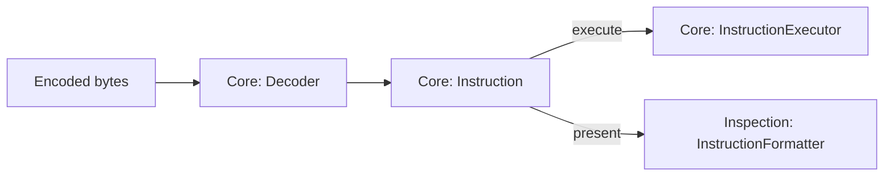

# Disassembly Architecture

Disassembly is a passive inspection capability provided by `@chip8nx/inspection`.

It combines encoded machine data and decoding semantics from `@chip8nx/core` with Inspection-owned traversal and formatting:

```text
Core: Memory
  ↓
Inspection: Disassembler
  ↓
Core: Decoder
  ↓
Core: Instruction
  ↓
Inspection: InstructionFormatter
  ↓
Inspection: DisassembledInstruction
```

Disassembly reuses the same typed `Instruction` boundary as CPU execution, but it never executes instructions or mutates emulated machine state.

The package dependency is one-way:

```text
@chip8nx/inspection
        ↓ depends on
@chip8nx/core
```

Core does not know that disassembly exists.

See also:

- [Architecture overview](./overview.md)
- [Instruction execution architecture](./instruction-execution.md)
- [Disassembling CHIP-8 programs](../guides/disassembling-programs.md)
- [ADR 0009 — Separate Opcode Decoding from Instruction Execution Semantics](../decisions/0009-separate-decoding-from-execution.md)
- [ADR 0012 — Application-Owned Composition](../decisions/0012-application-owned-composition.md)

## Responsibility

`Disassembler` coordinates three operations:

1. read complete two-byte instruction words from Core `Memory`;
2. decode them with Core `Decoder` into typed `Instruction` values;
3. format those instructions through an Inspection `InstructionFormatter`.

It deliberately does not own:

```text
ROM loading
CPU state
instruction execution
debugger state
terminal / DOM presentation
code-vs-data classification
```

Those concerns belong to Core machine components, the consuming application, or future higher-level tooling according to their responsibility.

The boundary is therefore:

```text
Core
    → machine data and instruction semantics

Inspection
    → passive disassembly and presentation tools

Application
    → loading, exploratory policy, and host presentation
```

## Shared Typed-Instruction Boundary

CPU execution and passive inspection share the same Core decoding semantics.



The important boundary is the typed `Instruction`.

Before that boundary, encoded bytes must be interpreted and validated by Core. After it, consumers work with semantic instruction fields rather than decoding opcode bit masks again.

The two paths then serve different responsibilities:

```text
Core execution
    Instruction
        ↓
    InstructionExecutor
        ↓
    machine state / capabilities

Inspection
    Instruction
        ↓
    InstructionFormatter
        ↓
    human-readable presentation
```

This gives execution and inspection one authoritative interpretation of the instruction set without making either concern depend on the other.

## Components

### `Decoder`

`Decoder` belongs to `@chip8nx/core`.

Its responsibility is to translate an `Opcode` into a typed `Instruction` according to the machine's instruction-set semantics.

It is authoritative for opcode interpretation and validation. Disassembly does not maintain a parallel decoder.

`Decoder` currently has one demonstrated implementation, so the project does not introduce a speculative decoder interface merely to make the dependency graph symmetrical.

### `InstructionFormatter`

`InstructionFormatter` belongs to `@chip8nx/inspection`.

It converts an already-decoded Core `Instruction` into a human-readable textual representation:

```ts
interface InstructionFormatter {
  format(instruction: Instruction): string;
}
```

Formatting policy is therefore independent from decoding semantics. A formatter chooses textual representation; it does not reproduce opcode decoding.

Different textual conventions can be introduced without changing Core execution or opcode interpretation.

### `ClassicInstructionFormatter`

`ClassicInstructionFormatter` is the current Classic CHIP-8 implementation.

It produces conventional uppercase assembly such as:

```text
CLS
LD V0, 0x01
ADD VA, VB
DRW V0, V1, 0x5
JP 0x200
```

Applications or future inspection consumers may provide another formatter without changing traversal or decoding behavior.

### `Disassembler`

`Disassembler` belongs to `@chip8nx/inspection`.

It coordinates memory reads, Core decoding, and instruction formatting over either a single address or a requested byte range.

Its public operations are conceptually:

```ts
disassembleAt(
  memory: Memory,
  sourceAddress: Address,
): DisassembledInstruction;

disassemble(
  memory: Memory,
  startAddress: Address,
  byteLength: number,
): readonly DisassembledInstruction[];
```

It does not classify bytes as code or data, follow control flow, resolve labels, or attempt recovery from invalid complete opcodes.

It also does not retain a particular `Memory` instance or traversal position between calls.

### `DisassembledInstruction`

`DisassembledInstruction` belongs to `@chip8nx/inspection`.

Each successfully decoded instruction produces a result conceptually shaped as:

```ts
interface DisassembledInstruction {
  readonly address: Address;
  readonly instruction: Instruction;
  readonly text: string;
}
```

The fields serve different consumers:

- `address` preserves the Core source location;
- `instruction` preserves typed Core semantic data;
- `text` provides the Inspection-produced presentation.

The original opcode is already retained by `Instruction`, so it is not duplicated as a separate result field.

Keeping the typed instruction also means future analyzers or debugger tooling do not need to parse formatted assembly text.

## Dependency Direction

The dependency direction is:

```text
Application
    ↓
@chip8nx/inspection
    ↓
@chip8nx/core
```

Applications may also depend directly on Core where they need machine or decoding APIs.

For example:

```ts
const disassembler = new Disassembler(new Decoder(), new ClassicInstructionFormatter());
```

The two collaborators intentionally use different forms of coupling:

```text
Disassembler
    ├── Core Decoder
    │     concrete injected collaborator
    │
    └── Inspection InstructionFormatter
          abstract capability
```

`Decoder` currently has one demonstrated implementation.

Formatting already has demonstrated substitution pressure: disassembly and tracing both consume instruction presentation independently from the concrete Classic representation.

The reverse package dependency is forbidden:

```text
@chip8nx/core ──X──> @chip8nx/inspection
```

Inspection imports Core concepts only through the public `@chip8nx/core` package API. It does not reach into `packages/core/src/...`.

This is an instance of the broader Chip8NX design rule:

> Reusable higher-level tools may depend on lower-level machine semantics, but lower-level machine semantics must not depend on presentation or inspection tooling.

That keeps decoding authoritative in Core while allowing inspection capabilities to evolve independently.

See [Machine state and capabilities architecture](./machine-state-and-capabilities.md) for the project-wide treatment of substitution seams and provider ownership.

## Memory Is Operation Input

`Memory` is supplied to each disassembly operation rather than stored in the constructor:

```ts
disassembler.disassembleAt(memory, address(0x200));
```

That reflects ownership:

```text
Decoder + formatter
    → define how disassembly works

Memory
    → data source inspected by this operation
```

The same `Disassembler` instance can inspect several machine or memory instances without reset or reconstruction.

## Range Semantics

CHIP-8 instructions are two bytes wide.

`Disassembler` therefore interprets a requested range as a sequence of complete two-byte instruction words beginning at the supplied start address.

The range is expressed as:

```text
start address + byte length
```

rather than an end address, avoiding inclusive/exclusive ambiguity.

For a range of `byteLength` bytes:

```text
offset = 0, 2, 4, ...
while offset + INSTRUCTION_SIZE <= byteLength
```

For example:

```text
0x200  [byte] [byte]  instruction 1
0x202  [byte] [byte]  instruction 2
0x204  [byte] [byte]  instruction 3
```

### Complete instructions only

Only complete two-byte words are processed.

For example:

```text
byteLength = 5

[byte byte] [byte byte] [byte]
     1           2        ignored
```

The unmatched trailing byte is intentionally ignored because it cannot form a complete CHIP-8 instruction.

A zero-length range is valid and returns an empty result without reading memory.

Odd positive byte lengths remain valid because only the final unmatched byte is ignored.

### Byte-length validation

`byteLength` must be a non-negative safe integer.

Examples rejected with `RangeError` include:

```text
-1
1.5
NaN
Infinity
```

Memory reads remain subject to Core memory and address invariants.

## Error Ownership

Errors follow the component that owns the violated contract:

```text
invalid byteLength
    → RangeError from Inspection Disassembler

invalid opcode
    → InvalidOpcodeError from Core Decoder

out-of-range memory access
    → RangeError from Core Memory
```

`Disassembler` does not wrap collaborator errors when it has no additional recovery behavior or domain information to add.

### Invalid opcodes

The reusable `Disassembler` is intentionally strict.

For every complete two-byte instruction word in the requested range:

```text
Memory bytes
    ↓
Opcode
    ↓
Core Decoder
    ↓
typed Instruction
```

If Core's `Decoder` rejects that opcode, disassembly fails immediately at that point.

For example:

```text
0x200  6001   valid
0x202  8AB8   invalid
0x204  7001   not reached
```

Inspection does not return partial range results, silently invent an `UNKNOWN` instruction, reinterpret the bytes as data, or skip the invalid word.

This preserves a useful invariant:

> A successfully disassembled instruction has exactly the same decoded meaning that Core execution would use for the same opcode.

### Memory boundaries

Both bytes of an instruction must exist.

For a 4096-byte memory, calling `disassembleAt()` at `0xFFF` fails because the second byte would lie outside the address space.

The error remains owned by Core `Memory`.

## Application-Owned Exploratory Policy

Strict reusable semantics do not prevent an application from providing a more tolerant exploration experience.

Whole-ROM inspection has a different uncertainty model because CHIP-8 programs may mix:

```text
code
data
sprites
tables
constants
```

The disassembler application may therefore choose policy such as:

```text
read next word
    ↓
try strict disassembly
    ├── valid
    │     ↓
    │   print formatted instruction
    │
    └── invalid opcode
          ↓
        print UNKNOWN / raw bytes
    ↓
continue
```

That behavior belongs to the application because it answers a host/tooling question:

> “How should this program be explored when some bytes are not valid instructions?”

It is not part of CHIP-8 execution semantics and should not weaken the reusable Inspection contract.

A word that successfully decodes is also not proof that the bytes represent executable code. Data may coincidentally resemble a valid opcode.

The separation lets both use cases coexist:

```text
@chip8nx/core
    authoritative opcode semantics

@chip8nx/inspection
    strict reusable semantic inspection

apps/disassembler
    tolerant whole-ROM exploration policy
```

The application may therefore recover from invalid-opcode errors for presentation purposes while Core and Inspection remain precise about what constitutes a valid decoded instruction.

## State and Lifecycle

The disassembly tools in `@chip8nx/inspection` are reusable, operation-oriented services.

`InstructionFormatter` implementations may hold immutable presentation configuration, and `Disassembler` retains its decoding and formatting collaborators, but neither owns per-ROM or per-session mutable state such as:

```text
current address
selected range
loaded ROM
breakpoints
execution history
current program
```

Traversal variables remain local to an operation.

`Memory` remains operation input rather than constructor-owned state:

```ts
disassembler.disassembleAt(memory, address(0x200));
```

That distinction reflects ownership:

```text
Decoder + formatter
    → define how disassembly works

Memory
    → data source inspected by this operation
```

The same `Disassembler` instance can therefore inspect multiple memory instances without reset or reconstruction.

Higher-level applications or future tooling may own session state and use `Disassembler` as one reusable capability. Disassembly itself does not acquire debugger, CPU-lifecycle, or application-state responsibilities merely because those consumers use it.

## Verification Strategy

Disassembly is verified at several boundaries.

### Formatter tests

`ClassicInstructionFormatter` tests verify the textual representation of typed Core `Instruction` values independently from memory traversal.

This keeps presentation failures separate from decoding or range-handling failures.

### Disassembler tests

`Disassembler` tests verify behavior such as:

- decoding one instruction from memory;
- traversing complete instruction words in address order;
- ignoring an unmatched trailing byte;
- accepting a zero-length range;
- rejecting invalid byte lengths;
- propagating invalid-opcode failures from Core `Decoder`;
- preserving memory-boundary failures.

These tests focus on Inspection behavior rather than re-testing the full Core decoder instruction table.

### Public package integration

`packages/inspection/tests/integration/inspection-public-api.test.ts` composes:

```text
@chip8nx/core
    Memory
    Decoder
        ↓
@chip8nx/inspection
    ClassicInstructionFormatter
    Disassembler
```

using package public APIs only.

This test protects the architectural boundary as well as behavior: Inspection must be able to perform static inspection without reaching into private Core source paths.

The disassembler application separately verifies its tolerant whole-ROM exploration policy. That application-level behavior should not be folded into the strict reusable Inspection tests.

## Future Extension Points

The current design exposes only variation and composition pressure already demonstrated by real consumers.

Possible future needs include:

- richer descriptions or comments;
- symbols and labels;
- invalid-word result types;
- code/data classification;
- control-flow analysis;
- structured presentation fields;
- CHIP-8-family decoding variation.

These possibilities are intentionally not forced into one extension or plugin framework today.

### Decoder variation

Future CHIP-8-family variants may create meaningful decoding differences.

`Disassembler` already receives its Core `Decoder` from outside, so construction remains flexible without introducing a speculative decoder interface.

If a real second decoding behavior appears, the project can then evaluate the smallest appropriate model, for example:

```text
multiple decoder implementations
variant configuration
different instruction unions
shared decoder extensions
```

The abstraction should follow demonstrated variation rather than precede it.

### Structured formatting

`InstructionFormatter` currently returns a string because that is sufficient for the project's existing disassembly and tracing consumers.

A future richer interface may need separate mnemonic, operands, comments, categories, or styling metadata.

The typed Core `Instruction` remains available, so such a representation can be introduced without parsing existing assembly text.

### Code and data analysis

A successfully decoded word is not proof that the corresponding ROM bytes are executable code.

Future tools may introduce:

```text
control-flow analysis
symbol discovery
code / data classification
references
labels
```

Those are analysis responsibilities above basic disassembly. They should not be added to `Disassembler` merely because disassembly is one input to them.

### Shared instruction fetching

`Cpu` and `Disassembler` both perform the small operation of reading two bytes and assembling an opcode.

That duplication currently occurs inside two different responsibilities:

```text
Cpu
    instruction execution sequencing

Disassembler
    passive memory inspection
```

A shared fetch abstraction should be introduced only if additional real consumers demonstrate repeated composition pressure around that operation.

## Deliberately Deferred Debugger Features

Disassembly is useful to a debugger, but it is not itself a debugger.

The current Inspection package does not own:

```text
breakpoints
watchpoints
pause conditions
step-over / step-out
execution selection
debugger session state
```

If reusable debugger behavior is later demonstrated, that responsibility should be modeled separately and may consume both Core runtime mechanisms and Inspection capabilities as needed.

Its dependency relationship should be derived from the behavior actually required rather than designed in advance.

## Evolution Guideline

Prefer this order when extending disassembly:

```text
real consumer need
      ↓
identify varying or repeated responsibility
      ↓
use an existing seam if sufficient
      ↓
introduce the smallest new abstraction if necessary
```

The guiding rule is:

> Abstract demonstrated variation and demonstrated composition pressure, not hypothetical future needs.

Avoid building extension mechanisms first and searching for consumers afterward.
