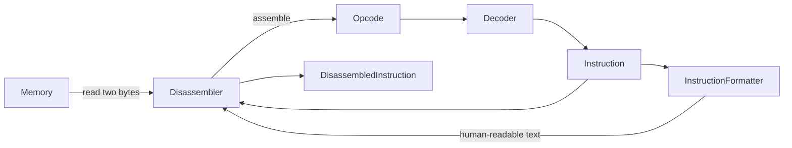
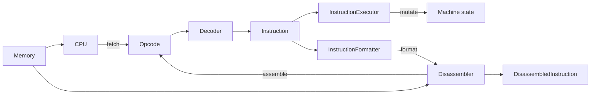
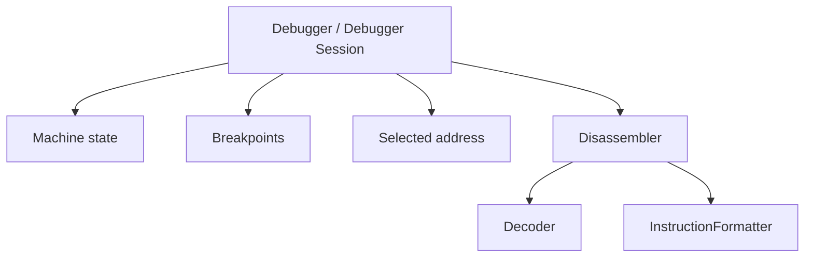

# Disassembly Architecture

The disassembly subsystem provides a read-only view of encoded CHIP-8 instructions.

It reads instruction words from memory, delegates opcode decoding to the existing `Decoder`, and converts the resulting typed `Instruction` values into human-readable text through an `InstructionFormatter`.

Disassembly does not execute instructions or mutate emulated machine state.

At a high level:

```text
Memory
  ↓
Opcode
  ↓
Decoder
  ↓
Instruction
  ↓
InstructionFormatter
  ↓
DisassembledInstruction
```

## Responsibility

The `Disassembler` coordinates three operations:

1. reading complete CHIP-8 instruction words from `Memory`;
2. decoding those words into typed `Instruction` values;
3. formatting those instructions for human-readable presentation.

The subsystem deliberately does not own ROM loading, CPU state, execution, debugger state, or presentation to a terminal or graphical interface.

Those concerns remain with their existing Core components or with higher-level applications that consume the disassembly API.

This keeps disassembly usable by different tools, including command-line utilities, debuggers, tracers, and graphical inspection interfaces, without coupling Core to any particular host.

## Disassembly Pipeline

Disassembly reuses the same decoding model as instruction execution.

A CHIP-8 instruction is stored as two bytes in memory. The `Disassembler` reads those bytes in big-endian order, constructs an `Opcode`, delegates decoding to `Decoder`, and then passes the resulting typed `Instruction` to the configured `InstructionFormatter`.



The resulting `DisassembledInstruction` contains:

- the source memory address;
- the decoded `Instruction`;
- the formatted textual representation.

The original opcode is not duplicated in the result because every decoded `Instruction` already retains the opcode from which it was created.

This pipeline intentionally avoids decoding opcode fields inside the formatter or disassembler. Opcode interpretation remains centralized in `Decoder`, so execution and inspection share the same typed instruction model instead of maintaining separate decoding logic.

Conceptually:

```text
encoded bytes
    ↓
Opcode
    ↓
Decoder
    ↓
typed Instruction
    ├── execution
    └── inspection
```

This shared boundary is important: once an opcode has been decoded successfully, downstream components work with semantic instruction data rather than raw bit masks.

## Relationship to CPU Execution

Instruction execution and disassembly share the same decoding path.

Both begin with encoded instruction bytes, assemble an `Opcode`, and delegate semantic decoding to `Decoder`. They diverge only after a valid typed `Instruction` has been produced.



The CPU follows an execution-oriented pipeline:

```text
Memory
  ↓
Opcode
  ↓
Decoder
  ↓
Instruction
  ↓
InstructionExecutor
  ↓
machine-state changes
```

The disassembler follows an inspection-oriented pipeline:

```text
Memory
  ↓
Opcode
  ↓
Decoder
  ↓
Instruction
  ↓
InstructionFormatter
  ↓
human-readable representation
```

The important boundary is the typed `Instruction`.

Before that boundary, encoded bytes must be interpreted and validated.

After that boundary, consumers no longer need to understand opcode bit layouts. Execution applies the instruction's semantics to machine state, while disassembly presents the same semantic instruction without executing it.

This separation keeps inspection observational. Disassembling an instruction does not advance the program counter, modify registers or memory, update timers, draw to the display, or otherwise affect the emulated machine.

It also prevents execution and inspection from drifting into separate interpretations of the CHIP-8 instruction set: both rely on the same `Decoder` and the same instruction model.

## Component Responsibilities

### `Disassembler`

`Disassembler` coordinates memory reading, decoding, formatting, and sequential traversal.

It owns the mechanics required to turn bytes stored in `Memory` into `DisassembledInstruction` results, but delegates instruction semantics and textual representation to other components.

Its responsibilities are:

- read complete two-byte instruction words from memory;
- assemble those bytes into an `Opcode`;
- delegate opcode interpretation to `Decoder`;
- delegate textual representation to `InstructionFormatter`;
- preserve the source address of each decoded instruction;
- traverse ranges in CHIP-8 instruction-sized steps.

It does not execute instructions, load ROMs, own a particular memory instance, or maintain debugger or traversal state between calls.

### `InstructionFormatter`

`InstructionFormatter` defines the formatting capability required by the disassembler:

```ts
interface InstructionFormatter {
  format(instruction: Instruction): string;
}
```

The formatter receives an already decoded `Instruction`.

It therefore does not need to inspect raw opcode masks or reproduce decoding logic. Its responsibility is limited to choosing how known semantic instruction data is represented as human-readable text.

Formatting is an explicit replacement point because different consumers may reasonably prefer different assembly syntax or presentation conventions.

### `ClassicInstructionFormatter`

`ClassicInstructionFormatter` is the standard formatter supplied by Core.

It renders Classic CHIP-8 instructions using conventional CHIP-8 assembly notation, for example:

```text
CLS
LD V0, 0x01
ADD VA, VB
DRW V0, V1, 0x5
JP 0x200
```

It is a default implementation, not a requirement of the disassembler. Applications may provide another `InstructionFormatter` without changing decoding or traversal behavior.

### `DisassembledInstruction`

`DisassembledInstruction` is the immutable result produced for one successfully decoded instruction:

```ts
interface DisassembledInstruction {
  readonly address: Address;
  readonly instruction: Instruction;
  readonly text: string;
}
```

The three fields serve different purposes:

- `address` identifies where the instruction was read from;
- `instruction` preserves the typed semantic representation;
- `text` provides the representation chosen by the configured formatter.

Keeping the typed `Instruction` alongside its formatted text allows higher-level tooling to inspect semantic data without parsing assembly strings.

The result deliberately remains small. Concerns such as descriptions, comments, symbols, breakpoints, or debugger metadata are not part of the base disassembly model and can be layered on by higher-level consumers if future requirements justify them.

## Dependency Direction and Composition

`Disassembler` receives its decoding and formatting collaborators through constructor injection:

```ts
const disassembler = new Disassembler(new Decoder(), new ClassicInstructionFormatter());
```

The disassembler therefore does not decide how those collaborators are constructed. Composition remains owned by the application or higher-level component using Core.

The two dependencies deliberately use different forms of coupling:

```text
Disassembler
    │
    ├── Decoder
    │      concrete dependency
    │
    └── InstructionFormatter
           abstract capability
```

### Decoder

`Decoder` is currently injected as a concrete class.

Injection still separates construction from use: `Disassembler` does not create its own decoder and can receive the decoder chosen by the composition layer.

An additional decoding interface is not introduced yet because Classic Core currently has one demonstrated decoding implementation and the exact form of future variant-related decoding differences is not yet known.

Introducing an interface solely in anticipation of possible CHIP-48, SCHIP, or other variants would risk committing to an abstraction before those variants provide evidence about what actually varies.

The current design therefore creates the seam without prematurely defining the abstraction:

```text
composition
    │
    └── Decoder
          │
          ▼
     Disassembler
```

If future variants demonstrate multiple meaningful implementations of the same decoding role, a narrower decoder abstraction can be introduced without changing the overall composition model.

### Instruction formatter

Formatting already has demonstrated variation.

Core provides `ClassicInstructionFormatter`, while applications are intentionally allowed to supply another implementation of `InstructionFormatter`.

The dependency therefore targets the required capability rather than one concrete formatter:

```text
               InstructionFormatter
                    ▲         ▲
                    │         │
ClassicInstructionFormatter  Custom formatter
```

This allows presentation policy to vary independently from memory traversal and opcode decoding.

### Dependency injection and dependency inversion

The distinction is intentional:

- **dependency injection** determines who supplies a collaborator;
- **dependency inversion** determines whether the consumer depends on a concrete implementation or on an abstract capability.

Both decoder and formatter are injected.

Only the formatter currently requires an abstraction because formatting is already a proven replacement point.

This follows a broader design rule used throughout Core:

> Make demonstrated variation replaceable, while avoiding abstractions justified only by hypothetical future requirements.

The goal is neither to hard-wire every collaborator nor to create an interface for every class. The composition boundary should remain explicit while abstractions are introduced where they represent real alternative behavior.

## Range Semantics and Error Behavior

CHIP-8 instructions are always two bytes wide.

`Disassembler.disassemble()` therefore traverses the requested range in two-byte instruction-sized steps:

```text
start
  ↓
0x200  [byte] [byte]  instruction 1
0x202  [byte] [byte]  instruction 2
0x204  [byte] [byte]  instruction 3
```

The range is expressed as a starting address and a byte length:

```ts
disassembler.disassemble(memory, address(0x200), byteLength);
```

Using a byte length avoids ambiguity about whether an end address would be inclusive or exclusive and maps naturally to known instruction-region lengths.

### Complete instructions only

Only complete two-byte instruction words are disassembled.

For an even byte length:

```text
byteLength = 6

[byte byte] [byte byte] [byte byte]
     1           2           3
```

three instructions are processed.

For an odd byte length:

```text
byteLength = 5

[byte byte] [byte byte] [byte]
     1           2        trailing
```

the unmatched trailing byte is ignored.

This behavior is intentional. An isolated byte does not form a valid CHIP-8 instruction, but the presence of trailing data does not prevent complete preceding instructions from being inspected.

The range operation therefore asks:

> How many complete CHIP-8 instructions are contained within this byte range?

rather than requiring every supplied byte to belong to an instruction.

### Byte-length validation

`byteLength` must be a non-negative safe integer.

Values such as the following are rejected with `RangeError`:

```text
-1
1.5
NaN
Infinity
```

Odd positive integers remain valid because the final unmatched byte is ignored.

A zero-length range is also valid and produces an empty result without reading memory.

### Invalid opcodes

Opcode validity remains the responsibility of `Decoder`.

If any complete two-byte word does not represent a valid instruction, `Decoder` throws `InvalidOpcodeError` and the disassembler allows that error to propagate unchanged.

For example:

```text
0x200  6001   valid
0x202  8AB8   invalid
0x204  7001   valid
```

range disassembly fails when it reaches `0x202`.

The Core range API deliberately uses fail-fast behavior. It does not return partial results, invent placeholder instructions, or skip invalid words.

Applications may layer a different traversal policy over `disassembleAt()` without changing this Core contract.

For example, the command-line disassembler performs an exploratory linear sweep of a ROM, catches `InvalidOpcodeError` for individual words, renders them as `UNKNOWN`, and continues with the next word.

That behavior remains application policy rather than part of the strict range-disassembly API.

### Memory boundaries

Memory access remains governed by the `Memory` abstraction.

If either byte required for a complete instruction lies outside the memory address space, the underlying memory implementation raises `RangeError`, which the disassembler allows to propagate.

For example, in a 4096-byte memory:

```text
0xFFF   first byte   valid
0x1000  second byte  outside memory
```

calling `disassembleAt()` at `0xFFF` therefore fails with `RangeError`.

Likewise, range traversal fails if it reaches a complete instruction whose bytes would extend beyond available memory.

The disassembler does not currently translate this into a disassembly-specific exception because it has no additional recovery behavior or domain information to add.

### Error ownership

The error model follows component responsibilities:

```text
invalid byteLength
      ↓
Disassembler
      ↓
RangeError

invalid opcode
      ↓
Decoder
      ↓
InvalidOpcodeError

invalid memory access
      ↓
Memory
      ↓
RangeError
```

The disassembler validates only the input contract it owns and otherwise preserves errors from the components responsible for decoding and memory access.

This keeps error semantics aligned with the same boundaries used elsewhere in Core.

## State, Lifecycle, and Higher-Level Tooling

`Disassembler`, `Decoder`, and the supplied instruction formatters are designed as reusable services rather than per-program or per-debugging-session objects.

They may hold collaborators or immutable configuration, but they do not own mutable state associated with a particular ROM or running machine.

### Memory is operation input

`Memory` is passed to disassembly operations:

```ts
disassembler.disassembleAt(memory, address(0x200));
```

rather than being stored by the `Disassembler` constructor.

This distinction reflects ownership.

The decoder and formatter define how the service performs its work, while memory is the data source being inspected by a particular call.

As a result, the same disassembler instance can inspect different memory implementations or machine instances:

```ts
disassembler.disassemble(memoryA, address(0x200), lengthA);
disassembler.disassemble(memoryB, address(0x300), lengthB);
```

No reset or reconstruction is required between operations.

Binding memory to the constructor would instead make a disassembler instance represent one particular program or machine, introducing session-like ownership that the subsystem does not require.

### Stateless operations

A disassembly call does not modify later calls.

The subsystem does not store values such as:

```text
current address
last instruction
selected range
loaded ROM
current program
```

Traversal variables remain local to the operation.

This keeps behavior deterministic and avoids hidden dependencies between calls.

### Configuration is not session state

A service may still hold immutable configuration without becoming stateful in the session sense.

For example, a future formatter could reasonably be configured when constructed:

```ts
const formatter = new SomeFormatter({
  uppercaseHex: true,
});
```

That configuration defines formatting policy but does not change as instructions are processed.

The distinction is:

```text
immutable configuration
    → defines service behavior

mutable session state
    → changes as a program is inspected or executed
```

The former can belong to a reusable service. The latter should normally belong to the higher-level component that owns the session.

### Debugger ownership

A future debugger will need state that the disassembler deliberately does not own, such as:

```text
running machine
selected address
breakpoints
watch expressions
execution status
step history
```

That suggests an ownership relationship such as:



The debugger may use the current CPU program counter to request disassembly:

```ts
const current = disassembler.disassembleAt(memory, cpu.snapshot().programCounter);
```

but the dependency direction remains from debugger tooling toward the reusable disassembly service.

The disassembler does not acquire knowledge of CPU execution state merely because a debugger consumes it.

### Host independence

The same ownership rule applies to presentation.

Core produces structured disassembly results:

```text
DisassembledInstruction[]
```

A higher-level application decides how those results are presented.

For example:

```text
      Disassembler
           │
           ▼
DisassembledInstruction[]
     /        |        \
    /         |         \
 CLI       Web UI     Debugger
```

Core does not print to stdout, manipulate the DOM, or maintain terminal presentation state.

This keeps the subsystem usable across hosts and preserves the same application-owned composition model used elsewhere in Chip8NX.

### Lifecycle rule

The intended lifecycle can be summarized as:

> `Decoder`, `InstructionFormatter`, and `Disassembler` are reusable services. They may hold immutable dependencies or configuration, but they do not own per-ROM, per-machine, or per-debugging-session mutable state.

Session state belongs to the application or higher-level tooling that coordinates those services.

## Future Extension Points and Deferred Abstractions

The first disassembly slice intentionally exposes only behavior justified by current requirements.

Several likely future needs are visible, but their exact shape is not yet proven. The architecture therefore preserves useful seams without introducing speculative framework code.

### Richer instruction descriptions

Higher-level tools may eventually want output such as:

```text
0x200  00E0  CLS          ; Clear the display
0x202  F00A  LD V0, K     ; Wait for a key press and store it in V0
```

The base `DisassembledInstruction` does not contain a description field today.

That is deliberate. A description is additional inspection metadata rather than part of the minimum result required for disassembly.

TypeScript's structural typing allows a richer result to extend the base contract later:

```ts
interface DescribedInstruction extends DisassembledInstruction {
  readonly description: string;
}
```

A future consumer could then enrich a base result without forcing every disassembly user to pay for or depend on descriptions.

The exact enrichment API is intentionally deferred until a real consumer demonstrates what information and composition model are required.

### Tolerant binary analysis

The command-line disassembler already demonstrates a minimal tolerant policy at the application level: unsupported words are rendered as `UNKNOWN` and traversal continues.

This is sufficient for exploratory linear inspection, but it cannot reliably distinguish executable code from data that happens to decode as a valid opcode.

For example:

```text
0x200  124E  JP 0x24E
0x202  EAAC  UNKNOWN
0x204  AAEA  LD I, 0xAEA
```

The `AAEA` word decodes successfully, but that alone does not prove it represents executable code.

A future debugger, analyzer, or ROM-inspection tool may require richer tolerant behavior such as:

```text
invalid-word result types
code/data classification
control-flow analysis
labels and references
```

If multiple consumers require the same policy, that repeated need may justify promoting an abstraction or richer result model into Core.

Until then, tolerant traversal remains an application concern layered over the strict `disassembleAt()` primitive.

### Decoder variation

Future CHIP-8 variants may introduce meaningful decoding differences.

Possible sources of variation include:

- additional opcodes;
- instructions with different semantics;
- different interpretations of existing opcode forms;
- variant-specific instruction models.

The current disassembler receives `Decoder` through constructor injection, so composition is already external.

However, Core does not yet introduce an `InstructionDecoder` interface or generic decoder hierarchy.

Variant implementation should first reveal whether decoder variation is best represented by:

```text
multiple decoder implementations
variant configuration
different instruction unions
shared decoder extensions
```

or another structure.

The abstraction should follow that evidence rather than predict it.

### Generic disassembly models

The current API deliberately avoids types such as:

```ts
Disassembler<TInstruction>;
DisassembledInstruction<TInstruction>;
VariantDisassembler;
DisassemblyProfile;
```

Classic CHIP-8 currently has one strongly typed instruction model, so generics would add complexity without solving a demonstrated problem.

If future variants require genuinely distinct instruction types, the type relationships can be revisited with concrete examples available.

### Formatter growth

`InstructionFormatter` currently returns a plain string:

```ts
format(instruction: Instruction): string;
```

This is sufficient for conventional assembly output.

A future graphical debugger might want separately structured data such as:

```text
mnemonic
operands
comment
semantic category
```

That does not justify expanding the current formatter contract today.

If a real consumer needs structured formatting, the project can determine whether to:

- introduce another formatter abstraction;
- enrich the formatter result;
- derive presentation data directly from `Instruction`;
- keep string formatting and structured inspection separate.

The existing typed `Instruction` remains available specifically so higher-level tooling does not have to parse formatted text.

### Shared instruction fetching

`Cpu` and `Disassembler` both currently perform the small operation of reading two bytes and assembling an opcode.

The duplication is visible, but no shared fetching abstraction is introduced yet.

The two consumers use the operation for different responsibilities:

```text
CPU
  → fetch as part of fetch-decode-execute

Disassembler
  → read arbitrary addresses for inspection
```

If future tracers, debuggers, analyzers, or other components repeatedly require the same operation, that additional evidence may justify extracting a shared read-only instruction-fetch capability.

Until then, a few explicit lines are preferred over an abstraction with unclear ownership.

### No generic plugin system

The formatter is pluggable because formatting is already a demonstrated policy boundary.

That does not imply that the disassembly subsystem needs a generic plugin architecture.

Descriptions, symbols, comments, labels, analysis metadata, and other possible extensions may eventually have different lifecycles and composition needs.

They should not be forced prematurely into a single generic extension mechanism.

The project instead follows this rule:

> Create clear seams for known collaborators, then introduce abstractions when a real second behavior demonstrates the need.

### Evolution guideline

When extending the subsystem, prefer the following order:

```text
real consumer need
      ↓
identify repeated or varying responsibility
      ↓
use the existing seam if sufficient
      ↓
introduce the smallest new abstraction if necessary
```

Avoid reversing that order by building extension mechanisms first and searching for consumers afterward.

The current disassembly architecture is intentionally small enough to understand and use directly, while preserving the typed boundaries needed for later debugger, tracer, CLI, and variant work.
