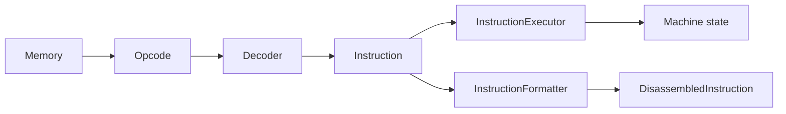
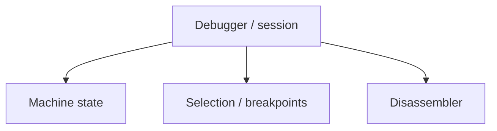

# Disassembly Architecture

The disassembly subsystem provides a read-only view of encoded CHIP-8 instructions.

```text
Memory
  ↓
Opcode
  ↓
Decoder
  ↓
Instruction
  ↓
InstructionFormatter
  ↓
DisassembledInstruction
```

It reuses the same typed instruction boundary as CPU execution, but it never executes instructions or mutates emulated machine state.

See also:

- [Instruction execution architecture](./instruction-execution.md)
- [Disassembling CHIP-8 programs](../guides/disassembling-programs.md)
- [ADR 0009 — Separate Opcode Decoding from Instruction Execution Semantics](../decisions/0009-separate-decoding-from-execution.md)
- [ADR 0012 — Application-Owned Composition](../decisions/0012-application-owned-composition.md)

## Responsibility

`Disassembler` coordinates three operations:

1. read complete two-byte instruction words from `Memory`;
2. decode them into typed `Instruction` values;
3. format those instructions for human-readable presentation.

It deliberately does not own:

```text
ROM loading
CPU state
instruction execution
debugger state
terminal / DOM presentation
code-vs-data classification
```

Those concerns belong to the application, existing Core components, or future higher-level tooling.

## Shared Typed-Instruction Boundary

CPU execution and disassembly share the same decoding path:



The important boundary is the typed `Instruction`.

Before that boundary, encoded bytes must be interpreted and validated. After it, consumers use semantic fields instead of decoding opcode bit masks again.

That gives one interpretation of the instruction set to both execution and inspection.

## Components

### `Disassembler`

`Disassembler` owns the mechanics required to turn bytes stored in `Memory` into inspection results.

Its public operations are conceptually:

```ts
disassembleAt(memory: Memory, sourceAddress: Address): DisassembledInstruction;

disassemble(
  memory: Memory,
  startAddress: Address,
  byteLength: number,
): readonly DisassembledInstruction[];
```

It does not retain a particular `Memory` instance or traversal position between calls.

### `InstructionFormatter`

Formatting is an explicit substitution seam:

```ts
interface InstructionFormatter {
  format(instruction: Instruction): string;
}
```

The formatter receives an already-decoded instruction. It chooses textual representation; it does not reproduce opcode decoding.

### `ClassicInstructionFormatter`

`ClassicInstructionFormatter` is the standard Classic CHIP-8 implementation.

It produces conventional uppercase assembly such as:

```text
CLS
LD V0, 0x01
ADD VA, VB
DRW V0, V1, 0x5
JP 0x200
```

Applications may provide another formatter without changing traversal or decoding behavior.

### `DisassembledInstruction`

Each successfully decoded instruction produces:

```ts
interface DisassembledInstruction {
  readonly address: Address;
  readonly instruction: Instruction;
  readonly text: string;
}
```

The fields serve different consumers:

- `address` preserves source location;
- `instruction` preserves typed semantic data;
- `text` provides the configured presentation.

The original opcode is already retained by `Instruction`, so it is not duplicated as a separate result field.

Keeping the typed instruction also means debugger or analyzer code never needs to parse formatted assembly text.

## Dependency Direction

The disassembler receives its decoding and formatting collaborators through constructor injection:

```ts
const disassembler = new Disassembler(
  new Decoder(),
  new ClassicInstructionFormatter(),
);
```

The two dependencies intentionally use different forms of coupling:

```text
Disassembler
    ├── Decoder
    │     concrete injected collaborator
    └── InstructionFormatter
          abstract capability
```

`Decoder` currently has one demonstrated implementation, so Core does not introduce a speculative decoder interface.

Formatting already has real variation, so the consumer depends on `InstructionFormatter` rather than one concrete formatter.

This follows the broader Core rule:

> Make demonstrated variation replaceable; do not introduce abstractions only to make the object graph look symmetrical.

See [Machine state and capabilities architecture](./machine-state-and-capabilities.md) for the project-wide treatment of substitution seams and provider ownership.

## Memory Is Operation Input

`Memory` is supplied to each disassembly operation rather than stored in the constructor:

```ts
disassembler.disassembleAt(memory, address(0x200));
```

That reflects ownership:

```text
Decoder + formatter
    → define how the service works

Memory
    → data source inspected by this call
```

The same `Disassembler` instance can inspect several machine or memory instances without reset or reconstruction.

## Range Semantics

CHIP-8 instructions are two bytes wide.

`disassemble()` traverses a byte range in instruction-sized steps:

```text
0x200  [byte] [byte]  instruction 1
0x202  [byte] [byte]  instruction 2
0x204  [byte] [byte]  instruction 3
```

The range is expressed as:

```text
start address + byte length
```

rather than an end address, avoiding inclusive/exclusive ambiguity.

### Complete instructions only

Only complete two-byte words are processed.

```text
byteLength = 5

[byte byte] [byte byte] [byte]
     1           2        ignored
```

An unmatched trailing byte is intentionally ignored.

A zero-length range is valid and returns an empty result without reading memory.

### Byte-length validation

`byteLength` must be a non-negative safe integer.

Examples rejected with `RangeError` include:

```text
-1
1.5
NaN
Infinity
```

Odd positive integers remain valid because only the final unmatched byte is ignored.

## Error Ownership

The strict Core API follows the component that owns the violated contract:

```text
invalid byteLength
    → RangeError from Disassembler

invalid opcode
    → InvalidOpcodeError from Decoder

out-of-range memory access
    → RangeError from Memory
```

### Invalid opcodes

If any complete word fails decoding, strict range disassembly fails immediately.

```text
0x200  6001   valid
0x202  8AB8   invalid
0x204  7001   not reached
```

The Core API does not return partial results, insert placeholder instructions, or silently skip the invalid word.

### Memory boundaries

Both bytes of an instruction must exist.

For a 4096-byte memory, calling `disassembleAt()` at `0xFFF` fails because the second byte would be outside the address space.

The disassembler does not wrap these collaborator errors because it has no additional recovery behavior or domain information to add.

## Strict Core vs Exploratory Application Traversal

Strict range disassembly is intended for regions the caller already believes contain instructions.

Whole-ROM inspection has a different uncertainty model because CHIP-8 programs may mix:

```text
code
data
sprites
tables
constants
```

The command-line disassembler therefore layers a tolerant policy over `disassembleAt()`:

```text
read next word
    ↓
disassembleAt()
    ├── valid   → print formatted instruction
    └── invalid → print UNKNOWN
    ↓
continue
```

That policy catches `InvalidOpcodeError` for one word and continues.

It does **not** prove that every successfully decoded word is executable code. Data may coincidentally resemble a valid opcode.

The boundary is deliberate:

```text
Core
    → strict decoding primitives

application
    → exploratory traversal/recovery policy
```

## State and Lifecycle

`Decoder`, `InstructionFormatter`, and `Disassembler` are reusable services.

They may hold collaborators or immutable configuration, but they do not own per-ROM or per-debugging-session mutable state such as:

```text
current address
selected range
loaded ROM
breakpoints
step history
current program
```

Traversal variables remain local to an operation.

A future formatter may hold immutable presentation configuration without changing this lifecycle model.

### Higher-level tooling owns session state

A future debugger may own:

```text
running machine
selected address
breakpoints
watch expressions
execution status
history
Disassembler
```

The dependency still points toward the reusable service:



Disassembly does not acquire CPU or debugger knowledge simply because those consumers use it.

## Future Extension Points

The current subsystem exposes only requirements already demonstrated by disassembly and the CLI.

Possible future needs include:

- richer descriptions or comments;
- symbols and labels;
- invalid-word result types;
- code/data classification;
- control-flow analysis;
- structured presentation fields;
- variant-specific decoding.

Those possibilities are intentionally not forced into one plugin framework today.

### Decoder variation

Future CHIP-8-family variants may create meaningful decoding differences. Constructor injection already keeps decoder construction external, but the project should wait for a real second decoding behavior before choosing among:

```text
multiple decoder implementations
variant configuration
different instruction unions
shared decoder extensions
```

### Structured formatting

`InstructionFormatter` currently returns a string because that is sufficient for assembly output.

A future debugger may want separate mnemonic, operands, comments, or categories. The typed `Instruction` remains available so that need can be solved without parsing existing formatter output.

### Shared instruction fetching

`Cpu` and `Disassembler` both read two bytes and assemble an opcode. The duplication is small and occurs in different responsibilities.

A shared fetch abstraction should be introduced only if future tracers, debuggers, or analyzers create repeated demand for the same read-only operation.

## Evolution Guideline

Prefer this order when extending disassembly:

```text
real consumer need
      ↓
identify varying/repeated responsibility
      ↓
use an existing seam if sufficient
      ↓
introduce the smallest new abstraction if necessary
```

Avoid building extension mechanisms first and searching for consumers afterward.
