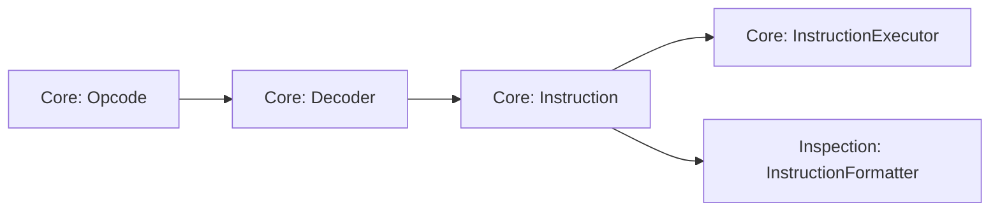

# Instruction Execution Architecture

The instruction-execution subsystem implements the CHIP-8 fetch/decode/execute cycle while keeping binary instruction encoding separate from execution semantics.

At a high level:

```text
ProgramCounter + Memory
        ↓
       Cpu
        ↓
      Opcode
        ↓
     Decoder
        ↓
  typed Instruction
        ↓
InstructionExecutor ← Chip8Compatibility
        ↓
 ExecutionContext
        ↓
machine-state changes
```

The central architectural boundary is the typed `Instruction`.

Compatibility-sensitive execution is configured separately from the decoded instruction.

The decoder answers:

> What instruction and operands does this opcode encode?

The active compatibility configuration answers:

> Which historical semantics should execution apply to those operands?

Before that boundary, the implementation deals with encoded instruction bytes and opcode validation. After that boundary, execution works with semantic instruction data and no longer needs to interpret opcode bit fields.

## Responsibilities

Instruction execution is divided among four collaborating concepts:

- `Cpu` owns one fetch/decode/execute cycle;
- `Decoder` translates an encoded `Opcode` into a typed `Instruction`;
- `InstructionExecutor` applies the semantics of that instruction;
- `ExecutionContext` exposes the machine state and capabilities required by instruction execution.

These responsibilities deliberately remain separate.

`Cpu` does not contain the semantics of individual CHIP-8 instructions. `Decoder` does not mutate machine state. `InstructionExecutor` does not fetch bytes or decode opcode fields. `ExecutionContext` aggregates resources without deciding how instructions use them.

This separation keeps instruction encoding, execution orchestration, semantic behavior, and machine-state ownership independently understandable and testable.

It also creates a reusable semantic boundary. The disassembler consumes the same decoded `Instruction` representation without depending on CPU execution or reproducing opcode-decoding logic.

## Fetch, Decode, and Execute Cycle

Each call to `Cpu.step()` processes one CHIP-8 instruction.

The current cycle is:

```text
1. Read the program counter
2. Read two bytes from memory
3. Assemble the bytes into an Opcode
4. Advance the program counter by two bytes
5. Decode the Opcode into an Instruction
6. Execute the Instruction
```

CHIP-8 instructions are two bytes wide, so normal sequential advancement is encapsulated by `ProgramCounter.advance()` using `INSTRUCTION_SIZE`.

### Fetching the instruction word

The program counter identifies the first byte of the instruction to execute.

For example:

```text
PC = 0x200

memory[0x200] = 0x6A
memory[0x201] = 0x42
```

The CPU combines the bytes in big-endian order:

```text
0x6A 0x42
   ↓
0x6A42
```

The resulting value is passed through the `Opcode` domain type before decoding.

Fetching belongs to `Cpu` because it is part of instruction-execution orchestration. `ProgramCounter` stores and updates an address; it does not read memory or decode instructions.

### Normal advancement happens before execution

After fetching the instruction word, the CPU advances the program counter before decoding and executing it.

For an instruction beginning at `0x200`:

```text
fetch from 0x200
      ↓
PC becomes 0x202
      ↓
decode and execute
```

This establishes an important executor invariant:

> When instruction semantics begin, the program counter already points to the next sequential instruction.

Ordinary instructions therefore leave the program counter unchanged.

### Control-flow instructions override normal flow

Instructions that alter control flow modify the already-advanced program counter.

For a jump:

```text
0x200  1300  JP 0x300

fetch at 0x200
      ↓
PC = 0x202
      ↓
execute JP 0x300
      ↓
PC = 0x300
```

Calls benefit from the same convention. When `CALL` executes, the program counter already contains the correct return address:

```text
0x200  2300  CALL 0x300

fetch at 0x200
      ↓
PC = 0x202
      ↓
push 0x202
      ↓
PC = 0x300
```

Taken skip instructions simply perform one additional `ProgramCounter.advance()` after the CPU's normal advance.

This gives a simple ownership rule:

```text
Cpu
  → owns normal sequential advancement

InstructionExecutor
  → owns instruction-specific control-flow changes
```

Those instruction-specific changes include jumps, calls, returns, taken skips, and retries.

### Waiting instructions restore the current address

Some instructions cannot complete immediately.

For example, `Fx0A` waits for the keyboard's required key-release event. If no completed event is available, the executor rewinds the program counter by one instruction so the same instruction is fetched again on a later CPU opportunity.

```text
instruction starts at 0x200
        ↓
CPU advances to 0x202
        ↓
Fx0A cannot complete
        ↓
PC restored to 0x200
```

Sprite drawing uses the same retry pattern when the active profile requires vertical-blank-gated drawing and no vertical-blank opportunity is available.

Profiles configured for immediate drawing do not wait or rewind for vertical blank.

This is normal emulated control flow, not a scheduler pause and not an exception. The CPU step completes, but the program counter again points at the waiting instruction.

### Decode failures occur after normal advancement

The current implementation advances the program counter before calling `Decoder`.

Consequently, if decoding throws `InvalidOpcodeError`, no instruction semantics are applied, but the program counter has already advanced to the next sequential address.

Execution is not transactional, so callers should not assume that an exception from `Cpu.step()` leaves the complete machine state exactly as it was before the step began.

## Typed Instructions and the Decoder Boundary

`Opcode` and `Instruction` represent different levels of understanding.

An `Opcode` is a validated 16-bit encoded value:

```text
6A42
```

Its meaning is still implicit in its bit layout. After decoding, the same word becomes semantic data:

```ts
{
  kind: "load-immediate",
  opcode: opcode(0x6a42),
  register: registerIndex(0xa),
  value: byte(0x42),
}
```

The decoder therefore marks the transition from encoded representation to semantic representation:

```text
encoded Opcode
      ↓
   Decoder
      ↓
typed Instruction
```

### `Instruction` is a discriminated union

The public `Instruction` type is a closed union of supported instruction shapes. Each shape contains a string-literal `kind` discriminator and only the operands meaningful to that instruction.

For example:

```ts
interface LoadImmediateInstruction {
  readonly kind: "load-immediate";
  readonly opcode: Opcode;
  readonly register: RegisterIndex;
  readonly value: Byte;
}

interface JumpInstruction {
  readonly kind: "jump";
  readonly opcode: Opcode;
  readonly address: Address;
}
```

TypeScript can then narrow safely:

```ts
switch (instruction.kind) {
  case "load-immediate":
    instruction.register;
    instruction.value;
    break;

  case "jump":
    instruction.address;
    break;
}
```

This is preferable to a generic object with optional `x`, `y`, `n`, `nn`, and `nnn` fields, where every consumer would need to remember which fields are valid for which instruction family.

The union makes invalid combinations harder to represent and moves useful knowledge into the type system.

### Semantic operands use domain types

Decoded instructions preserve existing Core domain types where appropriate:

```text
address operand    → Address
8-bit immediate    → Byte
register operand   → RegisterIndex
source word        → Opcode
```

The executor therefore receives already-validated semantic operands rather than unqualified numbers that need to be interpreted again.

### `Decoder` owns opcode-field interpretation

`Decoder` extracts encoded fields such as `x`, `y`, `n`, `nn`, and `nnn` and converts them into semantic instruction properties.

Once decoding has succeeded, downstream consumers should use those properties rather than decode `instruction.opcode` again.

This is especially important when historical variants assign different semantics to the same encoded operands.

For example, `Bnnn` preserves both:

```text
NNN target address
X register encoded by the instruction
```

in the decoded `JumpWithOffsetInstruction`.

Classic execution uses `V0` as the offset and ignores the decoded X register. CHIP-48 execution uses the decoded `Vx` register.

The executor therefore does not re-decode X from the original opcode when applying CHIP-48 semantics.

```text
raw opcode fields
      ↓
   Decoder
      ↓
typed semantic fields
      ↓
Core execution / Inspection tooling / future higher-level consumers
```

Keeping one authority for opcode interpretation prevents execution and tooling from drifting into subtly different interpretations of the same bit pattern.

### The original opcode is provenance

Every instruction retains its original `Opcode`.

That value is useful for diagnostics, tracing, disassembly listings, debugging, and conformance failures, but it is not intended to become a second semantic source of truth.

The preferred rule is:

> Use decoded semantic fields for behavior; keep the opcode as provenance.

### Register operations form a nested semantic family

The `8xy*` family is represented as one `register-operation` instruction with a nested `RegisterOperation` discriminator:

```text
register-operation
      ↓
assign | or | and | xor | add | subtract |
shift-right | reverse-subtract | shift-left
```

This models a genuine semantic family without introducing nine almost-identical top-level instruction interfaces.

### Decoding validates raw uncertainty

Not every 16-bit value represents a supported Classic CHIP-8 instruction.

`Decoder` validates encoded constraints and throws `InvalidOpcodeError` when a word does not match a supported form.

That runtime validation belongs at the decoding boundary because the input is still uncertain:

```text
arbitrary Opcode
      ↓
may or may not decode
```

After successful decoding, consumers receive a known `Instruction` union member and can rely on strong typing.

The design principle is:

> Validate uncertainty at the boundary; exploit strong types after the boundary.

### Decoding and executability are separate questions

A successfully decoded instruction is not necessarily executable by the generic Core.

Classic `0mmm` is the current example. `Decoder` recognizes it as a `system-call` instruction because the opcode has a defined meaning, but `InstructionExecutor` cannot transfer execution into native CDP1802 machine code.

```text
Decoder
  asks: what instruction does this opcode represent?

InstructionExecutor
  asks: can this Core execute that instruction?
```

That separation lets inspection tools identify `0mmm` correctly without pretending the generic virtual machine can execute it.

### The typed instruction is shared infrastructure

The same Core semantic model supports execution and passive inspection:



`Decoder` is therefore more than an internal CPU helper. It defines the shared boundary between encoded CHIP-8 representation and semantic instruction data.

Core execution and Inspection tooling can consume that same typed representation without depending on one another or interpreting the opcode independently.

Future higher-level analysis or debugger tooling may consume the same semantic boundary if concrete needs justify it.

## Instruction Executor

`InstructionExecutor` applies one already-decoded `Instruction` to an `ExecutionContext`.

Its public operation is conceptually:

```ts
execute(
  instruction: Instruction,
  context: ExecutionContext,
): void;
```

`InstructionExecutor` receives immutable compatibility configuration at construction:

```ts
new InstructionExecutor(profile.compatibility);
```

It retains that configuration but no mutable per-execution machine state.

Persistent emulator state remains in the components referenced by `ExecutionContext`.

This distinction is intentional:

```text
Chip8Compatibility
    → configures instruction semantics

ExecutionContext
    → exposes mutable machine state and execution capabilities
```

Compatibility therefore does not belong inside `ExecutionContext`.

### Semantic dispatch

`execute()` dispatches on `instruction.kind`.

Because `Instruction` is a discriminated union, each branch receives exactly the operands appropriate to that instruction.

```text
"jump"
  → instruction.address

"load-immediate"
  → instruction.register
  → instruction.value

"draw-sprite"
  → instruction.x
  → instruction.y
  → instruction.height
```

The executor therefore mirrors the semantic instruction model rather than the binary opcode layout.

### Instruction semantics coordinate focused components

The executor owns instruction-level relationships between machine components. It does not reimplement those components internally.

Examples include:

```text
clear screen
    → DisplayBuffer.clear()

return
    → Stack.pop()
    → ProgramCounter.setValue()

call
    → Stack.push()
    → ProgramCounter.setValue()

load immediate
    → Registers.set()

font address
    → Font.getSpriteAddress()
    → IndexRegister.setValue()

random mask
    → RandomNumberGenerator.nextByte()
    → Registers.set()
```

The components retain their own storage rules and invariants; the executor owns the semantic collaboration imposed by the CHIP-8 instruction.

### Arithmetic helpers separate numeric rules from register orchestration

Arithmetic and shifts use focused helpers such as `add8`, `subtract8`, `shiftRight8`, and `shiftLeft8`.

Those helpers calculate values and flags, while the executor decides which CHIP-8 registers receive them:

```text
arithmetic helper
      ↓
{ value, flag }
      ↓
Vx = value
VF = flag
```

`VF` is represented through a single `FLAG_REGISTER = registerIndex(0xf)` domain value rather than a scattered numeric literal.

### Compatibility-sensitive semantics live in execution

Variant-sensitive behavior belongs to instruction semantics rather than opcode decoding.

The same decoded instruction may therefore execute differently depending on the compatibility supplied to `InstructionExecutor`.

Current compatibility-sensitive dimensions include:

```text
8xy6 / 8xyE
    → shift Vx or Vy

8xy1 / 8xy2 / 8xy3
    → reset VF or leave it unchanged

Fx55 / Fx65
    → I += X + 1
    → I += X
    → I unchanged

Bnnn
    → offset from V0
    → offset from encoded Vx

Dxyn
    → wait for vertical blank
    → draw immediately
```

Sprite overflow is also compatibility-sensitive, but that behavior belongs to `DisplayBuffer` because the buffer owns sprite-pixel placement.

This gives a responsibility split:

```text
Decoder
    → identify instruction and operands

InstructionExecutor
    → apply compatibility-sensitive instruction semantics

DisplayBuffer
    → apply compatibility-sensitive sprite-overflow semantics
```

For example, both Classic CHIP-8 and CHIP-48 decode `8xy6` into the same semantic instruction shape containing X and Y operands.

Their profiles then select different execution behavior:

```text
Classic CHIP-8
    shiftSource = "vy"

CHIP-48
    shiftSource = "vx"
```

This avoids creating variant-specific decoders for instructions whose encoding is unchanged.

### Waiting and draw timing remain instruction semantics

`Fx0A` and profile-controlled sprite drawing demonstrate that the executor can coordinate temporal machine state without owning the scheduler.

`Fx0A` always uses retry-style execution:

```text
Fx0A
  → Keyboard
  → completed release available?
      yes → store key
      no  → rewind PC
```

`Dxyn` depends on the active compatibility:

```text
spriteDrawTiming = "vertical-blank"

Dxyn
  → VerticalBlank.consume()
      yes → read sprite and draw
      no  → rewind PC
```

```text
spriteDrawTiming = "immediate"

Dxyn
  → do not consult VerticalBlank
  → read sprite and draw immediately
```

Immediate drawing also leaves any already-pending vertical-blank opportunity untouched.

For either draw-timing mode, the executor still coordinates:

```text
Registers       → coordinates
IndexRegister   → sprite start
Memory          → sprite bytes
DisplayBuffer   → XOR drawing / collision
Registers       → VF collision result
```

`VerticalBlank` participates only when the selected profile requires it.

No lower-level component owns that complete relationship; the instruction does.

### Unsupported execution and exhaustiveness

`InstructionExecutor` currently falls through to `UnsupportedInstructionError` for instructions it cannot execute. The intentional Classic case is decoded `0mmm`.

```text
invalid encoded word
    → Decoder
    → InvalidOpcodeError

recognized but unexecutable instruction
    → InstructionExecutor
    → UnsupportedInstructionError
```

The current outer switch is therefore not compile-time exhaustive: the default branch handles both intentionally unsupported instructions and any future instruction kind that has not yet received an execution branch.

That gives a useful runtime safety net, but a newly added union member may compile and fail only when executed. An exhaustive `never` check would provide stronger compile-time protection, but would require intentionally unsupported execution to be represented more explicitly.

The current implementation keeps the runtime default. Future variant work may provide evidence for revisiting that tradeoff.

## Execution Context

`ExecutionContext` groups the machine components required by instruction execution into one typed dependency aggregate.

Its current shape is:

```ts
export interface ExecutionContext {
  readonly registers: Registers;
  readonly memory: Memory;
  readonly stack: Stack;
  readonly programCounter: ProgramCounter;
  readonly indexRegister: IndexRegister;
  readonly soundTimer: Timer;
  readonly delayTimer: Timer;
  readonly displayBuffer: DisplayBuffer;
  readonly verticalBlank: VerticalBlank;
  readonly keyboard: Keyboard;
  readonly font: Font;
  readonly randomNumberGenerator: RandomNumberGenerator;
}
```

The context has no machine behavior of its own. It provides stable access to the components that own state and capabilities.
`ExecutionContext` deliberately does not contain `Chip8Profile` or `Chip8Compatibility`.

Those values configure the machine when components are composed; they are not mutable machine state or execution capabilities.

For example:

```text
profile.compatibility
    → InstructionExecutor constructor

profile.compatibility.spriteOverflow
    → DisplayBuffer constructor

ExecutionContext
    → references the resulting configured components
```

This keeps configuration separate from live state.

### Why an aggregate exists

Different instructions need different combinations of components. Passing every possible dependency separately to `execute()` would produce a large, noisy parameter list.

Instead:

```ts
executor.execute(instruction, context);
```

expresses the real relationship:

> Execute this instruction against this set of machine resources.

The aggregate reduces parameter noise without hiding the underlying component boundaries.

### `readonly` protects wiring, not state

Context properties are `readonly`, which prevents replacing a component reference through the context:

```ts
context.registers = otherRegisters; // not allowed
```

It does not make the referenced component immutable:

```ts
context.registers.set(...); // expected mutation
```

So the wiring is stable while the emulated machine state remains mutable.

### The context does not own its components

Applications construct components and then group those existing objects into an `ExecutionContext`.

```text
Application composition root
        ↓
construct components
        ↓
ExecutionContext
        ↓
Cpu / MachineInitializer
```

The context describes which objects participate in machine operations; it does not decide which implementations should be constructed.

That remains an application-composition responsibility.

### The context is not a `Chip8Machine`

Although the context references most instruction-visible machine resources, it deliberately does not become a complete machine façade.

It has no `run()`, `pause()`, `reset()`, `loadRom()`, or rendering lifecycle. It does not own the scheduler, clock, runtime, host audio, host rendering, filesystem access, or application lifecycle.

Its scope is narrower:

```text
ExecutionContext
    → resources needed by machine operations
```

rather than:

```text
Chip8Machine
    → one object owning the entire emulator lifecycle
```

This preserves application-owned composition and avoids combining machine state, execution, initialization, scheduling, and host integration merely for construction convenience.

### An interface fits the role

`ExecutionContext` defines a structural contract rather than an object with its own behavior, invariants, or lifecycle, so an interface is sufficient.

Applications can construct it directly as an object literal. The meaningful constructors remain on the components themselves.

The types inside the context are intentionally not all interfaces. Some roles have demonstrated substitution needs—such as `Memory`, `Keyboard`, `Font`, and `RandomNumberGenerator`—while several focused state objects currently use concrete Core implementations.

Those are separate design questions:

```text
ExecutionContext interface
    → how are dependencies grouped?

component abstraction
    → does this role need multiple implementations?
```

The project does not add interfaces merely for symmetry.

### Dependency injection remains explicit

The execution graph is assembled through ordinary TypeScript composition:

```text
Application
   ├── selects Chip8Profile
   ├── constructs machine components from profile characteristics
   ├── constructs ExecutionContext
   ├── constructs Decoder
   └── constructs InstructionExecutor(profile.compatibility)
             ↓
            Cpu
```

This is dependency injection without a DI framework: consumers receive dependencies instead of constructing them internally, while the graph remains visible in code.

### One context represents one composed machine state

A `Cpu` retains one `ExecutionContext` and performs subsequent steps against those same component references.

Persistent state survives from one instruction to the next because the components retain it—not because the executor stores anything.

`MachineInitializer` can reuse the same aggregate when establishing or resetting the state of those already-constructed components.

The resulting responsibility split is:

```text
Component
    → owns focused state or behavior

ExecutionContext
    → groups components needed by machine operations

Application
    → owns construction and composition
```

## Execution Errors and Invariant Ownership

Instruction execution crosses several validation boundaries. Each layer validates the invariant it has enough information to own.

### Domain types validate local numeric invariants

Core uses branded numeric types such as `Address`, `Byte`, `Opcode`, and `RegisterIndex`.

Their factory functions validate properties that can be decided from the value alone:

```text
byte(value)          → integer in 0x00..0xFF
opcode(value)        → integer in 0x0000..0xFFFF
registerIndex(value) → integer in 0x0..0xF
address(value)       → non-negative integer
```

Invalid values produce `RangeError`. Once created, the branded type records that validation for downstream TypeScript code.

### Context-dependent invariants stay with components

An `Address` deliberately has no fixed maximum because whether an address is usable depends on the concrete memory instance.

```text
Address
    → is this structurally an address?

Ram
    → does this address fit this memory?
```

Likewise, `ProgramCounter` stores and advances `Address` values without duplicating memory-size validation. If execution moves outside available RAM, the later `Memory.read()` fails where that contextual information is available.

`Stack` similarly owns capacity and underflow. `InstructionExecutor` calls `push()` and `pop()` rather than reproducing stack validation itself.

The general rule is:

> Validate an invariant at the lowest layer that has enough information to own it.

### Encoding and execution failures are distinct

The main error boundaries are:

| Boundary              | Responsibility                               | Failure                       |
| --------------------- | -------------------------------------------- | ----------------------------- |
| Domain factory        | numeric value fits its domain                | `RangeError`                  |
| `Ram`                 | address fits configured memory               | `RangeError`                  |
| `Stack`               | capacity / underflow                         | `RangeError`                  |
| `Decoder`             | opcode matches a supported encoding          | `InvalidOpcodeError`          |
| `InstructionExecutor` | decoded instruction has executable semantics | `UnsupportedInstructionError` |
| Waiting semantics     | key or vblank not ready                      | normal retry, no error        |

This distinguishes malformed numeric data, unsupported encoded words, recognized-but-unexecutable instructions, concrete machine-state violations, and ordinary emulated waiting.

### Errors normally propagate

`Cpu`, `InstructionExecutor`, and focused components generally do not catch and translate one another's failures.

A decoder error, memory `RangeError`, or stack `RangeError` propagates to the caller with the information provided by the layer that owns the violated invariant.

Applications can decide how to present or respond to those failures at their own boundary.

### Execution is not transactional

Instruction execution does not currently provide rollback semantics.

If an instruction performs several mutations and a later operation fails, earlier successful mutations may remain. Sequential register/memory transfers are one example: earlier writes or loads can complete before a later out-of-range memory access throws.

The CPU also advances the program counter before decoding and execution.

Therefore:

> Catching an execution exception does not imply that the complete machine state is unchanged from before `Cpu.step()` began.

Execution failures represent violated program, machine, or API assumptions rather than a normal recovery mechanism.

### Waiting is normal state, not failure

Retry-style instructions do not use exceptions.

```text
temporary emulated condition
    → model through state and control flow

violated invariant / unsupported operation
    → throw an error
```

This keeps CHIP-8 waiting behavior inside the emulated machine model rather than turning it into host-language exception handling.

## Testing and Verification

The execution architecture is verified at several boundaries rather than through one large end-to-end suite.

```text
Decoder tests
    → encoded instruction interpreted correctly?

InstructionExecutor tests
    → decoded instruction semantics correct?

Cpu tests
    → fetch/decode/execute collaboration correct?

Component tests
    → focused state invariants correct?

Conformance tests
    → composed Classic machine behaves correctly?
```

### Decoder tests isolate representation translation

Decoder tests start from real `Opcode` values and assert the exact typed `Instruction` produced. They also verify rejection of encoded forms that resemble valid instruction families but violate required bit patterns.

They deliberately do not test register mutation, display behavior, timers, or other execution effects.

### Executor tests start after decoding

`InstructionExecutor` tests construct typed instructions directly and execute them against a real `ExecutionContext`.

That isolates the question:

> Given this semantic instruction, does execution produce the correct machine-state effect?

The suite uses real Core components with focused test substitutions where useful, such as deterministic randomness, rather than large mocks that reproduce Core behavior.

### Semantic edge cases receive direct coverage

The executor suite covers behavior that can be correct for ordinary operands but fail at aliases, boundaries, or compatibility choices, including:

- arithmetic overflow and borrow behavior;
- profile-controlled logic-operation handling of `VF`;
- `VF` aliasing an operand;
- both Vx- and Vy-source shift semantics;
- all three `Fx55` / `Fx65` index-register update behaviors;
- both V0- and Vx-based jump-offset semantics;
- draw collision and sprite-overflow behavior;
- zero-height drawing;
- vertical-blank-gated and immediate draw timing;
- preservation of pending vertical blank during immediate drawing;
- `Fx0A` wait completion;
- unsupported `0mmm` execution.

These cases turn compatibility-sensitive and ordering-sensitive semantics into executable regression evidence.

### CPU tests verify orchestration

CPU tests use the real collaboration between memory, decoder, executor, and context to verify behavior that belongs to the pipeline itself:

- big-endian two-byte fetch;
- decode and execution delegation;
- normal program-counter advancement;
- pre-advance behavior for calls;
- jump replacement of the normal address;
- additional advancement for taken skips;
- retry by restoring the instruction address.

The testing rule is:

> Test behavior at the narrowest useful boundary that can prove it.

```text
opcode interpretation     → Decoder test
ADD carry semantics       → InstructionExecutor test
stack underflow           → Stack test
CPU pre-advance convention→ Cpu test
complete ROM behavior     → conformance test
```

Focused tests make failures diagnosable; composed tests catch collaboration errors.

### External conformance provides independent evidence

The implementation also executes independently authored CHIP-8 programs through the normal machine pipeline.

The Classic baseline includes:

- IBM Logo;
- original corax89 opcode test;
- Timendus Corax+;
- Timendus Flags;
- Timendus Quirks in Classic CHIP-8 mode;
- Timendus Keypad.

Multi-profile compatibility is additionally checked with Gulrak's Variant Detection Test v1.4.

The same ROM is executed independently using:

```text
CLASSIC_CHIP8_PROFILE
CHIP48_PROFILE
```

and its stable framebuffer output is compared against separate golden results for each profile.

This independently exercises compatibility dimensions including:

```text
logic VF behavior
memory-transfer I updates
shift source
jump-offset source
display wait behavior
sprite wrapping / clipping
```

The Gulrak test is particularly useful because it distinguishes all three currently modeled `Fx55` / `Fx65` index-register outcomes:

```text
MEM1 → I += X + 1
MEMX → I += X
MEM0 → I unchanged
```

Conformance does not replace focused tests. A failing ROM can expose a behavioral mismatch without identifying whether the root cause lies in decoding, compatibility semantics, memory, display behavior, timing, or another component.

The two evidence types answer different questions:

```text
focused tests
    → does this specific contract hold?

conformance tests
    → does the composed implementation satisfy independent expectations?
```

### The Classic opcode audit is the behavior inventory

[`../reference/classic-opcode-audit.md`](../reference/classic-opcode-audit.md) records the supported Classic instruction baseline and the evidence behind it.

At `v0.5.0` it records 35 recognized Classic opcode families, 34 executable virtual-machine families, direct unit coverage for those executable families, and intentional rejection of `0mmm` during execution.

This architecture document explains **how and why execution is structured this way**. The opcode audit remains the authoritative inventory of **what Classic behavior is implemented and verified**.

## Related Documentation

- [Architecture overview](./overview.md) — places execution in the wider Core architecture.
- [Machine lifecycle](./machine-lifecycle.md) — construction, initialization, reset, runtime startup, and state lifecycle.
- [Disassembly architecture](./disassembly.md) — reuses the same `Decoder` and typed `Instruction` boundary for read-only inspection.
- [Classic opcode audit](../reference/classic-opcode-audit.md) — supported instruction behavior and verification evidence.
- [ADR 0003 — Explicit CHIP-8 domain value types](../decisions/0003-domain-value-types.md) — rationale for types such as `Address`, `Byte`, `Opcode`, and `RegisterIndex`.
- [ADR 0009 — Separate opcode decoding from instruction execution semantics](../decisions/0009-separate-decoding-from-execution.md) — historical decision behind the typed instruction boundary.
- [ADR 0012 — Application-owned composition](../decisions/0012-application-owned-composition.md) — why Core does not own a mandatory machine factory or composition container.
- [ADR 0013 — Emulated display timing](../decisions/0013-emulated-display-timing.md) — rationale for vblank-gated Classic drawing.

## Design Summary

The instruction-execution architecture follows a small set of recurring rules:

```text
encoded uncertainty
    → validate and decode once

semantic instruction
    → execute through strong types

compatibility-sensitive behavior
    → configured explicitly at composition

normal PC progression
    → owned by Cpu

instruction-specific control flow
    → owned by InstructionExecutor

focused state invariants
    → owned by focused components

machine composition
    → owned by applications

waiting conditions
    → represented as emulated state, not exceptions
```

Together, these boundaries allow Classic CHIP-8 and CHIP-48 to share one decoding and execution architecture while selecting different historical semantics explicitly. The same seams remain available for future CHIP-8-family variation when concrete requirements justify extending them.
