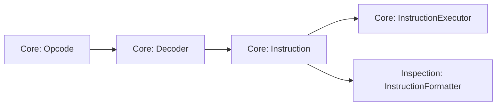

# Instruction Execution Architecture

The instruction-execution subsystem implements the CHIP-8 fetch/decode/execute cycle while keeping binary instruction encoding separate from execution semantics.

At a high level:

```text
ProgramCounter + Memory
        ↓
       Cpu
        ↓
      Opcode
        ↓
     Decoder
        ↓
  typed Instruction
        ↓
InstructionExecutor ← Chip8InstructionSet + Chip8Quirks
        ↓
 ExecutionContext
        ↓
machine-state changes
```

The central architectural boundary is the typed `Instruction`.

The decoder answers:

> What instruction and operands does this opcode encode?

The active `Chip8InstructionSet` answers:

> Which instruction semantics belong to this machine?

The active `Chip8Quirks` answers:

> How do instructions shared by supported variants behave on this machine?

Before the decoder boundary, the implementation deals with encoded instruction bytes and opcode validation. After that boundary, execution works with semantic instruction data and no longer needs to interpret opcode bit fields.

Instruction-set membership and shared-instruction quirks are deliberately separate. A SUPER-CHIP-only instruction is not modeled as a base instruction plus an `"unsupported"` quirk value; its semantics come from the selected instruction set. Quirks are reserved for demonstrated behavioral variation in instructions shared by the supported machine families.

## In this document

- [Responsibilities](#responsibilities)
- [Fetch, Decode, and Execute Cycle](#fetch-decode-and-execute-cycle)
- [Typed Instructions and the Decoder Boundary](#typed-instructions-and-the-decoder-boundary)
- [Instruction Executor](#instruction-executor)
- [Execution Context](#execution-context)
- [Execution Errors and Invariant Ownership](#execution-errors-and-invariant-ownership)
- [Testing and Verification](#testing-and-verification)
- [Related Documentation](#related-documentation)
- [Design Summary](#design-summary)

## Responsibilities

Instruction execution is divided among four collaborating concepts:

- `Cpu` owns one fetch/decode/execute cycle;
- `Decoder` translates an encoded `Opcode` into a typed `Instruction`;
- `InstructionExecutor` applies the semantics of that instruction;
- `ExecutionContext` exposes the machine state and capabilities required by instruction execution.

These responsibilities deliberately remain separate.

`Cpu` does not contain the semantics of individual CHIP-8 instructions. `Decoder` does not mutate machine state. `InstructionExecutor` does not fetch bytes or decode opcode fields. `ExecutionContext` aggregates resources without deciding how instructions use them.

This separation keeps instruction encoding, execution orchestration, semantic behavior, and machine-state ownership independently understandable and testable.

It also creates a reusable semantic boundary. The disassembler consumes the same decoded `Instruction` representation without depending on CPU execution or reproducing opcode-decoding logic.

## Fetch, Decode, and Execute Cycle

Each call to `Cpu.step()` processes one CHIP-8 instruction.

The current cycle is:

```text
0. If ExitState is exited, return without fetching
1. Read the program counter
2. Read two bytes from memory
3. Assemble the bytes into an Opcode
4. Advance the program counter by two bytes
5. Decode the Opcode into an Instruction
6. Execute the Instruction
```

CHIP-8 instructions are two bytes wide, so normal sequential advancement is encapsulated by `ProgramCounter.advance()` using `INSTRUCTION_SIZE`.

The exit guard is deliberately checked before the program counter is read or memory is fetched. Once SUPER-CHIP `00FD` marks the interpreter as exited, later CPU steps are inert until machine initialization resets `ExitState`.

### Fetching the instruction word

The program counter identifies the first byte of the instruction to execute.

For example:

```text
PC = 0x200

memory[0x200] = 0x6A
memory[0x201] = 0x42
```

The CPU combines the bytes in big-endian order:

```text
0x6A 0x42
   ↓
0x6A42
```

The resulting value is passed through the `Opcode` domain type before decoding.

Fetching belongs to `Cpu` because it is part of instruction-execution orchestration. `ProgramCounter` stores and updates an address; it does not read memory or decode instructions.

### Normal advancement happens before execution

After fetching the instruction word, the CPU advances the program counter before decoding and executing it.

For an instruction beginning at `0x200`:

```text
fetch from 0x200
      ↓
PC becomes 0x202
      ↓
decode and execute
```

This establishes an important executor invariant:

> When instruction semantics begin, the program counter already points to the next sequential instruction.

Ordinary instructions therefore leave the program counter unchanged.

### Control-flow instructions override normal flow

Instructions that alter control flow modify the already-advanced program counter.

For a jump:

```text
0x200  1300  JP 0x300

fetch at 0x200
      ↓
PC = 0x202
      ↓
execute JP 0x300
      ↓
PC = 0x300
```

Calls benefit from the same convention. When `CALL` executes, the program counter already contains the correct return address:

```text
0x200  2300  CALL 0x300

fetch at 0x200
      ↓
PC = 0x202
      ↓
push 0x202
      ↓
PC = 0x300
```

Taken skip instructions simply perform one additional `ProgramCounter.advance()` after the CPU's normal advance.

This gives a simple ownership rule:

```text
Cpu
  → owns normal sequential advancement

InstructionExecutor
  → owns instruction-specific control-flow changes
```

Those instruction-specific changes include jumps, calls, returns, taken skips, and retries.

### Interpreter exit stops future instruction attempts

SUPER-CHIP interpreter exit does not throw an exception and does not pause `Chip8Runtime`.

The explicit `00FD` instruction, historical SUPER-CHIP `00C0` behavior, and the historical `Fx1E` index-overflow quirk all converge on the same explicit machine state:

```text
00FD / historical 00C0 / configured Fx1E overflow
  → ExitState.exit()
```

`00FD` and `00C0` are SUPER-CHIP 1.1 instruction semantics. `Fx1E` is different: the instruction is shared, while its overflow behavior varies and therefore remains a quirk.

The next `Cpu.step()` observes that state before fetch:

```text
Cpu.step()
    ↓
ExitState exited?
    ├── yes → return
    └── no  → fetch / advance / decode / execute
```

This keeps interpreter-exit semantics inside the emulated machine rather than coupling an instruction or historical boundary condition to host lifecycle policy. A host may choose how to react to an exited machine, but Core does not translate interpreter exit into runtime pause, callback invocation, or process termination.

Machine initialization resets `ExitState`, so reset or program initialization makes the CPU executable again.

### Waiting instructions restore the current address

Some instructions cannot complete immediately.

For example, `Fx0A` waits for the keyboard's required key-release event. If no completed event is available, the executor rewinds the program counter by one instruction so the same instruction is fetched again on a later CPU opportunity.

```text
instruction starts at 0x200
        ↓
CPU advances to 0x202
        ↓
Fx0A cannot complete
        ↓
PC restored to 0x200
```

Sprite drawing uses the same retry pattern when the resolved draw-timing quirk requires vertical-blank-gated drawing and no vertical-blank opportunity is available.

Quirks configured for immediate drawing do not wait or rewind for vertical blank.

This is normal emulated control flow, not a scheduler pause and not an exception. The CPU step completes, but the program counter again points at the waiting instruction.

### Decode failures occur after normal advancement

The current implementation advances the program counter before calling `Decoder`.

Consequently, if decoding throws `InvalidOpcodeError`, no instruction semantics are applied, but the program counter has already advanced to the next sequential address.

Execution is not transactional, so callers should not assume that an exception from `Cpu.step()` leaves the complete machine state exactly as it was before the step began.

## Typed Instructions and the Decoder Boundary

`Opcode` and `Instruction` represent different levels of understanding.

An `Opcode` is a validated 16-bit encoded value:

```text
6A42
```

Its meaning is still implicit in its bit layout. After decoding, the same word becomes semantic data:

```ts
{
  kind: "load-immediate",
  opcode: opcode(0x6a42),
  register: registerIndex(0xa),
  value: byte(0x42),
}
```

The decoder therefore marks the transition from encoded representation to semantic representation:

```text
encoded Opcode
      ↓
   Decoder
      ↓
typed Instruction
```

### `Instruction` is a discriminated union

The public `Instruction` type is a closed union of supported instruction shapes. Each shape contains a string-literal `kind` discriminator and only the operands meaningful to that instruction.

For example:

```ts
interface LoadImmediateInstruction {
  readonly kind: "load-immediate";
  readonly opcode: Opcode;
  readonly register: RegisterIndex;
  readonly value: Byte;
}

interface JumpInstruction {
  readonly kind: "jump";
  readonly opcode: Opcode;
  readonly address: Address;
}
```

TypeScript can then narrow safely:

```ts
switch (instruction.kind) {
  case "load-immediate":
    instruction.register;
    instruction.value;
    break;

  case "jump":
    instruction.address;
    break;
}
```

This is preferable to a generic object with optional `x`, `y`, `n`, `nn`, and `nnn` fields, where every consumer would need to remember which fields are valid for which instruction family.

The union makes invalid combinations harder to represent and moves useful knowledge into the type system.

### Semantic operands use domain types

Decoded instructions preserve existing Core domain types where appropriate:

```text
address operand    → Address
8-bit immediate    → Byte
register operand   → RegisterIndex
source word        → Opcode
```

The executor therefore receives already-validated semantic operands rather than unqualified numbers that need to be interpreted again.

### `Decoder` owns opcode-field interpretation

`Decoder` extracts encoded fields such as `x`, `y`, `n`, `nn`, and `nnn` and converts them into semantic instruction properties.

Once decoding has succeeded, downstream consumers should use those properties rather than decode `instruction.opcode` again.

This is especially important when historical variants assign different semantics to the same encoded operands.

For example, `Bnnn` preserves both:

```text
NNN target address
X register encoded by the instruction
```

in the decoded `JumpWithOffsetInstruction`.

Classic execution uses `V0` as the offset and ignores the decoded X register. CHIP-48 and SUPER-CHIP execution use the decoded `Vx` register.

The executor therefore does not re-decode X from the original opcode when applying CHIP-48-style semantics.

```text
raw opcode fields
      ↓
   Decoder
      ↓
typed semantic fields
      ↓
Core execution / Inspection tooling / future higher-level consumers
```

Keeping one authority for opcode interpretation prevents execution and tooling from drifting into subtly different interpretations of the same bit pattern.

### The original opcode is provenance

Every instruction retains its original `Opcode`.

That value is useful for diagnostics, tracing, disassembly listings, debugging, and conformance failures, but it is not intended to become a second semantic source of truth.

The preferred rule is:

> Use decoded semantic fields for behavior; keep the opcode as provenance.

### Register operations form a nested semantic family

The `8xy*` family is represented as one `register-operation` instruction with a nested `RegisterOperation` discriminator:

```text
register-operation
      ↓
assign | or | and | xor | add | subtract |
shift-right | reverse-subtract | shift-left
```

This models a genuine semantic family without introducing nine almost-identical top-level instruction interfaces.

### Decoding validates raw uncertainty

Not every 16-bit value represents a supported Classic CHIP-8 instruction.

`Decoder` validates encoded constraints and throws `InvalidOpcodeError` when a word does not match a supported form.

That runtime validation belongs at the decoding boundary because the input is still uncertain:

```text
arbitrary Opcode
      ↓
may or may not decode
```

After successful decoding, consumers receive a known `Instruction` union member and can rely on strong typing.

The design principle is:

> Validate uncertainty at the boundary; exploit strong types after the boundary.

### Decoding and executability are separate questions

A successfully decoded instruction is not necessarily executable by every composed machine.

Classic `0mmm` is one example. `Decoder` recognizes it as a `system-call` instruction because the opcode has a defined meaning, but `InstructionExecutor` cannot transfer execution into native CDP1802 machine code.

SUPER-CHIP extends the same principle. `Decoder` recognizes SUPER-CHIP instruction syntax such as `00Cn`, `00FB`, `00FC`, `00FD`, `00FE`, `00FF`, `Fx30`, `Fx75`, and `Fx85` without consulting the active profile.

Instruction-set membership is checked later by `InstructionExecutor`:

```text
Decoder
  asks: what instruction does this opcode represent?

Chip8InstructionSet
  answers: does this machine define these instruction semantics?

InstructionExecutor
  applies those semantics to the composed machine state/capabilities
```

The current executor centralizes the repeated SUPER-CHIP membership check through `requireSuperChipInstruction()`. Classic CHIP-8 and CHIP-48 can therefore share the same decoder while rejecting SUPER-CHIP-only operations before they mutate machine state.

Concrete capabilities still matter after membership has been established. For example, SUPER-CHIP display-control instructions require a switchable display composition, and `Fx30` delegates large-font lookup to the configured `Font` capability. Those capability requirements do not replace the instruction-set check; they are the resources used to carry out semantics that the instruction set has already admitted.

This keeps opcode recognition profile-agnostic and avoids variant-specific decoder branches for instruction encodings that are structurally well-defined. It also lets inspection tools identify supported Classic and SUPER-CHIP instruction forms without making the decoder responsible for machine configuration.

### The typed instruction is shared infrastructure

The same Core semantic model supports execution and passive inspection:



`Decoder` is therefore more than an internal CPU helper. It defines the shared boundary between encoded CHIP-8 representation and semantic instruction data.

Core execution and Inspection tooling can consume that same typed representation without depending on one another or interpreting the opcode independently.

Future higher-level analysis or debugger tooling may consume the same semantic boundary if concrete needs justify it.

## Instruction Executor

`InstructionExecutor` applies one already-decoded `Instruction` to an `ExecutionContext`.

Its public operation is conceptually:

```ts
execute(
  instruction: Instruction,
  context: ExecutionContext,
): void;
```

`InstructionExecutor` receives immutable instruction semantics at construction:

```ts
new InstructionExecutor(profile.instructionSet, profile.quirks);
```

It retains that configuration but no mutable per-execution machine state.

Persistent emulator state remains in the components referenced by `ExecutionContext`.

This distinction is intentional:

```text
Chip8InstructionSet
    → selects instruction-set membership and extension semantics

Chip8Quirks
    → selects behavioral variation of shared instructions

ExecutionContext
    → exposes mutable machine state and execution capabilities
```

Neither the profile nor its instruction-set/quirk configuration belongs inside `ExecutionContext`.

The main `execute()` method is primarily a semantic dispatcher. Two instruction families have enough internal coordination to justify focused private methods:

```text
register-operation
    → executeRegisterOperation()

draw-sprite
    → executeDrawSprite()
```

The draw path further names its three policy decisions through `resolveSpriteDrawTiming()`, `resolveSpriteDrawForm()`, and `resolveSpriteDrawFlag()` rather than embedding all timing, geometry, and `VF` interpretation directly in the dispatch switch.

### Semantic dispatch

`execute()` dispatches on `instruction.kind`.

Because `Instruction` is a discriminated union, each branch receives exactly the operands appropriate to that instruction.

```text
"jump"
  → instruction.address

"load-immediate"
  → instruction.register
  → instruction.value

"draw-sprite"
  → instruction.x
  → instruction.y
  → instruction.height

"set-display-mode"
  → instruction.mode

"scroll-display-down"
  → instruction.rows

"store-rpl-flags" / "load-rpl-flags"
  → instruction.register
```

The executor therefore mirrors the semantic instruction model rather than the binary opcode layout.

### Instruction semantics coordinate focused components

The executor owns instruction-level relationships between machine components. It does not reimplement those components internally.

Examples include:

```text
clear screen
    → DisplayBuffer.clear()

return
    → Stack.pop()
    → ProgramCounter.setValue()

call
    → Stack.push()
    → ProgramCounter.setValue()

load immediate
    → Registers.set()

font address
    → Font.getSpriteAddress()
    → IndexRegister.setValue()

SUPER-CHIP display mode
    → DisplayBuffer.setMode()

SUPER-CHIP scrolling
    → DisplayBuffer scroll operation

RPL transfer
    → Registers
    → RplFlags

interpreter exit
    → ExitState.exit()

random mask
    → RandomNumberGenerator.nextByte()
    → Registers.set()
```

The components retain their own storage rules and invariants; the executor owns the semantic collaboration imposed by the CHIP-8 instruction.

### Arithmetic helpers separate numeric rules from register orchestration

Arithmetic and shifts use focused helpers such as `add8`, `subtract8`, `shiftRight8`, and `shiftLeft8`.

Those helpers calculate values and flags, while the executor decides which CHIP-8 registers receive them:

```text
arithmetic helper
      ↓
{ value, flag }
      ↓
Vx = value
VF = flag
```

`VF` is represented through a single `FLAG_REGISTER = registerIndex(0xf)` domain value rather than a scattered numeric literal.

### Instruction-set semantics and quirks live in execution

Variant-sensitive behavior belongs to instruction semantics rather than opcode decoding, but not every kind of variation is modeled the same way.

`Chip8Quirks` contains only behavioral choices for instructions shared by the supported machine families. Current quirk dimensions include:

```text
8xy6 / 8xyE
    → shift Vx or Vy

8xy1 / 8xy2 / 8xy3
    → reset VF or leave it unchanged

Fx55 / Fx65
    → I += X + 1
    → I += X
    → I unchanged

Bnnn
    → offset from V0
    → offset from encoded Vx

Dxyn timing
    → uniform vertical-blank timing
    → uniform immediate timing
    → display-mode-dependent timing

Fx1E beyond memory
    → continue with the wider I value
    → exit interpreter
```

Sprite overflow is also a quirk, but that choice is supplied to `DisplayBuffer` because the buffer owns sprite-pixel placement.

SUPER-CHIP-only instructions and extension-specific interpretations are different. They are selected by `Chip8InstructionSet`, not represented by `"unsupported"` values inside `Chip8Quirks`:

```text
superchip-1.1
    → 00Cn / 00FB / 00FC scrolling
    → 00FE / 00FF display modes
    → 00FD interpreter exit
    → Fx30 large-font addressing
    → Fx75 / Fx85 RPL transfer
    → historical 00C0 interpreter exit
    → extended Dxy0 sprite forms
    → high-resolution affected-row VF semantics
```

The executor therefore combines two independent axes:

```text
Chip8InstructionSet
    → what semantics exist

Chip8Quirks
    → how shared semantics vary
```

For example, Classic CHIP-8, CHIP-48, and SUPER-CHIP all decode `8xy6` into the same semantic instruction shape containing X and Y operands. Their profiles then select the shared shift quirk:

```text
Classic CHIP-8
    shiftSource = "vy"

CHIP-48
    shiftSource = "vx"

SUPER-CHIP 1.1
    shiftSource = "vx"
```

Likewise, SUPER-CHIP reuses the same `Fx55` / `Fx65` instruction model while selecting the historically appropriate shared quirk:

```text
SUPER-CHIP 1.1
    memoryTransferIndex = "unchanged"
```

By contrast, Classic CHIP-8 does not need a setting such as `interpreterExit = "unsupported"` or `rplFlags = "unsupported"`. Those instructions simply are not part of its selected instruction set.

This avoids both variant-specific decoders for unchanged encodings and profile objects padded with configuration for instructions that do not exist on that machine.

### SUPER-CHIP display instructions preserve display ownership

SUPER-CHIP mode and scrolling instructions are admitted by the `superchip-1.1` instruction set and executed through `DisplayBuffer` rather than by manipulating framebuffer storage directly in `InstructionExecutor`.

The executor first enforces SUPER-CHIP instruction membership through `requireSuperChipInstruction()`. After that guard succeeds, the display capability owns the actual mode or scrolling mutation.

The mode instructions are:

```text
00FE
    → low-resolution mode

00FF
    → high-resolution mode
```

Changing mode preserves the shared backing framebuffer. It changes how the backing pixels are interpreted; it does not imply a clear. The ordinary `00E0` clear instruction likewise clears pixels without changing the current display mode.

SUPER-CHIP scrolling operates in physical backing-buffer units:

```text
00Cn, n > 0
    → scroll down N backing rows

00FB
    → scroll right 4 backing pixels

00FC
    → scroll left 4 backing pixels
```

For the targeted historical SUPER-CHIP 1.1 semantics, `00C0` does not perform a zero-row no-op. Once SUPER-CHIP membership has been established, `rows === 0` means interpreter exit:

```text
00C0
    → ExitState.exit()
```

That historical interpretation belongs to the `superchip-1.1` instruction set rather than to a configurable zero-scroll quirk.

Scrolling itself is mode-independent. Low-resolution logical pixels may occupy 2 × 2 backing pixels, but the scrolling operation still moves the shared physical framebuffer directly.

A fixed Classic/CHIP-48 display cannot grant these semantics to a `chip8` instruction set, and a SUPER-CHIP-capable display cannot grant SUPER-CHIP instruction membership by itself. Instruction semantics and display capability are separate composition concerns.

This keeps responsibilities aligned:

```text
Chip8InstructionSet
    → whether SUPER-CHIP display instructions exist

InstructionExecutor
    → instruction-level intent and historical 00C0 meaning

DisplayBuffer
    → display mode, backing storage, scrolling, pixel placement
```

### Waiting and draw timing remain instruction semantics

`Fx0A` and quirk-controlled sprite drawing demonstrate that the executor can coordinate temporal machine state without owning the scheduler.

`Fx0A` always uses retry-style execution:

```text
Fx0A
  → Keyboard
  → completed release available?
      yes → store key
      no  → rewind PC
```

Sprite draw timing is represented by `SpriteDrawTimingBehavior`, which remains a shared-instruction quirk.

A profile can require one timing rule for every display mode:

```text
{ kind: "uniform", timing: "vertical-blank" }
{ kind: "uniform", timing: "immediate" }
```

or different timing according to the current display mode:

```text
{
  kind: "display-mode",
  low: "vertical-blank",
  high: "immediate",
}
```

`executeDrawSprite()` delegates this decision to `resolveSpriteDrawTiming()`.

When the resolved timing is vertical-blank-gated:

```text
Dxyn
  → VerticalBlank.consume()
      yes → continue draw attempt
      no  → rewind PC
```

When the resolved timing is immediate:

```text
Dxyn
  → do not consult VerticalBlank
  → continue draw attempt immediately
```

Immediate drawing also leaves any already-pending vertical-blank opportunity untouched.

After timing has been resolved, `resolveSpriteDrawForm()` decides the amount and width of sprite data from the decoded instruction, instruction-set identity, and live display mode.

For ordinary `Dxyn`, `n` remains the byte count. `Dxy0` is where instruction-set membership matters:

```text
chip8 instruction set
    Dxy0
    → zero source rows
    → existing zero-height/no-op behavior

superchip-1.1 + low mode
    Dxy0
    → 16 source bytes
    → 8 × 16 logical sprite

superchip-1.1 + high mode
    Dxy0
    → 32 source bytes
    → 16 × 16 sprite
```

The extended interpretation therefore does not come from display capability alone. A machine composed with a switchable display but the `chip8` instruction set still receives base `Dxy0` semantics.

The executor then coordinates:

```text
Registers       → coordinates
IndexRegister   → sprite start
Memory          → sprite bytes
DisplayBuffer   → XOR drawing / draw facts
```

`DisplayBuffer` returns a `SpriteDrawResult` describing facts of the draw rather than deciding complete machine semantics:

```text
collision
collisionRows
clippedBottomRows
```

Finally, `resolveSpriteDrawFlag()` interprets those facts according to instruction-set semantics and display mode:

```text
Classic / CHIP-48
    → VF = boolean collision

SUPER-CHIP low
    → VF = boolean collision

SUPER-CHIP high
    → VF = collisionRows + clippedBottomRows
```

This prevents a high-resolution-capable display from granting SUPER-CHIP `VF` semantics to a machine whose instruction set is still `chip8`.

The resulting draw orchestration remains readable without pushing whole-machine policy into `DisplayBuffer`:

```text
executeDrawSprite()
    ↓
resolveSpriteDrawTiming()
    ↓
resolveSpriteDrawForm()
    ↓
fetch + draw
    ↓
resolveSpriteDrawFlag()
```

### Unsupported execution and exhaustiveness

`InstructionExecutor` uses `UnsupportedInstructionError` when a decoded instruction cannot execute on the configured machine. This includes decoded `0mmm` native calls and rejection of SUPER-CHIP-only operations when the selected instruction set is `chip8`.

```text
invalid encoded word
    → Decoder
    → InvalidOpcodeError

recognized instruction outside the selected instruction set
    → InstructionExecutor
    → UnsupportedInstructionError

recognized but deliberately unimplemented machine operation
    → InstructionExecutor
    → UnsupportedInstructionError
```

SUPER-CHIP membership checks are centralized by `requireSuperChipInstruction()` so `00FD`, display control, `Fx30`, and `Fx75` / `Fx85` apply the same pre-mutation rule.

The current outer switch is not compile-time exhaustive: the default branch handles instruction kinds that have no executor implementation, while explicit branches may also reject a decoded instruction because the active instruction set does not define that operation.

That gives a useful runtime safety net, but a newly added union member may compile and fail only when executed. An exhaustive `never` check would provide stronger compile-time protection, but would require intentionally unsupported execution to be represented more explicitly.

The current implementation keeps the runtime default. Future instruction-set work may provide evidence for revisiting that tradeoff.

### SUPER-CHIP state-transfer instructions use focused capabilities

Several SUPER-CHIP instructions extend machine semantics without requiring a new execution architecture.

`Fx30` is admitted by the `superchip-1.1` instruction set and then uses the existing font capability with an explicit size request:

```text
Fx29
    → Font.getSpriteAddress(value, "small")

Fx30
    → requireSuperChipInstruction()
    → Font.getSpriteAddress(value, "large")
```

`ClassicFont` supports the small font and rejects a large-font request. `SuperChipFont` supports both the shared small font and the SUPER-CHIP 1.1 ten-byte large decimal font.

The targeted historical large font contains digits `0` through `9`; values above `9` are intentionally not normalized into a modern hexadecimal large-font interpretation.

`Fx75` and `Fx85` are likewise SUPER-CHIP-only instructions. After the common instruction-set guard, they transfer registers through the explicit `RplFlags` state object:

```text
Fx75
    V0..Vx → RplFlags 0..x

Fx85
    RplFlags 0..x → V0..Vx
```

The supported RPL storage is limited to the eight historical flags corresponding to `V0` through `V7`. `Fx75` and `Fx85` with `x > 7` are rejected by the decoder as invalid instruction encodings, so execution cannot partially mutate the valid RPL range before discovering an invalid endpoint.

RPL lifetime is intentionally longer than ordinary resettable machine state. `MachineInitializer` does not clear `RplFlags`, so instruction execution can observe values preserved across reset or program initialization when the host reuses the same RPL store.

Instruction-set membership and resource lifetime remain separate concerns:

```text
Chip8InstructionSet
    → says Fx75 / Fx85 exist

RplFlags + host composition
    → provide storage and decide how long it lives
```

## Execution Context

`ExecutionContext` groups the machine components required by instruction execution into one typed dependency aggregate.

Its current shape is:

```ts
export interface ExecutionContext {
  readonly registers: Registers;
  readonly memory: Memory;
  readonly stack: Stack;
  readonly programCounter: ProgramCounter;
  readonly indexRegister: IndexRegister;
  readonly soundTimer: Timer;
  readonly delayTimer: Timer;
  readonly displayBuffer: DisplayBuffer;
  readonly verticalBlank: VerticalBlank;
  readonly keyboard: Keyboard;
  readonly font: Font;
  readonly randomNumberGenerator: RandomNumberGenerator;
  readonly rplFlags: RplFlags;
  readonly exitState: ExitState;
}
```

The context has no machine behavior of its own. It provides stable access to the components that own state and capabilities. `ExecutionContext` deliberately does not contain `Chip8Profile`, `Chip8InstructionSet`, or `Chip8Quirks`.

Those values configure the machine when components are composed; they are not mutable machine state or execution capabilities.

For example:

```text
profile.instructionSet + profile.quirks
    → InstructionExecutor constructor

profile.quirks.spriteOverflow
    → DisplayBuffer constructor

profile.display.specification
    → DisplayBuffer constructor

profile.fonts.small / profile.fonts.large
    → font composition and machine initialization

ExecutionContext
    → references the resulting configured components
```

This keeps configuration separate from live state.

### Why an aggregate exists

Different instructions need different combinations of components. Passing every possible dependency separately to `execute()` would produce a large, noisy parameter list.

Instead:

```ts
executor.execute(instruction, context);
```

expresses the real relationship:

> Execute this instruction against this set of machine resources.

The aggregate reduces parameter noise without hiding the underlying component boundaries.

### `readonly` protects wiring, not state

Context properties are `readonly`, which prevents replacing a component reference through the context:

```ts
context.registers = otherRegisters; // not allowed
```

It does not make the referenced component immutable:

```ts
context.registers.set(...); // expected mutation
```

So the wiring is stable while the emulated machine state remains mutable.

### The context does not own its components

Applications construct components and then group those existing objects into an `ExecutionContext`.

```text
Application composition root
        ↓
construct components
        ↓
ExecutionContext
        ↓
Cpu / MachineInitializer
```

The context describes which objects participate in machine operations; it does not decide which implementations should be constructed.

That remains an application-composition responsibility.

### The context is not a `Chip8Machine`

Although the context references most instruction-visible machine resources, it deliberately does not become a complete machine façade.

It has no `run()`, `pause()`, `reset()`, `loadRom()`, or rendering lifecycle. It does not own the scheduler, clock, runtime, host audio, host rendering, filesystem access, or application lifecycle.

Its scope is narrower:

```text
ExecutionContext
    → resources needed by machine operations
```

rather than:

```text
Chip8Machine
    → one object owning the entire emulator lifecycle
```

This preserves application-owned composition and avoids combining machine state, execution, initialization, scheduling, and host integration merely for construction convenience.

### An interface fits the role

`ExecutionContext` defines a structural contract rather than an object with its own behavior, invariants, or lifecycle, so an interface is sufficient.

Applications can construct it directly as an object literal. The meaningful constructors remain on the components themselves.

The types inside the context are intentionally not all interfaces. Some roles have demonstrated substitution needs—such as `Memory`, `Keyboard`, `Font`, and `RandomNumberGenerator`—while several focused state objects currently use concrete Core implementations.

Those are separate design questions:

```text
ExecutionContext interface
    → how are dependencies grouped?

component abstraction
    → does this role need multiple implementations?
```

The project does not add interfaces merely for symmetry.

### Dependency injection remains explicit

The execution graph is assembled through ordinary TypeScript composition:

```text
Application
   ├── selects Chip8Profile
   ├── constructs machine components from profile characteristics
   ├── constructs ExecutionContext
   ├── constructs Decoder
   └── constructs InstructionExecutor(
         profile.instructionSet,
         profile.quirks,
       )
             ↓
            Cpu
```

This is dependency injection without a DI framework: consumers receive dependencies instead of constructing them internally, while the graph remains visible in code.

### One context represents one composed machine state

A `Cpu` retains one `ExecutionContext` and performs subsequent steps against those same component references.

Persistent state survives from one instruction to the next because the components retain it—not because the executor stores anything.

`MachineInitializer` can reuse the same aggregate when establishing or resetting the state of those already-constructed components.

Not every referenced state object has the same reset lifetime. In particular:

```text
ordinary machine state
    registers / timers / stack / display / ExitState
    → reset during initialization

RplFlags
    → deliberately preserved during initialization
```

That lifetime distinction belongs to initialization policy, not to `InstructionExecutor`; execution simply reads and writes the provided state object.

The resulting responsibility split is:

```text
Component
    → owns focused state or behavior

ExecutionContext
    → groups components needed by machine operations

Application
    → owns construction and composition
```

## Execution Errors and Invariant Ownership

Instruction execution crosses several validation boundaries. Each layer validates the invariant it has enough information to own.

### Domain types validate local numeric invariants

Core uses branded numeric types such as `Address`, `Byte`, `Opcode`, and `RegisterIndex`.

Their factory functions validate properties that can be decided from the value alone:

```text
byte(value)          → integer in 0x00..0xFF
opcode(value)        → integer in 0x0000..0xFFFF
registerIndex(value) → integer in 0x0..0xF
address(value)       → non-negative integer
```

Invalid values produce `RangeError`. Once created, the branded type records that validation for downstream TypeScript code.

### Context-dependent invariants stay with components

An `Address` deliberately has no fixed maximum because whether an address is usable depends on the concrete memory instance.

```text
Address
    → is this structurally an address?

Ram
    → does this address fit this memory?
```

Likewise, `ProgramCounter` stores and advances `Address` values without duplicating memory-size validation. If execution moves outside available RAM, the later `Memory.read()` fails where that contextual information is available.

`Fx1E` is a deliberate quirk-sensitive exception: historical SUPER-CHIP defines leaving the 4 KiB address space through that shared instruction as interpreter exit, so `InstructionExecutor` compares the resulting `I` value with the configured memory size when the `indexOverflow` quirk selects `"exit-interpreter"`.

`Stack` similarly owns capacity and underflow. `InstructionExecutor` calls `push()` and `pop()` rather than reproducing stack validation itself.

The general rule is:

> Validate an invariant at the lowest layer that has enough information to own it.

### Encoding and execution failures are distinct

The main error boundaries are:

| Boundary              | Responsibility                               | Failure                       |
| --------------------- | -------------------------------------------- | ----------------------------- |
| Domain factory        | numeric value fits its domain                | `RangeError`                  |
| `Ram`                 | address fits configured memory               | `RangeError`                  |
| `Stack`               | capacity / underflow                         | `RangeError`                  |
| `Decoder`             | opcode and encoded operands are valid        | `InvalidOpcodeError`          |
| `InstructionExecutor` | decoded instruction has executable semantics | `UnsupportedInstructionError` |
| `RplFlags`            | register index fits RPL storage              | `RangeError`                  |
| Waiting semantics     | key or vblank not ready                      | normal retry, no error        |

This distinguishes malformed numeric data, unsupported encoded words, recognized-but-unexecutable instructions, concrete machine-state violations, and ordinary emulated waiting.

### Errors normally propagate

`Cpu`, `InstructionExecutor`, and focused components generally do not catch and translate one another's failures.

A decoder error, memory `RangeError`, or stack `RangeError` propagates to the caller with the information provided by the layer that owns the violated invariant.

Applications can decide how to present or respond to those failures at their own boundary.

### Execution is not transactional

Instruction execution does not currently provide rollback semantics.

If an instruction performs several mutations and a later operation fails, earlier successful mutations may remain. Sequential register/memory transfers are one example: earlier writes or loads can complete before a later out-of-range memory access throws.

The CPU also advances the program counter before decoding and execution.

Therefore:

> Catching an execution exception does not imply that the complete machine state is unchanged from before `Cpu.step()` began.

Execution failures represent violated program, machine, or API assumptions rather than a normal recovery mechanism.

### Waiting is normal state, not failure

Retry-style instructions do not use exceptions.

```text
temporary emulated condition
    → model through state and control flow

violated invariant / unsupported operation
    → throw an error
```

This keeps CHIP-8 waiting behavior inside the emulated machine model rather than turning it into host-language exception handling.

## Testing and Verification

The execution architecture is verified at the narrowest boundary that owns each behavior:

```text
Decoder tests
    → encoded opcode → typed Instruction

InstructionExecutor tests
    → semantics of an already-decoded instruction

Cpu tests
    → fetch / pre-advance / decode / execute orchestration

component tests
    → local state invariants

conformance tests
    → composed historical-machine behavior against external ROMs
```

### Focused tests

Decoder tests validate instruction recognition, operand extraction, and rejection of invalid encodings without involving machine-state mutation.

Executor tests start after decoding and use typed instructions directly. They protect semantic boundaries such as arithmetic flags, register aliasing, shared-instruction quirk choices, draw timing and geometry, SUPER-CHIP instruction-set isolation, display control, large-font lookup, RPL transfer, and interpreter exit.

CPU tests cover pipeline behavior that does not belong to one instruction implementation: big-endian fetch, normal pre-advance, control-flow overrides, retry by restoring the instruction address, and the pre-fetch `ExitState` guard.

The important rule is:

> Test behavior where its responsibility lives; use broader tests only to verify collaboration among those responsibilities.

### External conformance

External ROMs provide independent evidence that the composed implementation matches historical expectations. The current suite includes Classic CHIP-8 tests, Gulrak's multi-profile Variant Detection Test, and pinned Timendus v4.2 legacy SUPER-CHIP Quirks/Scrolling automation.

Conformance does not replace focused tests. A ROM can reveal a mismatch without identifying whether it originated in decoding, instruction-set membership, quirks, memory, display behavior, timing, or another collaborator.

The detailed Classic behavior inventory remains in the [Classic opcode coverage audit](../reference/classic-opcode-audit.md), while SUPER-CHIP target/evidence is recorded in the [SUPER-CHIP 1.1 coverage audit](../reference/superchip-1.1-coverage-audit.md) and fixture details live in the [conformance README](../../packages/core/tests/conformance/README.md).

## Related Documentation

- [Architecture overview](./overview.md) — places execution in the wider Core architecture.
- [Machine profiles and variation](./machine-profiles-and-variation.md) — owns the `instructionSet` / shared-quirk profile model.
- [Machine lifecycle](./machine-lifecycle.md) — construction, initialization, reset, runtime startup, and state lifecycle.
- [Disassembly architecture](./disassembly.md) — reuses the same `Decoder` and typed `Instruction` boundary for read-only inspection.
- [Classic opcode audit](../reference/classic-opcode-audit.md) — supported instruction behavior and verification evidence.
- [ADR 0003 — Explicit CHIP-8 domain value types](../decisions/0003-domain-value-types.md) — rationale for types such as `Address`, `Byte`, `Opcode`, and `RegisterIndex`.
- [ADR 0009 — Separate opcode decoding from instruction execution semantics](../decisions/0009-separate-decoding-from-execution.md) — historical decision behind the typed instruction boundary.
- [ADR 0012 — Application-owned composition](../decisions/0012-application-owned-composition.md) — why Core does not own a mandatory machine factory or composition container.
- [ADR 0013 — Emulated display timing](../decisions/0013-emulated-display-timing.md) — rationale for vblank-gated Classic drawing.

## Design Summary

The instruction-execution architecture follows a small set of recurring rules:

```text
encoded uncertainty
    → validate and decode once

semantic instruction
    → execute through strong types

instruction-set membership
    → selects which variant-specific semantics exist

shared-instruction quirks
    → select demonstrated behavioral variation

mode-sensitive behavior
    → resolve from configured semantics + live machine state

normal PC progression
    → owned by Cpu

instruction-specific control flow
    → owned by InstructionExecutor

focused state invariants
    → owned by focused components

machine composition
    → owned by applications

waiting conditions
    → represented as emulated state, not exceptions
```

Together, these boundaries allow Classic CHIP-8, CHIP-48, and historical SUPER-CHIP 1.1 to share one decoding and execution architecture without forcing extension-only semantics into a generic compatibility object. The same seams remain available for future CHIP-8-family variation when concrete requirements justify extending them.
