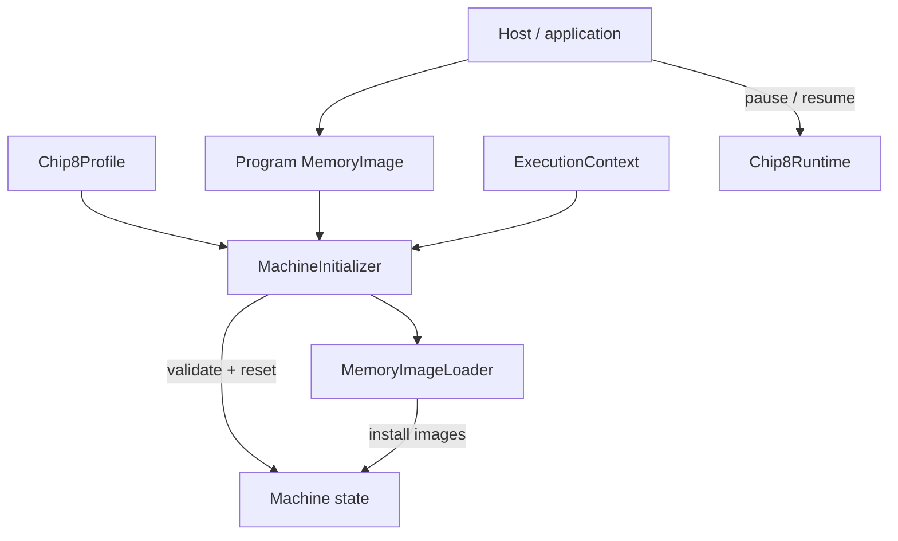

# Machine Initialization Architecture

Machine initialization establishes a valid starting state for an already-constructed CHIP-8 machine.

At a high level:

```text
Application composition
    ↓
ExecutionContext + Chip8Profile + Program MemoryImage
    ↓
MachineInitializer
    ├── validate layout
    ├── reset machine state
    ├── install font image
    └── install program image
```

The central rule is:

> Construction chooses the objects; initialization validates their relationships and establishes the machine's starting state.

This keeps object composition, memory loading, reset semantics, host I/O, and runtime execution as separate responsibilities.

See also:

- [Architecture overview](./overview.md)
- [Machine state and capabilities architecture](./machine-state-and-capabilities.md)
- [Machine lifecycle](./machine-lifecycle.md)
- [Instruction execution architecture](./instruction-execution.md)
- [ADR 0012 — Application-owned composition](../decisions/0012-application-owned-composition.md)

## Responsibility Model

Initialization is built from three concepts at different semantic levels:

```text
MemoryImage
    → immutable binary contents

MemoryImageLoader
    → generic contiguous placement

MachineInitializer
    → CHIP-8-specific initialization policy
```

### `MemoryImage`: contents without placement

`MemoryImage` represents an immutable sequence of validated `Byte` values.

It answers:

> What bytes belong to this binary image?

It does not decide where those bytes belong in memory.

That separation lets the same abstraction represent:

```text
ROM program
font image
test data
future binary resources
```

The image copies its source data, so later mutations of the original iterable do not change the stored definition.

### `MemoryImageLoader`: placement without meaning

`MemoryImageLoader` performs one generic operation:

```text
load this image
into this Memory
starting at this Address
```

It writes sequentially:

```text
start
start + 1
start + 2
...
```

The loader does not know whether the image is a font, program, sprite table, or test fixture.

It also does not duplicate concrete memory bounds logic.

```text
MemoryImageLoader
    → sequential placement

Memory
    → concrete address-space validity
```

### `MachineInitializer`: semantic machine setup

`MachineInitializer` knows the CHIP-8-specific relationship among:

```text
machine profile
font image
program image
program start address
machine reset state
```

It receives:

```text
ExecutionContext
Chip8Profile
MemoryImage program
```

and establishes a valid starting machine.

It does not:

- construct components;
- read ROM files;
- choose keyboard/display implementations;
- create or control the scheduler;
- resume execution;
- render or present anything.

Its responsibility is:

> Given an already-composed machine, a machine profile, and a program image, establish the defined initial state.

## Construction and Initialization

Construction and initialization are deliberately separate.

Construction creates valid component instances:

```ts
const memory = new Ram(profile.memorySize);
const stack = new Stack(profile.stackCapacity);
const displayBuffer = new DisplayBuffer(
  profile.display.width,
  profile.display.height,
);
```

At that point, the object graph exists.

Initialization establishes the relationships that make it a runnable machine:

```text
font installed
program installed
PC at program start
registers/stack/timers reset
display cleared
vblank reset
keyboard interpreter state reset
```

The distinction is:

```text
construction
    → "these objects exist"

initialization
    → "these objects represent a valid starting machine"
```

That lets applications choose concrete implementations without making every constructor understand the complete emulator.

## Initialization Inputs

Each `initialize()` input contributes a different kind of information.

### `ExecutionContext`

The context supplies the actual components to mutate:

```text
Memory
Registers
Stack
ProgramCounter
IndexRegister
DelayTimer
SoundTimer
DisplayBuffer
VerticalBlank
Keyboard
```

The initializer coordinates them for one lifecycle operation but does not own them.

### `Chip8Profile`

The profile supplies stable machine-definition data used by initialization:

```text
expected memory size
program start address
font image
font base address
```

These are definition/reset sources rather than current execution values.

### Program `MemoryImage`

The program image supplies immutable ROM bytes.

The host owns obtaining those bytes:

```text
file system
browser upload
network
embedded resource
test fixture
```

Core initialization begins only after the host-specific bytes have been converted into a `MemoryImage`.

## Validate Before Mutate

The initializer validates all known layout relationships before changing machine state.

Current checks include:

```text
font image is non-empty
program image is non-empty

context memory size
    =
profile memory size

font range fits memory
program range fits memory

font and program ranges do not overlap
```

Only after those checks succeed does the reset/load phase begin.

This gives a useful failure guarantee:

> Known invalid profile/program relationships are rejected before the existing machine state is modified.

That matters especially during reset or ROM replacement.

```text
existing machine
    ↓
attempt invalid initialization
    ↓
validation fails
    ↓
existing state remains intact
```

### Structural vs semantic validation

`MemoryImage` may legitimately be empty because it is a generic binary-value abstraction.

Machine initialization has stronger semantics:

```text
font image
    → must contain data

program image
    → must contain data
```

Likewise:

```text
Address
    → validates one address-shaped value

Memory
    → validates one concrete access

MachineInitializer
    → validates relationships among
      destination + image length + profile + memory size
```

The rule is:

> Low-level types validate structural invariants; higher-level operations validate semantic relationships.

### Memory-size agreement

The initializer requires:

```text
context.memory.size === profile.memorySize
```

A mismatch is rejected rather than silently resizing or replacing memory.

Those would be composition decisions belonging to the application.

### Half-open ranges

Memory layout uses half-open ranges:

```text
[start, start + length)
```

For a four-byte image at `0x200`:

```text
[0x200, 0x204)

0x200
0x201
0x202
0x203
```

An image fits memory of size `N` when:

```text
start + length <= N
```

Two ranges overlap when:

```text
firstStart < secondEnd
and
secondStart < firstEnd
```

This representation naturally allows adjacency:

```text
font    [0x050, 0x0A0)
program [0x0A0, 0x200)

no overlap
```

The semantic relationship belongs in `MachineInitializer` because no lower-level object has all the required information.

## Initialization Sequence

Once validation succeeds, the current mutation order is:

```text
memory.clear()
registers.clear()
stack.clear()

I  = 0
PC = profile.programStartAddress

DT = 0
ST = 0

displayBuffer.clear()
verticalBlank.reset()
keyboard.reset()

load profile font image
load program image
```

This can be understood in four stages.

### 1. Clear mutable collections

```text
Memory
Registers
Stack
```

are cleared so previous execution state cannot leak into the new run.

### 2. Restore control/scalar state

```text
I  = 0
PC = program start
DT = 0
ST = 0
```

re-establish the machine's initial control and timer state.

### 3. Reset display/input synchronization state

```text
DisplayBuffer.clear()
VerticalBlank.reset()
Keyboard.reset()
```

restore the relevant interpreter-visible state.

Keyboard reset is semantic rather than physical: it clears transient `Fx0A` interpretation while preserving keys that remain pressed.

### 4. Reinstall definition data

The initializer loads:

```text
1. profile font image
2. program image
```

through `MemoryImageLoader`.

Successful prevalidation already guarantees that the two ranges fit and do not overlap, so correctness does not depend on load order. The order simply reflects the conceptual sequence:

```text
install machine/system data
        ↓
install user program
```

## Prevalidated, Not Fully Transactional

The initializer provides strong protection against the layout failures it understands, but it is not a general rollback transaction.

The guarantee is:

```text
known invalid layout
    ↓
throw before mutation
    ↓
old state preserved
```

There is no general mechanism such as:

```text
snapshot complete machine
        ↓
attempt initialization
        ↓
any later error?
        ↓
restore previous state
```

### Loader behavior

`MemoryImageLoader` writes incrementally:

```text
byte 0
byte 1
byte 2
...
```

through `Memory.write()`.

With standard `Ram`, successful layout validation and memory-size agreement rule out normal out-of-range image writes before loading begins.

A custom `Memory` implementation could still throw unexpectedly after mutation has started.

For example:

```text
validation succeeds
        ↓
old state cleared
        ↓
font loaded
        ↓
part of program loaded
        ↓
Memory.write() throws
```

The previous complete machine state is not restored automatically.

The distinction is:

```text
prevalidation guarantee
    → known setup/layout errors are failure-atomic

full transactional guarantee
    → every later collaborator failure rolls back
    → not currently provided
```

### Why no general rollback today?

General rollback would require machinery for:

```text
complete memory snapshot
register/stack snapshot
display snapshot
keyboard semantic snapshot
restore ordering
rollback error handling
```

The standard component graph does not currently justify that complexity.

The design instead chooses:

```text
validate everything the initializer can know
        +
depend on trustworthy component contracts
        =
simple deterministic initialization
```

If future hot-swapping or pluggable backends require stronger failure atomicity, that would provide concrete evidence for revisiting the boundary.

### Error propagation

Layout errors owned by the initializer are reported directly.

Errors from collaborators such as:

```text
Memory
Keyboard
MemoryImageLoader
other state components
```

propagate outward rather than being wrapped merely for uniformity.

The application decides how initialization failures should be presented.

## Reset and ROM Replacement

Initialization is reusable.

The same operation supports:

```text
first initialization
    → establish state after construction

reset
    → establish the same initial-state contract
      on existing components
```

### Reset preserves component identity

A normal reset can reuse the complete object graph:

```text
runtime.pause()
      ↓
MachineInitializer.initialize(
  existing context,
  same profile,
  same program
)
      ↓
runtime remains paused
```

The same component instances remain wired:

```text
DisplayBuffer
Timers
Keyboard
Ram
Registers
ExecutionContext
Chip8Runtime
```

Only the relevant machine state is re-established.

This is useful for hosts whose adapters already reference those objects.

### Writable memory must be rebuilt

CHIP-8 memory is writable, so previous execution may have changed:

```text
program bytes
font bytes
data regions
```

Reset therefore rebuilds memory from immutable definition sources:

```text
Memory.clear()
    ↓
profile.fontImage
    ↓
stored program MemoryImage
```

The live memory is not treated as the reset source.

### The program image is a reset source

A host that wants deterministic reset should retain the immutable program `MemoryImage`.

After execution:

```text
live Memory
    ≠
original program image
```

Reset uses the original image again.

That makes the program image naturally part of application/session definition rather than mutable execution state.

### Reset and replacement are distinct policies

Reset usually means:

```text
same profile
same program
same component graph
```

In-place ROM replacement can mean:

```text
same profile
new program
same component graph
```

while a host may instead choose:

```text
new program
new component graph
new session
```

Both are valid.

`MachineInitializer` supports reuse because the program is an input:

```ts
initialize(context, profile, program);
```

but it does not require reuse.

### Current Web-host example

The current Web host demonstrates both approaches.

For reset, it reuses the current session.

For loading a different ROM, it tears down the current host session and composes a new machine.

That is application policy, not Core policy.

The initialization boundary supports both without changing its contract.

## Runtime and Host Boundaries

`MachineInitializer` does not pause or resume `Chip8Runtime`.

The application coordinates lifecycle explicitly:

```text
pause runtime
      ↓
initialize machine
      ↓
render / update host state
      ↓
resume if desired
```

This preserves clear ownership:

```text
Application
    → lifecycle coordination

Chip8Runtime
    → temporal progression

MachineInitializer
    → machine-state initialization
```

Initialization should not run concurrently with scheduled CPU/timer/display work; the caller is responsible for arranging a safe lifecycle context.

### Initialization does not automatically resume

A reset can intentionally leave the runtime paused at the program start.

This is useful for debugging and user control.

Initialization never decides whether execution should continue afterward.

### Host I/O stops before Core initialization

`MachineInitializer` never receives host-specific objects such as:

```text
File
path
URL
upload control
terminal argument
```

The host performs I/O first:

```text
browser File
    ↓
Uint8Array
    ↓
MemoryImage
    ↓
MachineInitializer
```

or:

```text
filesystem path
    ↓
Deno.readFile()
    ↓
Uint8Array
    ↓
MemoryImage
    ↓
MachineInitializer
```

This keeps Core independent of browser, terminal, filesystem, and network APIs.

### Application-session state remains outside

Reset or ROM replacement may also involve:

```text
stop animation loop
silence audio
change status text
update buttons
render cleared screen
remember ROM name
reset debugger UI
```

Those are application/session concerns.

```text
MachineInitializer
    → emulator state

Host/application
    → session and presentation state
```

### Capability providers are not reconstructed

In-place reset preserves injected providers unless their semantic contract explicitly participates in reset.

For example:

```text
Keyboard
    → same instance
    → interpreter wait state reset

RandomNumberGenerator
    → same instance
    → provider-owned state preserved
```

If a host wants a new RNG or keyboard implementation for a new session, it can reconstruct the machine graph.

Core does not silently replace injected dependencies.

## Reset / Replacement Matrix

| Operation                   | Program image | Component graph | Runtime policy                                             |
| --------------------------- | ------------- | --------------- | ---------------------------------------------------------- |
| First start                 | new           | new             | application resumes when ready                             |
| Reset                       | same          | usually reused  | pause, initialize, then remain paused or resume explicitly |
| In-place ROM replacement    | new           | reused          | caller coordinates pause/resume                            |
| New-session ROM replacement | new           | rebuilt         | old session stopped, new one composed                      |

The key point is:

> Initialization is reusable enough to support reset and in-place ROM replacement, but it does not prescribe the application's session lifecycle.

## Testing and Verification

Initialization is tested at the boundary that owns each responsibility.

```text
MemoryImage tests
    → binary-image value semantics

MemoryImageLoader tests
    → generic placement

MachineInitializer tests
    → CHIP-8 layout/reset policy
      and failure-before-mutation guarantees
```

### `MemoryImage`

Tests verify:

```text
ordinary byte iterables accepted
Uint8Array input accepted
source data copied
invalid byte values rejected
```

The copy test protects `MemoryImage` as an immutable definition source.

### `MemoryImageLoader`

Tests verify sequential placement:

```text
image = [0x10, 0x20, 0x30]
start = 0x300

memory[0x300] = 0x10
memory[0x301] = 0x20
memory[0x302] = 0x30
```

They also verify memory outside the image range remains unchanged.

Out-of-range behavior is exercised through real `Ram`, confirming that concrete address validation belongs to `Memory` and its errors propagate through the loader.

### `MachineInitializer`

Initializer tests compose real Core state/capability components and verify the complete reset contract.

The machine is deliberately made non-initial first, then initialization is expected to restore:

```text
memory
registers
stack
PC
I
timers
display
vertical blank
keyboard interpreter state
font image
program image
```

### Keyboard and RNG lifecycle evidence

The tests explicitly protect two subtle lifecycle boundaries.

Keyboard:

```text
held key preserved
old Fx0A wait discarded
```

RNG:

```text
provider progression preserved across machine initialization
```

This confirms that reset scope follows semantic ownership rather than blindly resetting every dependency.

### Failure-before-mutation evidence

Initializer tests seed observable machine state, attempt invalid initialization, and then verify the old state remains unchanged.

Covered invalid cases include:

```text
program too large
font too large
font/program overlap
memory/profile size mismatch
empty font image
empty program image
```

These tests prove:

```text
known invalid layout
    ↓
throw
    ↓
mutation phase never begins
```

They do not claim general rollback for arbitrary later collaborator failures.

### Boundary hardening opportunities

The documented half-open range model naturally permits:

```text
image ending exactly at memory end
font/program exactly adjacent
```

Explicit regression tests for those two boundary cases would strengthen the contract further.

That is a test-hardening opportunity, not evidence of a current defect.

### Verification rule

The overall testing rule is:

> Verify generic binary behavior generically, and verify CHIP-8-specific layout/reset semantics at the initializer boundary.

Examples:

```text
source image copied
    → MemoryImage test

bytes placed sequentially
    → MemoryImageLoader test

memory access rejected
    → Ram / loader collaboration

font/program overlap rejected
    → MachineInitializer test

invalid layout preserves previous state
    → MachineInitializer test

keyboard wait state reset correctly
    → MachineInitializer test

RNG provider state preserved
    → MachineInitializer test
```

## Ownership Through Initialization



Ownership remains explicit:

```text
Host/application
    → acquire ROMs
    → construct components
    → coordinate runtime lifecycle

MemoryImage
    → immutable binary definition

MemoryImageLoader
    → generic contiguous placement

MachineInitializer
    → validate memory layout
    → establish/reset machine state
    → decide which images go where

Chip8Runtime
    → temporal progression

State/capability components
    → own resulting state and local semantics
```

## Design Summary

The initialization architecture follows a few stable rules:

1. **Construction and initialization are separate.**\
   Construction chooses objects; initialization establishes valid machine state.

2. **Binary contents and placement are separate concerns.**\
   `MemoryImage` owns immutable bytes; `MemoryImageLoader` owns sequential placement.

3. **CHIP-8 setup policy belongs in `MachineInitializer`.**\
   Font/program layout, reset ordering, and state establishment are machine-level concerns.

4. **Validate semantic relationships before controlled mutation.**\
   Known invalid layout conditions fail before existing machine state is changed.

5. **Initialization is prevalidated, not fully transactional.**\
   Unexpected collaborator failures after mutation starts are not automatically rolled back.

6. **Memory is rebuilt from immutable definition sources.**\
   Writable font/program bytes are reinstalled during reset.

7. **Reset reuses the object graph when the application wants it to.**\
   Component identity can remain stable across initialization.

8. **ROM replacement policy belongs to the application.**\
   Hosts may reuse the graph or create a new session.

9. **Initialization does not own runtime lifecycle.**\
   Pause/resume remains an explicit application/runtime concern.

10. **Host I/O stops before the Core boundary.**\
    External bytes become `MemoryImage` before initialization begins.

11. **Reset scope follows semantic ownership.**\
    Keyboard interpreter state resets; provider-specific RNG state does not.

12. **Verification mirrors responsibility.**\
    Image, loader, and initializer behavior are tested at separate boundaries.

Together these rules make initialization deterministic and reusable without coupling it to host I/O, factories, runtime scheduling, or a monolithic machine façade.
