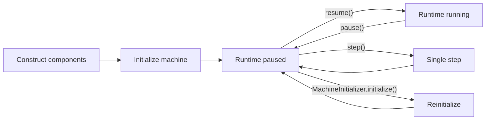

# Machine Lifecycle

A CHIP-8 machine passes through several conceptually distinct phases:



## Construction

Construction belongs to the application composition root.

The application chooses concrete implementations and assembles the execution context.

Conceptually:

```ts
const profile = CLASSIC_CHIP8_PROFILE;

const memory = new Ram(profile.memorySize);
const registers = new Registers();
const stack = new Stack(profile.stackCapacity);
const programCounter = new ProgramCounter(
  profile.programStartAddress,
);

const displayBuffer = new DisplayBuffer(
  profile.display.width,
  profile.display.height,
);

const verticalBlank = new VerticalBlank();
const keyboard = new KeyboardState();
```

Construction selects implementations. It does not establish the complete runnable machine state.

## Initialization

`MachineInitializer.initialize()` establishes that state.

Initialization first validates the complete memory layout.

Known validation failures occur before any machine state is mutated.

The initializer then establishes:

```text
Memory             cleared
V0-VF              0
Stack              empty
I                  0
PC                 profile program start
Delay timer        0
Sound timer        0
DisplayBuffer      cleared
VerticalBlank      no pending opportunity
Keyboard wait      reset
Font               reinstalled
Program            loaded
```

The font is installed on every initialization because CHIP-8 memory is writable and a program may have modified the font region during a previous run.

The random-number generator is deliberately not reset.

## Program images

Programs are represented by `MemoryImage`.

`MemoryImage` is deliberately generic and may structurally contain zero or more bytes.

`MachineInitializer` imposes the stronger semantic requirement that a runnable machine must be initialized with:

- a non-empty font image;
- a non-empty program image.

This illustrates the validation strategy used throughout the project:

> Low-level abstractions validate local structural invariants. Higher-level domain operations validate relationships and semantic requirements.

## Keyboard lifecycle

Resetting keyboard interpretation state does not mean pretending every physical key was released.

`KeyboardState.reset()` clears transient CHIP-8 interpreter state, including an outstanding `FX0A` wait, while preserving the keys currently reported as pressed by the host.

The host adapter owns the physical-event lifecycle and may explicitly release all keys when its own session ends.

## Vertical-blank lifecycle

`VerticalBlank` is transient emulated machine state.

Initialization calls `reset()`, leaving no pending display opportunity.

During scheduled execution, the runtime's display-frame task calls:

```ts
verticalBlank.signal();
```

The state is non-accumulating: multiple signals before consumption still represent one available opportunity.

A Classic `Dxyn` instruction consumes that opportunity before drawing. If no opportunity is available, the instruction waits by rewinding the program counter and retrying later.

## Random-number generator lifecycle

Initialization deliberately does not reset the random-number generator.

CHIP-8 does not define a random-number generator seeding lifecycle, and applications may use:

- system randomness;
- deterministic seeded randomness;
- recorded randomness;
- test sequences.

The application or concrete RNG implementation owns that lifecycle.

## Runtime startup

`Chip8Runtime` starts paused.

A typical startup sequence is:


Starting paused keeps construction and initialization separate from execution.

## Running

While resumed, the runtime allows the scheduler to process:

- display-frame boundaries;
- timer ticks;
- CPU instructions.

The host does not need to call `runtime.tick()` at the CPU frequency. The deadline-driven scheduler determines which occurrences are due from its monotonic clock.

## Pause

Pausing freezes scheduled emulated execution:

- vertical-blank scheduling is suspended;
- timer scheduling is suspended;
- CPU scheduling is suspended.

Elapsed host time while paused does not become execution debt.

A long host pause therefore does not cause a burst of historical CPU, timer, or display-frame events when execution resumes.

## Single stepping

Single-step execution is allowed only while paused.

One call to:

```ts
runtime.step();
```

executes one CPU instruction.

It does not:

- advance scheduler time;
- tick the delay timer;
- tick the sound timer;
- advance the normal scheduled display-frame task.

### Display-synchronized draw during a step

Classic `Dxyn` normally requires a pending vertical-blank opportunity.

A debugger must still be able to step over a draw instruction while the runtime is paused.

If no real vertical-blank opportunity is already pending, `runtime.step()` temporarily signals one so that the draw can complete.

After the CPU step:

- an unused temporary signal is removed;
- a real pre-existing pending signal is preserved;
- scheduled time has not advanced.

This gives debugger stepping useful instruction-level behavior without leaking synthetic timing state into later execution.

## `FX0A` is not a runtime pause

Classic `FX0A` waits for a key press followed by release.

This does not pause the runtime.

While the CPU repeatedly waits on `FX0A`:

- CPU scheduling continues;
- timer scheduling continues;
- display-frame scheduling continues.

The instruction itself rewinds and retries until `KeyboardState` reports completion of the press/release lifecycle.

## Reset

Resetting a machine does not require reconstructing all components.

The application can pause the runtime and call `MachineInitializer.initialize()` again with the same execution context, profile, and program image.

This:

- clears mutable machine state;
- clears pending vertical blank;
- resets transient keyboard interpretation state;
- reinstalls system data;
- reloads the program;
- returns the machine to its defined initial state.

The runtime should be paused before reinitializing the machine.
