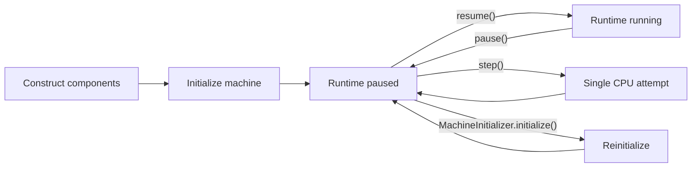
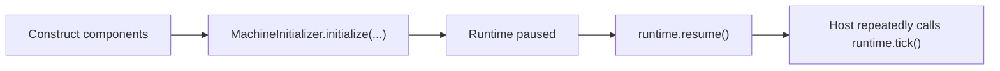
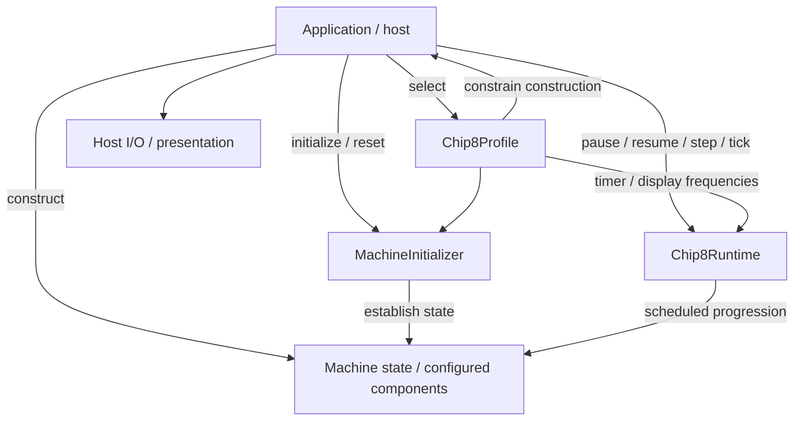

# Machine Lifecycle

A CHIP-8 machine passes through several conceptually distinct phases:



The lifecycle is intentionally distributed across explicit responsibilities:

```text
Application
    → construction and lifecycle coordination

MachineInitializer
    → initial/reset machine state

Chip8Runtime
    → paused/running progression and manual stepping
```

Construction, initialization, execution, pause, stepping, and reset are related operations, but they are not the same operation hidden behind one machine façade.

See also:

- [Machine initialization architecture](./machine-initialization.md)
- [Machine state and capabilities architecture](./machine-state-and-capabilities.md)
- [Runtime and timing architecture](./runtime-and-timing.md)
- [Instruction execution architecture](./instruction-execution.md)
- [ADR 0012 — Application-owned composition](../decisions/0012-application-owned-composition.md)

## Construction

Construction belongs to the application composition root.

The application chooses concrete implementations and assembles the object graph:

```ts
const profile = CLASSIC_CHIP8_PROFILE;

const memory = new Ram(profile.memorySize);
const registers = new Registers();
const stack = new Stack(profile.stackCapacity);
const programCounter = new ProgramCounter(profile.programStartAddress);

const displayBuffer = new DisplayBuffer(
  profile.display.width,
  profile.display.height,
  profile.compatibility.spriteOverflow,
);

const executor = new InstructionExecutor(profile.compatibility);

const verticalBlank = new VerticalBlank();
const keyboard = new KeyboardState();
```

Construction answers two related composition questions:

> Which machine profile is being emulated?

and:

> Which concrete objects implement that machine in this application?

The selected profile constrains construction without constructing the objects itself.

It does not install the font/program or establish the complete runnable state.

See [Machine state and capabilities architecture](./machine-state-and-capabilities.md) for composition roles and state/capability ownership.

## Initialization

`MachineInitializer.initialize()` establishes the defined starting state of those already-constructed components.

The lifecycle-level contract is:

```text
validate
    ↓
reset existing machine state
    ↓
install machine/system data
    ↓
install program
    ↓
machine ready while runtime remains paused
```

Known invalid memory-layout relationships are rejected before mutation begins.

Initialization does not:

```text
construct components
perform host file I/O
pause/resume the runtime
render output
rebuild the host session
```

Those boundaries are covered in detail by [Machine initialization architecture](./machine-initialization.md).

## Runtime Startup

`Chip8Runtime` starts paused.

A typical startup sequence is:



Runtime timing is also derived partly from the selected profile.

For example:

```text
profile.timerFrequency
    → timer scheduling

profile.display.refreshFrequency
    → emulated display / vertical-blank scheduling

host runtime configuration
    → CPU execution frequency
```

Timer and display frequencies are characteristics of the emulated machine. CPU frequency remains host/runtime policy.

Starting paused preserves a useful invariant:

> Construction and initialization do not implicitly begin emulated execution.

The host explicitly decides when the initialized machine should start running.

## Running

While resumed, the runtime allows the scheduler to process:

```text
display-frame boundaries
timer ticks
CPU attempts
```

The host only needs to wake the runtime by calling:

```ts
runtime.tick();
```

The deadline-driven scheduler determines which emulated occurrences are due from its monotonic clock.

The host event-loop frequency is therefore not the emulator's CPU/timer/display timing model.

See [Runtime and timing architecture](./runtime-and-timing.md) for deadline ordering, catch-up, equal-deadline policy, and exact timing semantics.

## Pause

Calling:

```ts
runtime.pause();
```

suspends scheduled emulated progression:

```text
vertical-blank scheduling
timer scheduling
CPU scheduling
```

It preserves the current machine state.

Elapsed host time while paused does not become execution debt, so a long pause does not cause historical work to burst on resume.

The distinction is:

```text
pause
    → preserve state
    → stop scheduled progression

reset
    → rewrite machine state
```

This makes pause suitable for debugging and inspection.

## Resume

Calling:

```ts
runtime.resume();
```

reactivates scheduled progression.

Resume does not replay elapsed paused time. Each suspended task is rebased from the current clock time.

Calling `resume()` on an already-running runtime is idempotent and does not rebase active deadlines.

Detailed scheduler semantics belong in [Runtime and timing architecture](./runtime-and-timing.md).

## Single Stepping

Single-step execution is allowed only while paused.

One call to:

```ts
runtime.step();
```

performs one CPU **attempt**.

It does not:

```text
advance scheduler time
tick the delay timer
tick the sound timer
advance the normal scheduled display task
resume the runtime
```

The word _attempt_ matters because an instruction may deliberately wait and retry.

Examples include:

```text
Fx0A
    → wait for keyboard press/release lifecycle

Dxyn
    → wait for a display opportunity when required
```

The runtime remains paused after the step.

### Display-synchronized draw during a step

Profiles configured with:

```ts
spriteDrawTiming: "vertical-blank";
```

make `Dxyn` depend on runtime-produced vertical blank.

Profiles configured for immediate drawing do not require that scheduling aid.

Because normal vblank scheduling is suspended while paused, `runtime.step()` may temporarily make one display opportunity available when the configured instruction semantics require one and none is already pending.

That temporary aid exists only so debugger-style stepping can make useful progress.

Scheduled time still does not advance.

The exact preservation/cleanup rules are documented in [Runtime and timing architecture](./runtime-and-timing.md).

## `Fx0A` Does Not Pause the Runtime

Classic `Fx0A` waits for a key press followed by release.

During normal running, this does **not** call:

```ts
runtime.pause();
```

Instead:

```text
CPU occurrence reaches Fx0A
    ↓
keyboard condition incomplete
    ↓
instruction restores its own address
    ↓
later CPU occurrence retries
```

Meanwhile:

```text
timers continue
display-frame scheduling continues
runtime remains running
```

This is an instruction-level wait condition, not a runtime lifecycle transition.

See [Instruction execution architecture](./instruction-execution.md) for retry semantics and [Machine state and capabilities architecture](./machine-state-and-capabilities.md) for keyboard-state ownership.

## Reset

Reset reuses machine initialization.

A typical lifecycle sequence is:

```text
running
    ↓
runtime.pause()
    ↓
MachineInitializer.initialize(
  existing context,
  profile,
  program
)
    ↓
paused at defined initial state
```

Reset must reuse the profile already associated with the current machine session.

Conceptually:

```text
machine session
    ├── profile
    ├── program
    └── execution state
```

Reset changes the execution state while retaining:

```text
same profile
same program
same composed object graph
```

A host must therefore not silently substitute a default profile during reset.

Reset does not require reconstructing every Core component.

This is different from changing the selected profile.

A different profile may configure:

```text
different font data
different timing
different instruction semantics
different display behavior
```

so a host may reasonably treat profile replacement as construction of a fresh machine session rather than reset of the existing one.

The existing object graph can remain in place while the initializer:

```text
clears mutable machine state
re-establishes control/timer state
resets interpreter-owned transient state
reinstalls font data
reloads the program image
```

The runtime should be paused before reinitialization.

Initialization itself does not resume the runtime afterward; the application explicitly chooses whether to remain paused or call `resume()`.

Detailed reset scope, memory restoration, keyboard/RNG lifecycle, failure guarantees, and ROM-replacement alternatives belong in [Machine initialization architecture](./machine-initialization.md).

## ROM Replacement

Loading another ROM is an application-session decision rather than a new Core lifecycle state.

A host may choose either:

```text
pause existing machine
    ↓
initialize same context with new program
```

or:

```text
stop old session
    ↓
construct a new object graph
    ↓
initialize new program
```

`MachineInitializer` supports in-place reuse, but Core does not require it.

The current Web host, for example:

```text
Reset
    → reuses the existing graph and retained profile

new ROM
    → composes a fresh session

new profile
    → composes a fresh session from the retained ROM image
```

That distinction keeps Core lifecycle semantics separate from frontend/session policy.

## Profile Replacement

Changing the active `Chip8Profile` is an application-session decision rather than a Core runtime transition.

A profile describes what machine is being emulated, so replacing it is conceptually broader than Reset.

The current Web host uses:

```text
existing session
    ├── retained ROM image
    └── current running / paused host state

user selects another profile
    ↓
compose fresh machine session
    ↓
initialize retained ROM using new profile
    ↓
select matching inspection formatter
    ↓
preserve previous running / paused policy
```

The fresh session receives the selected profile consistently across:

```text
memory / stack / PC construction
font installation
instruction compatibility
sprite-overflow behavior
timer frequency
display frequency
inspection formatting
```

Trace history and other session-local execution state are not preserved because the replacement represents a new emulated machine.

This gives three distinct host operations:

```text
Reset
    → same profile
    → same ROM
    → same object graph
    → reinitialize machine state

ROM replacement
    → host chooses whether to reuse or rebuild
    → different program

Profile replacement
    → different machine definition
    → current Web host rebuilds the session
    → may reuse retained ROM bytes
```

Core does not prescribe that exact host policy. It supplies the profile, initialization, execution, and runtime boundaries that make the policy explicit.

## Lifecycle Ownership



The responsibilities are:

```text
Application
    → select machine profile
    → construct object graph
    → obtain ROM data
    → coordinate startup/reset/session replacement
    → select profile-appropriate inspection presentation
    → call runtime operations

Chip8Profile
    → describe emulated machine characteristics
    → describe compatibility-sensitive semantics

MachineInitializer
    → establish or re-establish machine state

Chip8Runtime
    → own scheduled paused/running behavior
    → perform manual paused stepping

State/capability components
    → own local state and invariants
```

## Lifecycle Design Rules

1. **Construction does not start execution.**\
   Object creation and emulated progression remain separate.

2. **Initialization does not construct the graph.**\
   It establishes state in already-composed components.

3. **The runtime starts paused.**\
   Applications explicitly decide when execution begins.

4. **Pause preserves machine state.**\
   It suspends progression without creating execution debt.

5. **Single stepping is paused instruction execution, not scheduled time.**\
   One step performs one CPU attempt while timers and normal display scheduling remain still.

6. **Instruction waits are not runtime pauses.**\
   `Fx0A` and profile-controlled retrying draw behavior remain instruction-level control flow.

7. **Reset reuses initialization.**\
   Re-establishing initial state does not require rebuilding the object graph.

8. **Reset retains the machine profile.**\
   Reset changes machine state, not which historical machine is being emulated.

9. **Reset does not automatically resume.**\
   Post-reset execution policy belongs to the application.

10. **ROM replacement is host/session policy.**\
    Applications may reuse or rebuild the machine graph.

11. **Profile replacement is host/session policy.**\
    Changing the machine definition may justify a fresh session; Core does not hide that transition behind Reset.

12. **Lifecycle ownership remains explicit.**\
    Application, profile, initializer, runtime, and state components each own distinct responsibilities.

These rules keep lifecycle sequencing understandable without making one class responsible for profile selection, construction, initialization, timing, reset, session replacement, and host behavior.
