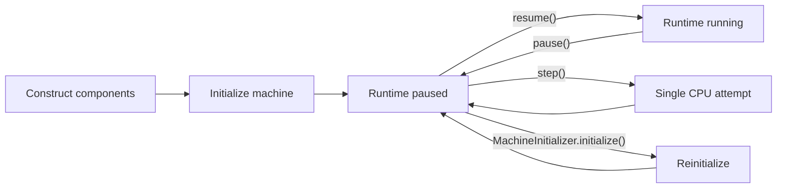
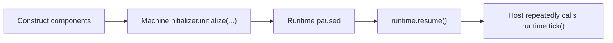
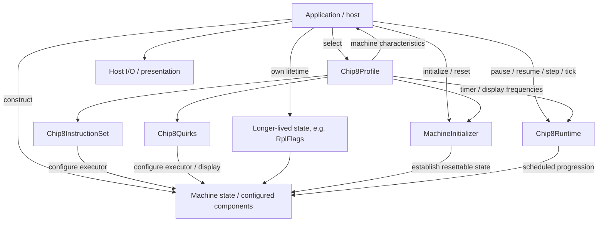

# Machine Lifecycle

A CHIP-8 machine passes through several conceptually distinct phases:



The lifecycle is intentionally distributed across explicit responsibilities:

```text
Application
    → profile selection, construction, and lifecycle coordination

Chip8Profile
    → declarative machine definition

MachineInitializer
    → initial/reset machine state

Chip8Runtime
    → paused/running progression and manual stepping
```

Construction, initialization, execution, pause, stepping, reset, interpreter exit, ROM replacement, and profile replacement are related operations, but they are not the same operation hidden behind one machine façade.

See also:

- [Machine initialization architecture](./machine-initialization.md)
- [Machine state and capabilities architecture](./machine-state-and-capabilities.md)
- [Machine profiles and variation](./machine-profiles-and-variation.md)
- [Runtime and timing architecture](./runtime-and-timing.md)
- [Instruction execution architecture](./instruction-execution.md)
- [ADR 0012 — Application-owned composition](../decisions/0012-application-owned-composition.md)

## In this document

- [Construction](#construction)
- [Initialization](#initialization)
- [Runtime Startup](#runtime-startup)
- [Running](#running)
- [Pause](#pause)
- [Resume](#resume)
- [Single Stepping](#single-stepping)
- [`Fx0A` Does Not Pause the Runtime](#fx0a-does-not-pause-the-runtime)
- [Interpreter Exit Does Not Pause the Runtime](#interpreter-exit-does-not-pause-the-runtime)
- [Reset](#reset)
- [ROM Replacement](#rom-replacement)
- [Profile Replacement](#profile-replacement)
- [Lifecycle Ownership](#lifecycle-ownership)
- [Lifecycle Design Rules](#lifecycle-design-rules)

## Construction

Construction belongs to the application composition root.

The application selects a `Chip8Profile`, chooses concrete implementations, and assembles the object graph:

```ts
const profile = CLASSIC_CHIP8_PROFILE;

const memory = new Ram(profile.memorySize);
const registers = new Registers();
const stack = new Stack(profile.stackCapacity);
const programCounter = new ProgramCounter(profile.programStartAddress);

const displayBuffer = new DisplayBuffer(
  profile.display.specification,
  profile.quirks.spriteOverflow,
);

const font = profile.fonts.large === null
  ? new ClassicFont(profile.fonts.small.baseAddress)
  : new SuperChipFont(
    profile.fonts.small.baseAddress,
    profile.fonts.large.baseAddress,
  );

const executor = new InstructionExecutor(
  profile.instructionSet,
  profile.quirks,
);

const verticalBlank = new VerticalBlank();
const keyboard = new KeyboardState();
const exitState = new ExitState();
const rplFlags = new RplFlags();
```

Construction answers two related composition questions:

> Which machine profile is being emulated?

and:

> Which concrete objects implement that machine in this application?

The selected profile constrains construction without constructing the objects itself.

Its fields participate at different boundaries:

```text
machine characteristics
    → memory, stack, display, timing, fonts

instructionSet
    → which instruction semantics exist

quirks
    → how shared instructions vary
```

Construction does not install the configured font images or program, establish the complete runnable state, or begin scheduled execution.

Some state may deliberately outlive one constructed machine session. `RplFlags` is the current demonstrated case: a host may own one RPL store above individual machine sessions and inject that same store into each new `ExecutionContext`.

See [Machine state and capabilities architecture](./machine-state-and-capabilities.md) for composition roles and state/capability ownership.

## Initialization

`MachineInitializer.initialize()` establishes the defined starting state of already-constructed components.

The lifecycle-level contract is:

```text
validate
    ↓
reset resettable machine state
    ↓
install machine/system data
    ↓
install program
    ↓
machine ready while runtime remains paused
```

Known invalid memory-layout relationships are rejected before mutation begins.

Initialization resets ordinary execution state such as registers, timers, stack state, display state, keyboard interpreter state, vertical-blank state, and `ExitState`. It also restores profile-defined display initialization, which means a SUPER-CHIP display returns to its initial low-resolution mode.

Initialization deliberately does **not** clear `RplFlags`.

That distinction matters:

```text
resettable machine state
    → re-established by MachineInitializer

persistent RPL state
    → preserved across initialization
```

The profile's instruction-set identity determines whether RPL instructions exist; it does not own the RPL values or their lifetime.

Initialization does not:

```text
construct components
perform host file I/O
select a different profile
pause/resume the runtime
render output
rebuild the host session
clear persistent RPL flags
```

Those boundaries are covered in detail by [Machine initialization architecture](./machine-initialization.md).

## Runtime Startup

`Chip8Runtime` starts paused.

A typical startup sequence is:



Runtime timing is derived partly from the selected profile and partly from host/runtime policy.

For example:

```text
profile.timerFrequency
    → timer scheduling

profile.display.refreshFrequency
    → emulated display / vertical-blank scheduling

host runtime configuration
    → CPU execution frequency
```

Timer and display frequencies are characteristics of the emulated machine. CPU frequency remains host/runtime policy.

Starting paused preserves a useful invariant:

> Construction and initialization do not implicitly begin emulated execution.

The host explicitly decides when the initialized machine should start running.

## Running

While resumed, the runtime allows the scheduler to process:

```text
display-frame boundaries
timer ticks
CPU attempts
```

The host only needs to wake the runtime by calling:

```ts
runtime.tick();
```

The deadline-driven scheduler determines which emulated occurrences are due from its monotonic clock.

The host event-loop frequency is therefore not the emulator's CPU/timer/display timing model.

When scheduled deadlines are equal, registration order gives a deterministic machine-visible order:

```text
vertical blank
    ↓
timers
    ↓
CPU
```

See [Runtime and timing architecture](./runtime-and-timing.md) for deadline ordering, catch-up, equal-deadline policy, and exact timing semantics.

## Pause

Calling:

```ts
runtime.pause();
```

suspends scheduled emulated progression:

```text
vertical-blank scheduling
timer scheduling
CPU scheduling
```

It preserves the current machine state.

Elapsed host time while paused does not become execution debt, so a long pause does not cause historical work to burst on resume.

The distinction is:

```text
pause
    → preserve machine state
    → stop scheduled progression

reset
    → rewrite resettable machine state
```

This makes pause suitable for debugging and inspection.

Pausing also does not change `ExitState`. Runtime lifecycle and interpreter lifecycle remain independent axes.

## Resume

Calling:

```ts
runtime.resume();
```

reactivates scheduled progression.

Resume does not replay elapsed paused time. Each suspended task is rebased from the current scheduler time.

Calling `resume()` on an already-running runtime is idempotent and does not rebase active deadlines.

Resume also does not alter interpreter state. If `ExitState` is already exited, the runtime may be running while CPU attempts remain inert.

Detailed scheduler semantics belong in [Runtime and timing architecture](./runtime-and-timing.md).

## Single Stepping

Single-step execution is allowed only while paused.

One call to:

```ts
runtime.step();
```

performs one CPU **attempt** and leaves the runtime paused.

At the lifecycle level, stepping means:

```text
paused runtime
    ↓
one Cpu.step() attempt
    ↓
paused runtime
```

Normal scheduled time does not advance, so timer tasks and the regular display task do not progress as part of the step.

The word _attempt_ matters because an instruction can deliberately remain incomplete and retry later. `Fx0A` is one example; a vertical-blank-gated draw is another. If the interpreter has already exited, the single `Cpu.step()` call reaches the exit guard and performs no fetch or execution.

Paused stepping also has a specific vertical-blank contract so display-synchronized instructions can be attempted without temporarily resuming the scheduler. `Chip8Runtime` supplies and cleans up that opportunity according to the runtime timing rules; lifecycle code does not inspect the opcode, draw-timing quirk, or current display mode.

The authoritative rules for temporary vertical blank, preservation of preexisting pending state, cleanup of unused temporary state, and the distinction between immediate and vertical-blank-gated drawing are documented in [Runtime and timing architecture](./runtime-and-timing.md#single-step-timing-semantics).

## `Fx0A` Does Not Pause the Runtime

`Fx0A` waits for the keyboard's required press-then-release lifecycle.

During normal running, this does **not** call:

```ts
runtime.pause();
```

Instead:

```text
CPU occurrence reaches Fx0A
    ↓
keyboard condition incomplete
    ↓
instruction restores its own address
    ↓
later CPU occurrence retries
```

Meanwhile:

```text
timers continue
display-frame scheduling continues
runtime remains running
```

This is an instruction-level wait condition, not a runtime lifecycle transition.

See [Instruction execution architecture](./instruction-execution.md) for retry semantics and [Machine state and capabilities architecture](./machine-state-and-capabilities.md) for keyboard-state ownership.

## Interpreter Exit Does Not Pause the Runtime

SUPER-CHIP interpreter-exit semantics mutate `ExitState`.

In the current historical SUPER-CHIP 1.1 model, exit can occur through:

```text
00FD
    → explicit SUPER-CHIP interpreter exit

00C0
    → historical SUPER-CHIP 1.1 zero-scroll interpretation

Fx1E overflow
    → shared instruction whose configured indexOverflow quirk selects exit
```

None of these calls:

```ts
runtime.pause();
```

and none throws an exception merely to escape the runtime.

Instead:

```text
CPU occurrence reaches an interpreter-exit condition
    ↓
ExitState becomes exited
    ↓
current instruction attempt completes normally
    ↓
later Cpu.step() calls observe ExitState before fetch
    ↓
CPU work becomes a no-op
```

This creates an important distinction:

```text
runtime state
    paused / running

interpreter state
    active / exited
```

The two are intentionally independent.

If the runtime remains resumed after interpreter exit, scheduler occurrences may continue and timers/display timing may continue to advance, but CPU steps no longer fetch or execute instructions.

A host may choose to react to an exited machine in its own UI or lifecycle policy, but Core does not automatically convert interpreter exit into runtime pause, process termination, or an application callback.

Machine initialization resets `ExitState`, making CPU execution possible again after reset or reinitialization.

## Reset

Reset is a lifecycle operation built from machine initialization.

A typical host sequence is:

```text
running or paused session
    ↓
runtime.pause()
    ↓
MachineInitializer.initialize(
  existing context,
  session profile,
  session program
)
    ↓
paused at the defined initial state
```

Reset keeps the identity of the current machine session:

```text
same profile
same program
same composed object graph
same longer-lived RPL storage
```

while re-establishing the resettable state defined by initialization. A host must therefore not silently substitute a default profile or another ROM when the user asks to reset the current machine.

`MachineInitializer` owns the exact reset/install contract, including memory reconstruction, display reset, interpreter-state reset, font/program installation, validation guarantees, and deliberate preservation of `RplFlags`. Those details are documented once in [Machine initialization architecture](./machine-initialization.md).

Initialization itself does not resume the runtime. After reset, the application explicitly decides whether the machine remains paused or resumes execution.

A profile change is not reset: it changes the machine definition and may require a differently composed object graph.

## ROM Replacement

Loading another ROM is an application-session decision rather than a new Core lifecycle state.

A host may choose either:

```text
pause existing machine
    ↓
initialize same context with new program
```

or:

```text
stop old session
    ↓
construct a new object graph
    ↓
initialize new program
```

`MachineInitializer` supports in-place reuse, but Core does not require it.

The current Web host uses a fresh session when a new ROM is loaded. Reset, by contrast, reuses the current session.

The Web application deliberately owns one `RplFlags` instance above those individual sessions, so RPL contents survive ROM replacement within the same application lifetime.

That persistence is host-lifetime state, not browser-storage persistence. Reloading or restarting the application creates a new RPL store.

This distinction keeps Core lifecycle semantics separate from frontend/session policy.

## Profile Replacement

Changing the active `Chip8Profile` is an application-session decision rather than a Core runtime transition. A profile describes **what machine is being emulated**, so replacement is conceptually broader than reset.

The current Web host treats profile replacement as recomposition:

```text
retained ROM image
    +
selected Chip8Profile
    +
host-owned longer-lived state where required
    ↓
compose and initialize replacement session
    ↓
install replacement using host lifecycle policy
```

This ensures the replacement machine receives the selected profile consistently across machine characteristics, instruction-set membership, shared-instruction quirks, timing, resources, and inspection presentation. The exact meaning of those profile dimensions belongs in [Machine profiles and variation](./machine-profiles-and-variation.md).

Session-local execution state such as trace history does not survive replacement in the current Web host. `RplFlags` are different because their lifetime is deliberately owned above individual Web sessions, so the same store can be injected into the replacement.

The lifecycle distinction is:

```text
Reset
    → same machine definition
    → same ROM
    → same object graph
    → reinitialize resettable state

ROM replacement
    → different program
    → host chooses whether to reuse or rebuild

Profile replacement
    → different machine definition
    → host may need a newly composed session
```

Core provides the profile, initialization, execution, state, and runtime boundaries; the host owns the replacement policy. The current browser workflow is documented in [Web application](../guides/web-application.md), while the architectural evidence for keeping recomposition application-owned is summarized in [Host composition evaluation](./composition-evaluation.md).

## Lifecycle Ownership



The responsibilities are:

```text
Application
    → select machine profile
    → construct object graph
    → own longer-lived application state where required
    → obtain ROM data
    → coordinate startup/reset/session replacement
    → select profile-appropriate inspection presentation
    → call runtime operations

Chip8Profile
    → describe emulated machine characteristics
    → select instruction-set identity
    → select shared-instruction quirks

MachineInitializer
    → establish or re-establish resettable machine state
    → preserve explicitly longer-lived state such as RPL flags

Chip8Runtime
    → own scheduled paused/running behavior
    → perform manual paused stepping

State/capability components
    → own local state and invariants
```

## Lifecycle Design Rules

1. **Construction does not start execution.**\
   Object creation and emulated progression remain separate.

2. **Profiles describe the machine; they do not construct it.**\
   Machine characteristics, instruction-set membership, and shared-instruction quirks guide application composition.

3. **Initialization establishes state in an already-composed graph.**\
   Its exact reset/install contract belongs in [Machine initialization](./machine-initialization.md).

4. **The runtime starts paused.**\
   Applications explicitly decide when scheduled execution begins.

5. **Pause preserves machine state.**\
   It suspends scheduled progression without creating execution debt.

6. **Single stepping is paused CPU execution, not scheduled time.**\
   One step performs one `Cpu.step()` attempt while the runtime remains paused; temporary-vblank mechanics belong to [Runtime and timing](./runtime-and-timing.md#single-step-timing-semantics).

7. **Instruction waits are not runtime pauses.**\
   `Fx0A` and vertical-blank-gated retry behavior remain instruction-level control flow.

8. **Interpreter exit is not runtime pause.**\
   Exit changes `ExitState`; later CPU steps become inert while runtime state remains independent.

9. **Reset reuses initialization and retains the session identity.**\
   It keeps the current profile, program, object graph, and explicitly longer-lived state such as RPL storage.

10. **Reset does not automatically resume.**\
    Post-reset execution policy belongs to the application.

11. **ROM replacement is host/session policy.**\
    Applications may reuse or rebuild the machine graph and may preserve explicitly longer-lived host-owned state.

12. **Profile replacement is host/session policy.**\
    Changing the machine definition may justify a fresh session; Core does not hide that transition behind reset.

13. **Lifecycle ownership remains explicit.**\
    Application, profile, initializer, runtime, and state/capability components each own distinct responsibilities.

These rules keep lifecycle sequencing understandable without making one class responsible for profile selection, construction, initialization, timing, reset, interpreter exit, persistent-state lifetime, session replacement, and host behavior.
