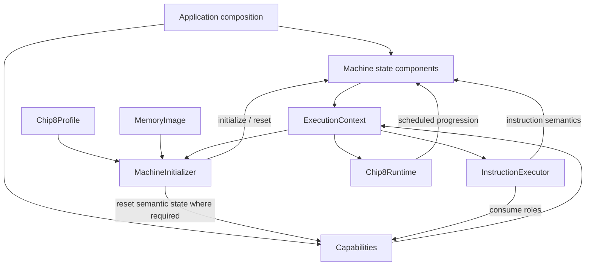

# Machine State and Capabilities Architecture

Chip8NX separates the mutable state of the emulated machine from the capabilities it depends on and from the configuration used to assemble and drive that machine.

At a high level:

```text
Machine definition
    ↓
application composition
    ↓
ExecutionContext
    ├── persistent machine state
    ├── semantic capabilities
    └── machine resources

Runtime configuration
    ↓
Chip8Runtime
    ↓
scheduled progression
```

The central rule is:

> State describes what the emulated machine currently contains; capabilities describe roles the machine can ask to perform; configuration describes characteristics or policies used to assemble or drive it.

These are architectural categories, not TypeScript declaration categories. An interface can represent mutable state, and a capability implementation can maintain internal state of its own.

See also:

- [Architecture overview](./overview.md)
- [Instruction execution architecture](./instruction-execution.md)
- [Runtime and timing architecture](./runtime-and-timing.md)
- [Machine lifecycle](./machine-lifecycle.md)
- [ADR 0012 — Application-owned composition](../decisions/0012-application-owned-composition.md)

## Responsibility Model

The current Core can be understood through three broad groups.

### Persistent machine state

Persistent state survives from one instruction to the next and forms part of the machine's observable execution state.

Examples include:

```text
Registers
ProgramCounter
IndexRegister
Stack
Memory
DelayTimer
SoundTimer
DisplayBuffer
VerticalBlank
```

Instruction execution reads and mutates these components.

For example:

```text
LD V0, 0x42
    → Registers changes

CALL 0x300
    → Stack changes
    → ProgramCounter changes

LD [I], Vx
    → Memory changes

DRW Vx, Vy, n
    → DisplayBuffer changes
    → VerticalBlank may be consumed
```

Later instructions observe the results of those mutations.

### Capabilities and services

Some dependencies are better understood as roles the machine can ask to perform.

The current examples are:

```text
Keyboard
RandomNumberGenerator
Font
```

Their roles are:

```text
Keyboard
    → query CHIP-8 key state
    → provide Fx0A press/release semantics

RandomNumberGenerator
    → provide the next random Byte

Font
    → resolve a CHIP-8 glyph to its sprite address
```

These roles can vary independently of instruction semantics, which makes them useful substitution seams.

### Configuration

Configuration describes stable machine characteristics or execution policy rather than current state.

The current split is:

```text
Chip8Profile
    → what machine is being emulated

Chip8RuntimeConfiguration
    → how the composed machine is driven
```

`Chip8Profile` includes characteristics such as:

```text
memory size
program start address
stack capacity
display geometry
display refresh frequency
timer frequency
font image
font base address
```

`Chip8RuntimeConfiguration` currently contains:

```text
CPU frequency
```

The distinction is:

```text
machine definition
    → profile

runtime execution policy
    → runtime configuration

current execution values
    → state components
```

## Architectural Categories Are Not TypeScript Categories

It is tempting to equate:

```text
class
    → state

interface
    → capability
```

but Chip8NX deliberately does not follow that rule.

`Memory` is the clearest counterexample.

It is exposed as an interface:

```ts
export interface Memory {
  readonly size: number;
  read(address: Address): Byte;
  write(address: Address, value: Byte): void;
  clear(): void;
}
```

yet memory is persistent mutable machine state.

The interface exists because the storage role is substitutable, not because memory is stateless.

Likewise, `RandomNumberGenerator` is a capability interface, but a pseudo-random implementation may maintain internal generator state.

The two questions are independent:

```text
What responsibility does this object have?
    → state / capability / configuration / resource

Does that role require substitution?
    → interface or concrete dependency
```

This prevents abstractions from being introduced merely for symmetry.

### Some roles cross category boundaries

`Keyboard` is a useful example.

From the executor's perspective it is an input capability:

```text
is this key pressed?
has an Fx0A key-release sequence completed?
```

But `KeyboardState` also owns the interpreter state required to answer those questions.

A better description is:

> `Keyboard` is an input capability whose implementation owns the state required to provide CHIP-8 keyboard semantics.

The categories describe dominant responsibility, not rigid boxes.

### `ExecutionContext` brings the roles together

`ExecutionContext` groups the concrete resources required by instruction execution:

```text
ExecutionContext
├── Registers
├── Memory
├── Stack
├── ProgramCounter
├── IndexRegister
├── DelayTimer
├── SoundTimer
├── DisplayBuffer
├── VerticalBlank
├── Keyboard
├── Font
└── RandomNumberGenerator
```

It does not erase their distinct responsibilities.

The application constructs the components, the context groups them, and `InstructionExecutor` coordinates them according to instruction semantics.

```text
Application
    → chooses and constructs objects

ExecutionContext
    → groups execution resources

InstructionExecutor
    → applies instruction-level relationships
```

The context therefore solves dependency aggregation without becoming a monolithic `Chip8Machine`.

## Persistent Machine State

Persistent state is split across focused components rather than stored in one large mutable object.

The goal is not merely smaller classes. It is to keep state together with the rules that protect and interpret it.

### State ownership includes behavior ownership

A component should not expose raw storage and expect every caller to preserve its invariants manually.

For example:

```text
Stack
    → owns return-address storage
    → owns capacity
    → owns push/pop semantics
    → owns underflow/overflow checks
```

rather than:

```text
MachineState.stackValues
MachineState.stackPointer
MachineState.stackCapacity
```

with each consumer manipulating those fields directly.

The same pattern appears throughout the Core:

```text
Registers
    → register storage

ProgramCounter
    → next instruction address
    → instruction-sized advancement

Ram
    → byte storage
    → concrete address-space bounds

Timer
    → countdown state
    → no-underflow transition

DisplayBuffer
    → pixel state
    → sprite-drawing state transitions

VerticalBlank
    → one pending synchronization opportunity
```

This is encapsulation in its useful sense:

> Keep state together with the rules required to use that state correctly.

### Registers

`Registers` owns the sixteen CHIP-8 general-purpose registers:

```text
V0 ... VF
```

Every stored value is a `Byte`.

Its storage remains private and callers use:

```text
get(RegisterIndex)
set(RegisterIndex, Byte)
clear()
snapshot()
```

The numeric-domain invariants are already represented by:

```text
RegisterIndex
Byte
```

so the register bank can focus on persistent storage rather than repeat validation owned by those domain types.

### Program counter

`ProgramCounter` owns one `Address`: the next instruction address.

Its focused API is:

```text
getValue()
setValue(Address)
advance()
```

`advance()` encapsulates the fixed CHIP-8 instruction width:

```text
PC = address(PC + INSTRUCTION_SIZE)
```

This lets callers express intent:

```ts
programCounter.advance();
```

instead of scattering:

```text
PC += 2
```

through execution code.

The program counter does not fetch memory, decode instructions, or know the size of the current RAM instance. Those responsibilities require other context.

### Index register

`IndexRegister` owns the current value of register `I`.

It stores an `Address` and exposes:

```text
getValue()
setValue(Address)
```

Instruction-specific behavior remains elsewhere.

For example:

```text
Fx1E
Fx29
Fx55
Fx65
```

decide how `I` changes; `IndexRegister` only owns the resulting stored address.

This keeps storage semantics separate from instruction semantics.

### Stack

`Stack` owns subroutine return-address state.

It keeps storage and capacity private and exposes operations such as:

```text
push(Address)
pop()
peek()
getSize()
getCapacity()
isEmpty()
isFull()
clear()
snapshot()
```

The configured capacity comes from the machine profile through composition rather than being hard-coded in the stack.

Overflow and underflow checks stay inside `Stack` because only the stack owns both its current depth and capacity.

The executor therefore asks:

```text
stack.push(returnAddress)
```

or:

```text
stack.pop()
```

without duplicating stack-pointer arithmetic.

### Memory

`Memory` represents mutable byte-addressable machine state and is exposed as an interface because the storage role is intentionally substitutable.

Its contract is narrow:

```text
size
read(Address)
write(Address, Byte)
clear()
```

It does not own:

- ROM file I/O;
- font installation policy;
- program loading policy;
- instruction fetching;
- disassembly;
- persistence.

`Ram` is the current concrete implementation.

It owns a private contiguous byte array and validates addresses against its configured size.

This gives two validation layers:

```text
Address
    → structurally valid non-negative address

Ram
    → address fits this concrete address space
```

The memory size comes from `Chip8Profile`, so `Ram` remains independent of one hard-coded Classic memory limit.

### Timers

The delay and sound timers are separate `Timer` instances.

Each stores one `Byte` with this transition rule:

```text
value > 0
    → tick decrements by one

value = 0
    → tick leaves it at zero
```

`Timer` does not know when `tick()` should occur.

That belongs to runtime timing.

```text
Timer
    → countdown state

Chip8Runtime
    → schedule countdown transitions
```

The two timers share mechanics but retain separate machine meaning.

### Display buffer

`DisplayBuffer` owns the emulated graphical state independently of host rendering.

```text
DisplayBuffer
    → machine pixels

Terminal / Canvas / future renderer
    → presentation
```

The buffer owns:

- pixel storage;
- pixel bounds;
- clear behavior;
- XOR sprite drawing;
- starting-coordinate wrapping;
- clipping beyond right/bottom edges;
- collision detection.

The executor still owns the larger `Dxyn` collaboration:

```text
read Vx / Vy
read sprite bytes from Memory
check VerticalBlank
call DisplayBuffer.drawSprite()
write collision result to VF
```

This split keeps graphical state-transition rules with the graphical state while leaving instruction-level coordination with the executor.

### Vertical blank

`VerticalBlank` stores whether one display-synchronization opportunity is pending.

Its API is:

```text
signal()
consume()
reset()
isPending
```

Repeated signals do not accumulate:

```text
signal()
signal()
signal()
    ↓
one pending opportunity
```

This is a small but meaningful state machine, not merely an arbitrary boolean flag.

See [Runtime and timing architecture](./runtime-and-timing.md) for how those opportunities are scheduled and how manual stepping interacts with them.

## Focused Invariant Ownership

The state components follow one consistent principle:

| Component        | Owns                                             | Does not own                            |
| ---------------- | ------------------------------------------------ | --------------------------------------- |
| `Registers`      | sixteen `Byte` values and register access        | instruction semantics                   |
| `ProgramCounter` | next instruction address and fixed-width advance | memory fetch/decode                     |
| `IndexRegister`  | current `I` value                                | meaning of instructions that modify `I` |
| `Stack`          | return addresses, depth, capacity                | call/return semantics                   |
| `Memory` / `Ram` | byte storage and concrete address bounds         | ROM/font loading policy                 |
| `Timer`          | countdown state                                  | scheduling                              |
| `DisplayBuffer`  | pixels and sprite state transitions              | host rendering / vblank timing          |
| `VerticalBlank`  | one pending opportunity                          | when opportunities occur                |

The rule is:

> Put an invariant in the lowest component that has enough information to own it, while keeping multi-component semantic relationships in the coordinating layer.

For example:

```text
Stack
    → knows whether it is full

InstructionExecutor
    → knows that CALL pushes the already-advanced PC
```

and:

```text
DisplayBuffer
    → knows how XOR drawing changes pixels

InstructionExecutor
    → knows where sprite bytes come from and that collision updates VF
```

### Why not one giant state bag?

A compact alternative could look like:

```ts
interface MachineState {
  registers: number[];
  programCounter: number;
  indexRegister: number;
  stack: number[];
  stackPointer: number;
  memory: Uint8Array;
  delayTimer: number;
  soundTimer: number;
  pixels: Uint8Array;
  verticalBlankPending: boolean;
}
```

That describes storage location but not responsibility.

Any consumer could then:

```text
write invalid register values
overflow stack state manually
bypass memory bounds
advance PC incorrectly
mutate pixels without drawing rules
erase or accumulate vblank state incorrectly
```

Chip8NX instead prefers:

```text
focused state object
        +
focused API
        =
state + invariant ownership
```

The object graph contains more types, but each type has a reason to exist.

### Small classes can still be meaningful

Some state objects are intentionally tiny.

`IndexRegister` and `VerticalBlank` are examples.

Their value comes from giving one domain responsibility a clear owner, not from having many methods.

A small class is justified when it provides at least one meaningful:

- invariant boundary;
- domain-specific transition;
- lifecycle/reset semantic;
- collaboration role.

That is different from wrapping every primitive automatically.

Chip8NX also uses branded primitive types such as:

```text
Byte
Address
Opcode
RegisterIndex
```

when the problem is value validation rather than stateful behavior.

### Domain values and state objects complement each other

The architecture therefore uses both:

```text
domain value
    → validates what one value means

state component
    → owns how validated values persist and change
```

For example:

```text
Byte
    → valid 8-bit value

Registers
    → sixteen persistent Byte values
```

and:

```text
Address
    → structurally valid address value

ProgramCounter
    → persistent next-instruction Address

Ram
    → concrete address range in which an Address may be used
```

The layers reinforce rather than duplicate one another.

## State Inspection Without Leaking Ownership

Tests, debuggers, tracers, and user interfaces need to observe mutable state.

Chip8NX prefers explicit observation APIs instead of exposing live backing collections.

Examples include:

```text
Registers.snapshot()
Stack.snapshot()
Cpu.snapshot()
```

`Cpu.snapshot()` produces an immutable `CpuState` containing selected state such as:

```text
registers
index register
program counter
stack contents
delay timer
sound timer
```

Collections are copied before being returned.

So:

```text
live mutable state
    ↓
snapshot()
    ↓
independent observation value
```

Later CPU execution cannot mutate an already-created snapshot.

### Snapshots are views, not second owners

`CpuState` is not an alternate place where machine state lives.

The ownership direction remains:

```text
Registers / Stack / Timers / PC / I
        ↓
live state
        ↓
Cpu.snapshot()
        ↓
CpuState
        ↓
debugger / tracer / UI / test
```

Machine control still occurs through the real components and execution operations.

The broader rule is:

> Inspection should copy or describe mutable state rather than leak ownership of that state.

## Capabilities and Services

Capabilities are roles instruction execution can ask to perform without depending on one concrete provider.

The current examples are:

```text
Keyboard
RandomNumberGenerator
Font
```

They are abstractions because their implementations genuinely vary, not because every dependency must be an interface.

### Narrow contracts describe consumer needs

A useful capability interface exposes only what its consumer requires.

`RandomNumberGenerator` exposes:

```ts
nextByte(): Byte;
```

because `Cxkk` needs one random byte.

It does not expose:

```text
seed
algorithm
entropy source
internal state
Math.random()
```

Likewise, `Font` exposes:

```ts
getSpriteAddress(value: Byte): Address;
```

because `Fx29` needs an address, not font rendering or loading operations.

The interface describes the role from the consumer's perspective.

## Keyboard: Host Adaptation vs CHIP-8 Semantics

`Keyboard` exposes:

```text
isPressed(key)
pollKeyRelease()
reset()
```

These are CHIP-8-facing operations, not host event APIs.

Core does not want to know about:

```text
DOM KeyboardEvent
terminal escape sequences
gamepad buttons
virtual keypad pointer events
```

The boundary is:

```text
host-specific input
        ↓
host adapter
        ↓
CHIP-8 Key press/release events
        ↓
KeyboardState
        ↓
Keyboard
        ↓
InstructionExecutor
```

The host maps physical/UI input to CHIP-8 keys.

`KeyboardState` owns the interpreter semantics required after that mapping.

### Stateful capability implementation

`KeyboardState` maintains state such as:

```text
currently pressed keys
whether an Fx0A wait is active
which key was latched
whether its release completed
```

This is necessary because `Fx0A` is not merely:

```text
which key is pressed now?
```

The current Classic behavior spans multiple calls:

```text
idle
  ↓
wait begins
  ↓
key is selected
  ↓
key is released
  ↓
completed release returned
  ↓
idle
```

So a capability interface can absolutely have a stateful implementation.

The distinction is one of responsibility, not mutability.

### Reset preserves externally driven pressed state

`Keyboard.reset()` clears transient interpreter wait state but preserves keys that remain physically/UI pressed.

```text
key A held
Fx0A wait active
    ↓
reset()
    ↓
Fx0A wait cleared
A still pressed
```

Only the input source knows whether a user released the key.

Machine reset must not fabricate that external event.

This gives a precise split:

```text
pressed state
    → driven by host input

Fx0A interpretation state
    → owned by KeyboardState
```

### Host input stays outside Core

`KeyboardState` does not listen to browsers, terminals, or devices directly.

Applications feed explicit:

```text
press(Key)
release(Key)
releaseAll()
```

events.

This lets the same Core keyboard semantics work with:

- terminal input;
- browser physical keyboard input;
- virtual keypads;
- future gamepad adapters;
- deterministic tests.

Hosts may combine multiple sources before they reach Core.

## Randomness: A Reproducible Capability

`RandomNumberGenerator` is one of the clearest substitution seams in the Core.

Normal execution may use:

```text
DefaultRandomNumberGenerator
    → Math.random()
```

while tests can use:

```text
TestRandomNumberGenerator
    → predetermined byte sequence
```

Instruction execution only depends on:

```ts
nextByte(): Byte;
```

For `Cxkk`:

```text
nextByte()
    ↓
AND instruction mask
    ↓
store in Vx
```

The executor does not know where the byte came from.

### Capability implementations may own internal state

A deterministic generator may store:

```text
configured values
current index
```

and advance the index on each call.

That is provider-owned state.

```text
InstructionExecutor
    → owns how the random byte affects CHIP-8 state

RandomNumberGenerator
    → owns how the next byte is produced
```

A future seeded PRNG could own its own seed/state without changing the executor.

### Deterministic substitution beats global patching

Because randomness is injected through a narrow capability, tests can use a deterministic implementation rather than patch global `Math.random()`.

```text
known sequence
    ↓
TestRandomNumberGenerator
    ↓
normal executor code
    ↓
deterministic result
```

The same principle appears in runtime timing with `Clock` / `TestClock`.

Those abstractions exist because controlled substitution has concrete value.

## Font: Layout Without Memory Ownership

`Font` answers one semantic question:

```text
For this CHIP-8 glyph value, where does its sprite begin?
```

`Fx29` therefore collaborates as:

```text
InstructionExecutor
      ↓
Font.getSpriteAddress(Vx)
      ↓
Address
      ↓
IndexRegister
```

The executor does not calculate the Classic layout directly.

### `ClassicFont` owns Classic layout rules

The current Classic implementation knows:

```text
16 glyphs
5 bytes per glyph
low nibble selects glyph
configured base address
```

It owns the mapping:

```text
glyph address =
base address + digit × glyph size
```

That keeps the executor independent of hard-coded Classic font location/layout.

### Font layout and font bytes are separate

Three concepts remain distinct:

```text
font image
    → sprite bytes

font layout
    → glyph → address mapping

memory
    → installed bytes
```

In the current design:

```text
Chip8Profile.fontImage
    → static definition

MachineInitializer
    → installs bytes in Memory

ClassicFont
    → resolves glyph addresses
```

`Font` does not own memory and `Fx29` does not need to know how the bytes were loaded.

## Why These Roles Are Interfaces

The current capability abstractions have concrete reasons:

| Role                    | Demonstrated variation                                         |
| ----------------------- | -------------------------------------------------------------- |
| `Keyboard`              | terminal, browser, virtual keypad, tests, future input sources |
| `RandomNumberGenerator` | normal source vs deterministic test source                     |
| `Font`                  | font layout/location may vary by machine model/configuration   |
| `Memory`                | storage role can vary even though memory is mutable state      |

There is no equivalent demonstrated need for interfaces such as:

```text
RegistersProvider
ProgramCounterService
StackInterface
```

Creating them only to make `ExecutionContext` symmetrical would add ceremony without solving a current variation problem.

The project rule remains:

> Abstract demonstrated variation, not hypothetical variation.

### Dependency injection vs dependency inversion

These capabilities also illustrate two different ideas.

Supplying an externally constructed dependency is dependency injection:

```text
consumer does not construct dependency
```

Depending on a role rather than one concrete provider adds an abstraction boundary:

```text
RandomNumberGenerator
instead of
DefaultRandomNumberGenerator
```

So:

```text
concrete dependency injected
    → dependency injection

abstract role injected
    → dependency injection + abstraction
```

Chip8NX uses both patterns according to whether substitution is justified.

## Configuration and Machine Profiles

Configuration is descriptive. It does not own mutable execution state or application composition.

### `Chip8Profile` describes the machine

The profile currently describes:

```text
memorySize
programStartAddress
stackCapacity

display.width
display.height
display.refreshFrequency

timerFrequency

fontImage
fontBaseAddress
```

These values guide construction and initialization.

For example:

```text
profile.memorySize
    → Ram capacity

profile.stackCapacity
    → Stack capacity

profile.programStartAddress
    → initial PC
    → program loading address

profile.display
    → DisplayBuffer geometry
    → emulated display timing

profile.timerFrequency
    → delay/sound timer timing

profile.fontImage
profile.fontBaseAddress
    → initialization
```

The profile centralizes machine characteristics that would otherwise become scattered literals.

### The Classic profile is data, not a factory

The Classic profile contains machine facts.

It does not construct:

```text
Ram
Registers
Stack
DisplayBuffer
Keyboard
Clock
Scheduler
Cpu
Chip8Runtime
```

That is deliberate.

The profile answers:

> What characteristics define this machine?

The application answers:

> Which concrete objects will implement those roles here?

The direction remains:

```text
Chip8Profile
      ↓
application composition
      ↓
concrete components
```

rather than turning the profile into a whole-application factory.

This preserves [application-owned composition](../decisions/0012-application-owned-composition.md).

### Profiles constrain composition without owning it

Applications use profile values when constructing compatible components:

```ts
const memory = new Ram(profile.memorySize);
const stack = new Stack(profile.stackCapacity);
const displayBuffer = new DisplayBuffer(profile.display.width, profile.display.height);
```

The profile supplies required characteristics; the application chooses concrete implementations.

That distinction leaves room for future alternative implementations without changing machine definition.

### Profiles also drive initialization

`MachineInitializer` receives:

```text
ExecutionContext
Chip8Profile
MemoryImage program
```

and uses the profile to validate and establish the initial state of the already-constructed machine.

The profile supplies constraints such as:

```text
expected memory size
program start
font image
font base address
```

while the initializer owns the operation:

```text
validate
    ↓
clear/reset
    ↓
install font
    ↓
install program
```

The profile remains declarative.

### Static definition vs current state

Profile values are reset/definition sources, not live state.

For example:

```text
profile.programStartAddress = 0x200
```

may initialize the PC, but after:

```text
JP 0x300
```

the current PC becomes `0x300` while the profile remains unchanged.

Likewise, program execution may modify memory, while:

```text
profile.fontImage
```

remains the static definition used during reset.

```text
profile
    → definition

state component
    → current execution value
```

## Runtime Configuration Is a Different Axis

`Chip8RuntimeConfiguration` currently contains:

```text
cpuFrequency
```

This is kept outside `Chip8Profile`.

The current architectural distinction is:

```text
display refresh frequency
timer frequency
    → machine-visible timing semantics
    → profile

CPU frequency
    → execution-driving policy
    → runtime configuration
```

The display boundary affects when vertical-blank opportunities exist, and timer frequency affects when `DT`/`ST` decrement.

CPU frequency controls how quickly the runtime attempts instructions and is currently considered tunable execution policy.

This is the present boundary, not a claim that future machine variants can never influence CPU timing.

## Profiles Should Not Become General Settings Bags

Not every configurable value belongs in the machine profile.

Examples that remain host/application concerns include:

```text
terminal colors
canvas scale
keyboard mappings
audio volume
ROM path
window size
debugger preferences
```

A useful question is:

> If two different hosts correctly emulate the same machine, should this value normally be the same?

If yes, it may be a machine characteristic.

If no, it is probably host or runtime policy.

This is a design guideline rather than a mechanical rule.

## Future CHIP-8-Family Variants

`Chip8Profile` is the natural place for machine characteristics that genuinely vary, but not every historical compatibility difference should automatically become a profile field.

### Avoid speculative quirk flags

A tempting design would add many booleans immediately:

```ts
interface Chip8Profile {
  shiftUsesVy: boolean;
  logicClearsVf: boolean;
  incrementIAfterRegisterTransfer: boolean;
  drawWaitsForVBlank: boolean;
}
```

That appears flexible, but it commits the project to a variation model before actual variant implementations have shown which behaviors belong together.

It also risks turning the profile into an unrelated feature-flag bag.

The current approach is:

> Keep Classic semantics explicit until a real second machine model provides evidence for the correct abstraction.

### Different variations may belong at different boundaries

Future differences may belong in:

```text
profile
    → memory / display / timing characteristics

decoder
    → supported instruction set

instruction semantics
    → behavior of existing instructions

display implementation
    → graphical behavior

font
    → glyph layout

runtime
    → timing policy
```

The right seam should follow the responsibility that actually varies.

### Profiles do not require a plugin framework

Supporting more profiles can remain simple:

```text
CLASSIC_CHIP8_PROFILE
CHIP48_PROFILE
SUPER_CHIP_PROFILE
```

with additional typed characteristics introduced only as needed.

If semantic variation requires a strategy or alternate implementation, that seam can be added at the responsible component.

The profile should remain declarative rather than become a registry of callbacks or component factories.

### Preserve meaningful combinations

Many historical behaviors may belong together as one interpreter family.

A large set of independent booleans could allow combinations that never describe a real or useful target.

When variant work begins, named profiles or richer typed semantic structures may better preserve meaningful combinations.

The current Classic-only baseline deliberately leaves that design space open.

## Lifecycle, Reset, and Ownership

Machine state has a lifecycle, but no one monolithic object owns every stage.

Chip8NX separates:

```text
construction
    → choose and create objects

initialization
    → establish valid initial state

runtime execution
    → advance state over time

reset
    → re-establish initial state in the existing graph
```

### Construction chooses implementations

Construction belongs to the application.

It decides which concrete objects participate:

```text
Ram
Registers
Stack
ProgramCounter
IndexRegister
Timers
DisplayBuffer
VerticalBlank
Keyboard
Font
RandomNumberGenerator
Clock
Scheduler
```

Construction answers:

> Which objects make up this emulator instance?

It does not yet guarantee that memory contains the font/program or that every component is in the defined starting state.

### Initialization establishes semantic state

`MachineInitializer.initialize()` operates on the already-constructed graph.

It establishes:

```text
Memory             cleared
Registers          cleared
Stack              cleared
I                   0
PC                  profile program start
Delay timer         0
Sound timer         0
DisplayBuffer       cleared
VerticalBlank       reset
Keyboard wait state reset
Font image          installed
Program image       installed
```

Initialization therefore means:

> Establish the defined starting state of this already-composed machine.

### Validate before mutate

Initialization validates its known layout relationships before changing state.

It checks conditions such as:

```text
font image non-empty
program image non-empty
memory size matches profile
font fits in memory
program fits in memory
font/program do not overlap
```

Only after successful validation does mutation begin.

This differs from ordinary instruction execution, which is not transactional.

Initialization controls the entire setup operation and can validate its complete known structure up front.

### Reset reuses component identities

Reset is reinitialization of the existing object graph.

A typical host flow is:

```text
runtime.pause()
      ↓
MachineInitializer.initialize(
  existing context,
  profile,
  program
)
      ↓
runtime remains paused
```

Objects such as:

```text
Registers
Ram
DisplayBuffer
Keyboard
RandomNumberGenerator
```

remain the same instances.

Their state is re-established only where initialization semantics require it.

This lets hosts retain references to those components across reset.

### Memory is rebuilt from definition sources

Memory is writable state, so reset cannot assume that font/program bytes survived execution unchanged.

Initialization clears memory and reinstalls:

```text
profile.fontImage
program MemoryImage
```

The relationship is:

```text
static definitions
    ↓
MachineInitializer
    ↓
current Memory state
```

This reinforces the distinction between definition/configuration and current state.

### Keyboard reset is semantic, not physical

Keyboard reset clears interpreter-side state such as:

```text
pending Fx0A wait
latched key
completed release
```

but preserves currently pressed keys.

```text
key held
Fx0A wait active
    ↓
machine reset
    ↓
wait cleared
key still held
```

The host remains authoritative for physical/UI press/release state.

### RNG lifecycle remains provider-owned

`MachineInitializer` does not reset `RandomNumberGenerator`.

The capability contract requires only:

```ts
nextByte(): Byte;
```

There is no universal CHIP-8 semantic for:

```text
reset RNG
reseed RNG
restore sequence
```

Applications may use system randomness, deterministic sequences, or future seeded generators.

The provider/application therefore owns RNG lifecycle.

This gives a useful rule:

> Add lifecycle operations to a capability only when that lifecycle is part of the machine semantics the consumer genuinely requires.

Generic symmetry is not a reason to add `reset()`, `start()`, or `dispose()` to every interface.

### Pause is not reset

Runtime pause suspends scheduled progression while preserving machine state.

```text
pause
    → preserve state
    → stop scheduled progression

reset
    → re-establish initial state
```

A debugger can therefore pause and inspect the exact current machine without destroying the state it wants to inspect.

`Chip8Runtime` also owns runtime state of its own:

```text
paused/running
scheduled deadlines
```

That runtime state is separate from `ExecutionContext`.

A host can:

```text
pause runtime
initialize machine
resume runtime
```

without rebuilding the runtime or scheduler.

### Host lifecycle remains outside Core

Machine reset does not imply resetting:

```text
terminal parser state
browser focus
canvas scale
audio volume
selected ROM path
window state
debugger UI state
```

A host may choose to update those, but that is application policy.

The Core reset boundary ends with machine state and the semantic capability state it explicitly owns.

## Ownership Through the Lifecycle



Ownership remains distributed by responsibility:

```text
Application
    → construction and host lifecycle

MachineInitializer
    → initial/reset machine state

InstructionExecutor
    → instruction-level transitions

Chip8Runtime
    → scheduled progression

State components
    → local persistent state and invariants

Capabilities
    → provider behavior and provider-owned state
```

No single machine façade needs to own every stage.

## Design Summary

The machine-state architecture follows a few stable rules:

1. **Persistent machine state lives in focused components.**\
   State survives because those components are mutated, not because the executor or runtime stores hidden execution history.

2. **State belongs with its invariants.**\
   Stack capacity, memory bounds, sprite transitions, timer countdown, and similar rules stay with the components that own the required information.

3. **Domain values and state objects solve different problems.**\
   `Byte`, `Address`, and `RegisterIndex` validate values; state components own persistence and transitions.

4. **Inspection should not leak mutable ownership.**\
   Snapshots and read APIs expose state without handing consumers live backing storage.

5. **Capabilities describe roles whose implementations genuinely vary.**\
   Keyboard input, randomness, font layout, and memory storage use abstraction boundaries for concrete reasons.

6. **Capabilities may still be stateful.**\
   `KeyboardState` and deterministic RNG implementations own the internal state required to provide their roles.

7. **Configuration is not live state.**\
   Profiles describe machine characteristics; runtime configuration describes execution-driving policy.

8. **Profiles are descriptions, not factories.**\
   Applications remain responsible for selecting and constructing concrete implementations.

9. **Future variation should follow evidence.**\
   Do not convert every historical CHIP-8 quirk into a speculative profile flag before real variant support reveals the correct seam.

10. **Construction, initialization, pause, and reset remain separate.**\
    Each lifecycle operation has different ownership and semantics.

11. **Reset scope follows semantic ownership.**\
    Machine/interpreter state is reset where required; provider-specific capability state is not assumed to have universal reset semantics.

12. **Application composition remains explicit.**\
    Core defines state components, capability roles, configuration, and lifecycle operations without collapsing them into one `Chip8Machine` object.

Together these rules keep the machine model modular and inspectable while preserving clear ownership of state, behavior, configuration, and lifecycle.
