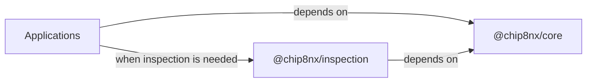
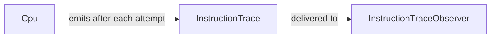
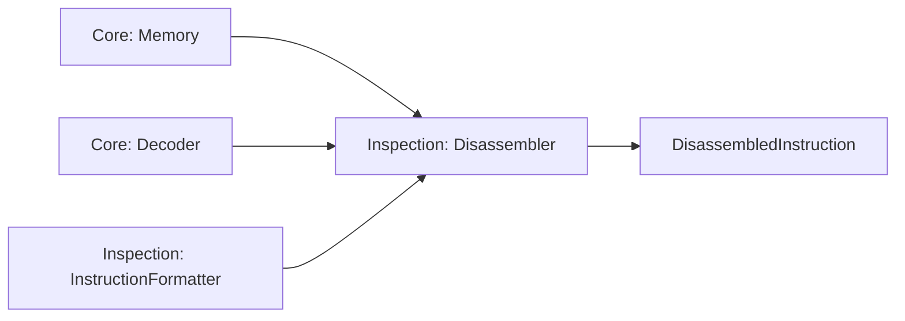
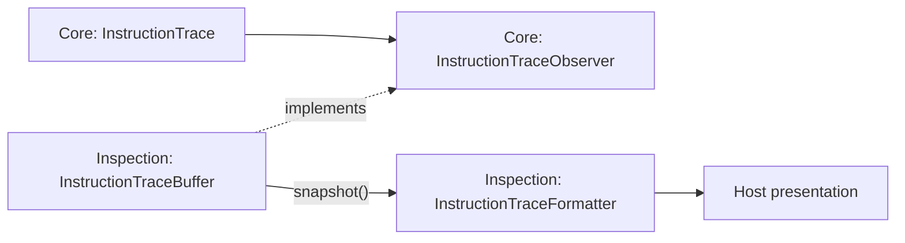
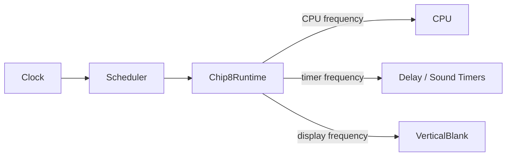
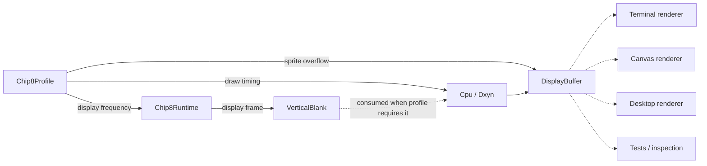

# Chip8NX Architecture Overview

Chip8NX is designed around a reusable CHIP-8 machine Core, complemented by host-independent inspection tooling and applications that provide host-specific behavior.

The package boundary reflects those responsibilities:

- `@chip8nx/core` owns the emulated machine, execution semantics, runtime mechanisms, and the minimal observation signals that only the machine can authoritatively produce;
- `@chip8nx/inspection` owns passive tools that consume Core semantics, including instruction formatting, disassembly, bounded trace history, and trace formatting;
- applications remain composition roots and own host-specific concerns such as rendering, audio output, input adapters, filesystem access, user interfaces, and lifecycle policy.

Core does not depend on Inspection, and neither reusable package assumes a terminal, browser, desktop toolkit, renderer, audio system, filesystem, or host event loop.

Within the machine itself, the architecture distinguishes three concerns:


## Package architecture

Chip8NX separates machine behavior, passive inspection, and host-specific concerns across explicit package boundaries.



The arrows in this diagram represent **dependency direction**, not runtime data flow.

`@chip8nx/core` has no dependency on `@chip8nx/inspection`. Inspection builds on Core's public machine semantics and observation contracts, while applications may compose either Core alone or Core together with Inspection according to their needs.

This keeps the reusable dependency graph acyclic and prevents presentation or inspection concerns from becoming machine requirements.

## Machine profile

`Chip8Profile` is the declarative description of the machine being emulated.

A profile describes the whole emulated machine target. Compatibility-sensitive behavior is one part of that description rather than another name for the profile.

Conceptually:

```text
Chip8Profile
    ├── machine characteristics
    │   ├── memory size
    │   ├── program start address
    │   ├── stack capacity
    │   ├── display geometry and refresh frequency
    │   ├── timer frequency
    │   └── font image and placement
    │
    └── compatibility
        ├── shift source
        ├── memory-transfer index behavior
        ├── jump-offset source
        ├── logic-operation flag behavior
        ├── sprite overflow behavior
        └── sprite draw timing
```

Chip8NX currently provides two built-in historical profiles:

- `CLASSIC_CHIP8_PROFILE`;
- `CHIP48_PROFILE`, representing CHIP-48 2.25.

Named historical profiles are coherent presets derived from the behavior of their target interpreters. The same `Chip8Profile` type may also represent deliberate custom combinations when a host or test needs them.

Compatibility choices use semantic values rather than boolean quirk flags. For example:

```ts
shiftSource: "vx";
memoryTransferIndex: "increment-by-x";
spriteOverflow: "clip";
```

This keeps the selected behavior explicit without requiring callers to interpret what an enabled or disabled "quirk" means.

A profile does not construct components, select host implementations, or represent current mutable state. Applications remain composition roots and provide the relevant profile values to the components they construct.

Runtime execution policy such as CPU frequency is intentionally separate from the machine profile. Timer frequency and emulated display timing belong to the profile because they are characteristics of the emulated machine, while CPU execution frequency remains host/runtime policy.

See [Machine state and capabilities architecture](./machine-state-and-capabilities.md) for the detailed state/configuration model and the project's evidence-driven approach to CHIP-8-family variation.

## Core instruction execution overview

One CPU step follows a deliberately small execution pipeline:


`Cpu` owns the sequencing of a single instruction attempt. It fetches the two opcode bytes from memory, advances the program counter, decodes the opcode into a typed `Instruction`, and delegates execution to `InstructionExecutor`.

The typed `Instruction` is the central boundary between encoded representation and instruction semantics.

`InstructionExecutor` operates through `ExecutionContext`, which groups the machine state and capabilities required by instruction semantics. The context does not construct those collaborators or collapse their responsibilities into one machine object; it is an explicit execution boundary.

Control-flow instructions override the already-advanced program counter when required. Retry-style instructions such as Classic `Fx0A` and vblank-gated `Dxyn` restore the current instruction address so the same instruction can be attempted again later.

This diagram intentionally omits initialization, scheduling, timers, and observation. Those concerns have different lifecycles and are described separately below.

See [Instruction execution architecture](./instruction-execution.md) for the detailed fetch/decode/execute model, typed instruction representation, execution semantics, invariant ownership, and verification strategy.

## Machine state and capabilities

Core keeps persistent state in focused components such as `Registers`, `Memory`, `Stack`, `ProgramCounter`, `IndexRegister`, `Timer`, `DisplayBuffer`, and `VerticalBlank`.

Roles whose implementations genuinely vary are exposed through capability boundaries such as `Keyboard`, `RandomNumberGenerator`, `Font`, and `Memory`.

Interface use and state ownership are independent concerns: for example, `Memory` is both an interface and mutable machine state, while `Keyboard` is a capability whose implementation owns interpreter-relevant state.

Applications construct the object graph explicitly, using profile characteristics where appropriate:

```ts
new Stack(profile.stackCapacity);

new ProgramCounter(profile.programStartAddress);

new DisplayBuffer(
  profile.display.width,
  profile.display.height,
  profile.compatibility.spriteOverflow,
);

new InstructionExecutor(profile.compatibility);
```

See [Machine state and capabilities architecture](./machine-state-and-capabilities.md) for focused invariant ownership, snapshot-based state observation, capability substitution, profiles and runtime configuration, reset semantics, and lifecycle ownership.

## CPU observation

Core exposes instruction execution through a minimal observation seam owned by `Cpu`.



The observation mechanism is optional. When no observer is attached, `Cpu` does not create trace snapshots.

`InstructionTrace` records semantic facts about one CPU instruction attempt, including the before/after CPU state and whether the attempt succeeded or failed. Failed traces preserve the stage reached by the attempt through the presence or absence of the fetched opcode and decoded instruction.

`InstructionTraceObserver` is the minimal consumer port. Core does not retain trace history, format trace output, filter observations, fan them out, or use them to control execution.

Observer failures are isolated from CPU semantics: an observer cannot replace a CPU failure, create a new CPU failure, or change the result of `Cpu.step()`.

Retry-style instructions remain visible as repeated CPU attempts. For example, a vblank-gated `Dxyn` or waiting `Fx0A` may restore its own instruction address and appear multiple times before a later attempt advances.

Passive consumers of this signal belong outside Core. `@chip8nx/inspection` provides reusable tools such as bounded trace history and human-readable trace formatting.

## Inspection

`@chip8nx/inspection` provides host-independent, passive tools for understanding CHIP-8 programs and observed execution.

It depends only on the public API of `@chip8nx/core`; Core has no dependency on Inspection.

Inspection currently supports two complementary views of the machine.

### Static inspection

Static inspection starts with encoded program bytes and uses Core decoding semantics to produce human-readable instruction listings.



`Disassembler` does not implement a second decoder. It reuses Core's `Decoder`, so execution and inspection share the same instruction semantics.

Instruction presentation is delegated to `InstructionFormatter`.

Inspection currently provides profile-specific formatters for the two built-in historical targets:

- `ClassicInstructionFormatter` presents Classic CHIP-8 instruction semantics;
- `Chip48InstructionFormatter` presents CHIP-48 semantics where the textual representation differs, while delegating unchanged instructions to the Classic formatter.

This distinction matters for instructions such as `Bnnn` and `8xy6` / `8xyE`, whose decoded operands are shared but whose historical interpretation differs between Classic CHIP-8 and CHIP-48.

Formatter selection remains a composition concern. Inspection does not inspect a global machine profile or choose a formatter implicitly.
Disassembly is strict over the requested range: invalid complete opcodes remain decoding errors. Policies such as treating unknown bytes as data and continuing through a whole ROM belong to the consuming application rather than the reusable disassembler.

See [Disassembly architecture](./disassembly.md) for the detailed component boundaries, composition model, range semantics, and extension strategy.

### Runtime inspection

Runtime inspection begins with the observation signal emitted by Core during CPU execution.



`InstructionTraceBuffer` is a bounded passive history of observed instruction attempts. It retains traces in chronological order up to its configured capacity, but does not control execution or determine when observations occur.

Trace formatters turn structured Core observations into human-readable representations. They may reuse instruction formatting, but remain independent from storage and host output.

The two inspection paths therefore have the same architectural shape:

```text
Core semantics / signals
        ↓
Inspection tools
        ↓
Host presentation or policy
```

Inspection remains passive. It does not currently provide breakpoints, watchpoints, pause conditions, step-over behavior, step-out behavior, or other debugger execution-control semantics.

See [Tracing architecture](./tracing.md) for the detailed trace data model, failure semantics, retry behavior, formatting boundaries, bounded history, testing strategy, and deliberately deferred debugger features.

## Machine initialization

`MachineInitializer` establishes the defined starting state of an already-composed machine.

```text
ExecutionContext + Chip8Profile + Program MemoryImage
    ↓
validate memory layout
    ↓
reset machine state
    ↓
install font + program
```

Known layout errors are rejected before mutation begins.

Initialization does not construct components, perform host I/O, control runtime pause/resume, or provide general rollback after mutation has started.

See [Machine initialization architecture](./machine-initialization.md) for binary-image boundaries, half-open memory ranges, reset and ROM-replacement semantics, failure guarantees, and verification strategy.

## Runtime and timing

`Chip8Runtime` maps generic periodic scheduling onto CHIP-8 execution.



The layers have distinct responsibilities:

- `Clock` provides monotonic time;
- `Scheduler` owns exact periodic deadlines, catch-up, suspension, and global chronological ordering;
- `Chip8Runtime` maps those generic deadlines to CPU, timer, and vertical-blank work;
- timed state such as `Timer` and `VerticalBlank` remains independent of scheduling.

When deadlines are equal, runtime registration order makes the result deterministic:

```text
vertical blank
    ↓
timers
    ↓
CPU
```

Pausing suspends scheduled progression without accumulating execution debt. Manual single stepping remains a separate paused operation: it executes one CPU attempt without advancing scheduled timer or display time.

`Chip8Runtime` therefore provides generic execution-control mechanisms such as `pause()`, `resume()`, `step()`, and paused-state inspection. Core does not decide _why_ execution should pause or resume.

Policies such as stopping at a breakpoint, pausing when a watch condition becomes true, or implementing step-over / step-out behavior would belong to a future reusable debugger layer if those needs are demonstrated. Such a layer would use Core runtime mechanisms rather than move debugger policy into `Chip8Runtime`.

See [Runtime and timing architecture](./runtime-and-timing.md) for deadline representation, catch-up, equal-deadline policy, pause/resume rebasing, timed machine state, and single-step semantics.

## Display boundary

`DisplayBuffer` is emulated graphical state.

`VerticalBlank` is emulated display-timing state.

A host renderer is neither of those things.



A renderer observes the buffer and presents it using host-specific technology.

Whether `Dxyn` must consume a vertical-blank opportunity is an instruction-semantics choice supplied by the active profile. Profiles using immediate drawing do not consult or consume `VerticalBlank`.

Likewise, `DisplayBuffer` owns the selected sprite-overflow behavior without knowing which historical profile selected it.

Host rendering does **not** generate CHIP-8 vertical blank and does not need to run at the exact emulated display refresh frequency.

This separation allows terminal hosts, browser hosts, future desktop hosts, and deterministic tests to share the same display state and timing semantics while historical profiles choose the behavior they require.

## Keyboard boundary

The machine-facing abstraction is `Keyboard`.

The standard mutable Core implementation is `KeyboardState`.

Host adapters translate platform events into state transitions:


`KeyboardState` owns CHIP-8-facing pressed-state behavior and the `Fx0A` press-then-release wait state machine.

The host adapter owns platform-specific concerns such as terminal escape-sequence parsing, browser event handling, or synthetic release behavior.

## Application composition

Applications are the composition roots of Chip8NX.

They construct the machine components required by `@chip8nx/core`, choose the machine profile, connect host-specific adapters, and decide which optional reusable tooling to include.

An application may depend only on Core:

```text
Application
    ↓
@chip8nx/core
```

or compose Core together with passive inspection tooling:

```text
Application
    ├──→ @chip8nx/core
    │
    └──→ @chip8nx/inspection
              ↓
        @chip8nx/core
```

This allows a minimal host to remain minimal while richer hosts can add inspection capabilities without changing the emulated machine.

Current applications illustrate different composition needs:

- the Terminal host composes Core with selected Inspection formatting tools for optional trace output;
- the disassembler application composes Core decoding and memory semantics with Inspection disassembly and instruction formatting;
- the Web host composes Core execution and CPU observation with Inspection disassembly, bounded trace history, and profile-appropriate formatting to provide live CPU state, nearby instructions, and recent instruction-attempt presentation. It currently allows the user to choose between Classic CHIP-8 and CHIP-48 2.25.

The Web host remains responsible for the policy around that composition. It chooses the active machine profile, corresponding instruction formatter, nearby-disassembly window, trace-history capacity, refresh cadence, DOM presentation, and lifecycle behavior without moving those concerns into either reusable package.

Changing the selected profile while a ROM is loaded creates a fresh Web machine session from the retained ROM image. The new session receives the selected profile consistently across initialization, execution, display behavior, runtime timing, and inspection formatting. Whether the previous session was running or paused is preserved as host lifecycle policy.

Reset is different from profile replacement: it reinitializes the existing machine using the profile already retained by that session.

Applications remain responsible for host-specific concerns such as rendering, audio presentation, physical input mapping, filesystem access, DOM or terminal interaction, and lifecycle integration.

The reusable packages deliberately do not require a dependency-injection container or a single mandatory machine factory.

The Terminal application provides optional higher-level composition helpers through its Level 1 / Level 2 / Level 3 model. Evaluation against the Web application showed that this structure is useful for Terminal but does not need to become a mandatory Core or project-wide composition framework.

Different hosts may therefore develop different host-local composition structures around the same reusable boundaries.

Inspection may depend only on Core's public API. Reaching into `packages/core/src/...` would bypass the package boundary and couple Inspection to private implementation details.

Core must remain usable without any inspection, formatting, disassembly, trace-history, or host-presentation tooling.

A future reusable debugger layer, if demonstrated by real execution-control needs, would depend inward on Core. Its exact relationship with Inspection should be determined by actual shared behavior rather than imposed in advance.

See:

- [Terminal composition levels](../guides/terminal-composition-levels.md)
- [Host composition evaluation](./composition-evaluation.md)
