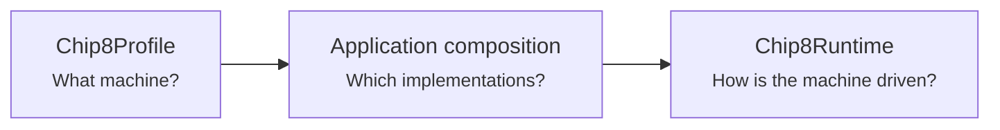
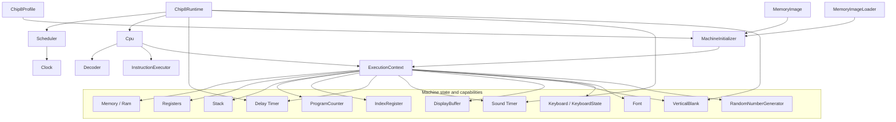
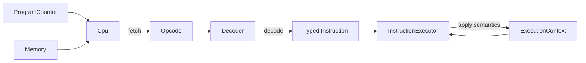
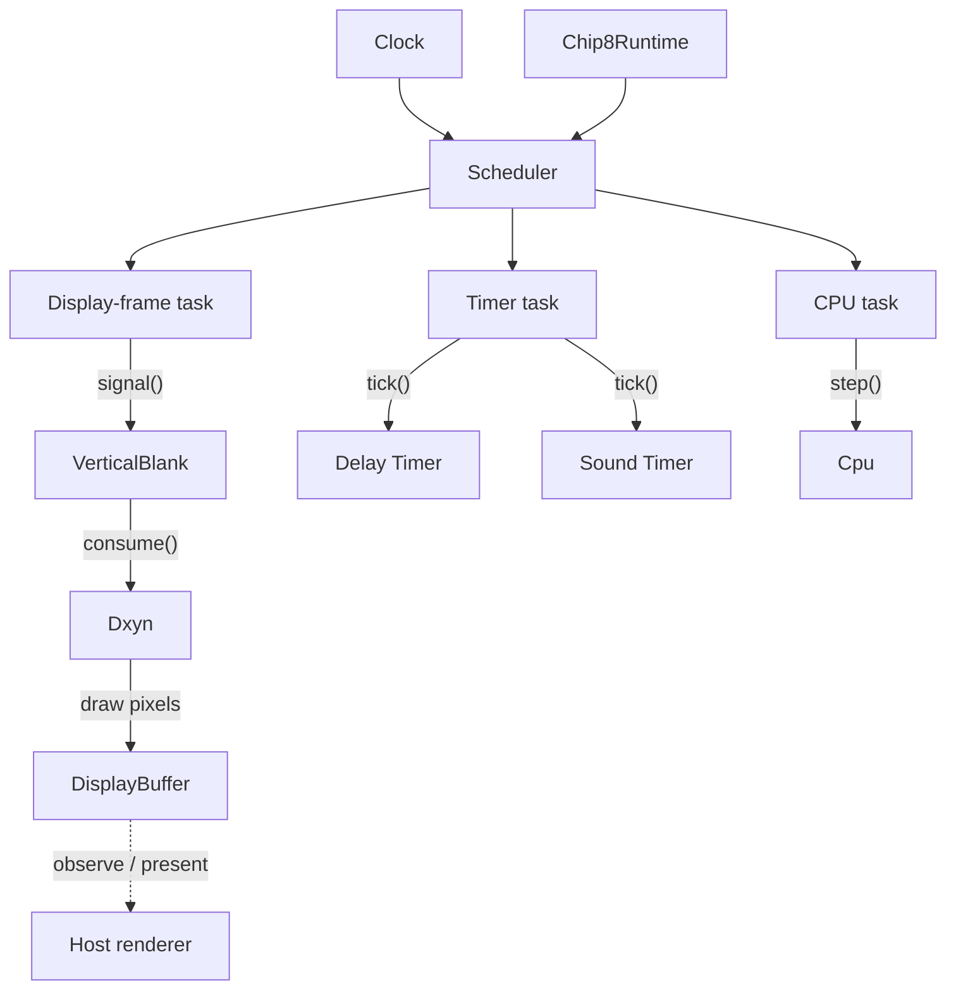
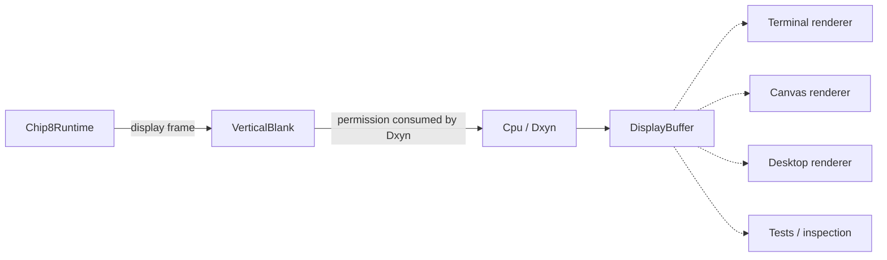
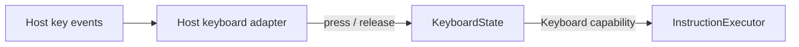
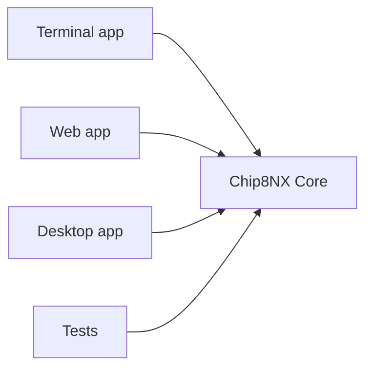

# Chip8NX Architecture Overview

Chip8NX is designed around a reusable CHIP-8 Core that can be hosted by multiple applications.

The Core does not assume a terminal, browser, desktop toolkit, renderer, audio system, filesystem, or host event loop. Those decisions belong to applications built around the Core.

At the highest level, the architecture distinguishes three concerns:



## Machine profile

A `Chip8Profile` is a declarative description of the CHIP-8 environment being emulated.

The Classic profile supplies characteristics such as:

- memory size;
- program start address;
- stack capacity;
- display width and height;
- display refresh frequency;
- timer frequency;
- font image;
- font location.

A profile describes the machine itself. It does not select host-specific implementations.

Future profiles may describe different machine characteristics or compatibility behavior when CHIP-8-family variants genuinely require different semantics.

## Core component overview

The following diagram is intentionally high level. It shows the main components and their most important direct relationships without trying to represent every method call.



`ExecutionContext` is an explicit aggregate of the mutable state and capabilities required by instruction execution.

The context does not make these components a monolith. The individual components remain independently constructed, replaceable, and testable.

## Focused components

The emulator is composed from narrow components such as:

- `Memory`;
- `Registers`;
- `Stack`;
- `ProgramCounter`;
- `IndexRegister`;
- `Timer`;
- `DisplayBuffer`;
- `VerticalBlank`;
- `Keyboard`;
- `Font`;
- `RandomNumberGenerator`;
- `Cpu`.

Generic components do not hide Classic-specific defaults.

For example:

```ts
new Stack(profile.stackCapacity);

new ProgramCounter(profile.programStartAddress);

new DisplayBuffer(profile.display.width, profile.display.height);
```

The profile supplies machine-specific values while the components remain reusable.

## CPU execution pipeline

The CPU owns the CHIP-8 fetch/decode/execute cycle.



The cycle advances the normal program counter before execution. Instructions that must wait, such as Classic `FX0A` or a display-synchronized `Dxyn`, can rewind the program counter so the same instruction is retried later.

Instruction decoding and instruction execution are deliberately separate responsibilities:

- `Decoder` understands opcode encoding;
- the typed `Instruction` representation carries decoded meaning;
- `InstructionExecutor` applies instruction semantics to `ExecutionContext`.

The executor is stateless.

## Machine initialization

`MachineInitializer` establishes a valid initial state for already-constructed components.

It:

1. validates the complete memory layout before mutation;
2. clears mutable machine state;
3. resets registers, stack, timers, index register, display, vertical-blank state, and keyboard interpreter state;
4. sets the initial program counter;
5. installs profile-provided font data;
6. loads the program image.

It does not construct components, perform external I/O, or drive execution.

The random-number generator is intentionally not reset by machine initialization because CHIP-8 does not define an RNG seeding lifecycle.

## Runtime and timing

`Chip8Runtime` coordinates emulated work over time through the generic deadline-driven `Scheduler`.

It schedules three categories of work:

- CPU instructions at the runtime-configured CPU frequency;
- both CHIP-8 timers at the profile timer frequency;
- display-frame boundaries at the profile display refresh frequency.



### Deadline ordering

The runtime registers vertical blank before timers and CPU.

This makes exact deadline ties deterministic:

1. a new display interval becomes available;
2. timer boundaries are processed;
3. the CPU executes the instruction scheduled at the same instant.

The scheduler itself contains no CHIP-8-specific logic. It owns globally chronological deadline ordering.

## Display boundary

`DisplayBuffer` is emulated graphical state.

`VerticalBlank` is emulated display-timing state.

A host renderer is neither of those things.



A renderer observes the buffer and presents it using host-specific technology.

Host rendering does **not** generate CHIP-8 vertical blank and does not need to run at the exact emulated display refresh frequency.

This separation allows a terminal host, browser host, desktop host, and deterministic tests to share the same display semantics.

## Keyboard boundary

The machine-facing abstraction is `Keyboard`.

The standard mutable Core implementation is `KeyboardState`.

Host adapters translate platform events into state transitions:



`KeyboardState` owns CHIP-8-facing pressed-state behavior and the `FX0A` press-then-release wait state machine.

The host adapter owns platform-specific concerns such as terminal escape-sequence parsing, browser event handling, or synthetic release behavior.

## Application composition

The reusable Core deliberately does not require a dependency-injection container or a single mandatory machine factory.

The application remains the composition root.

A terminal application can choose terminal-specific adapters while a browser application can choose browser-specific adapters, with both sharing the same Core semantics.

The terminal application provides optional higher-level composition helpers through its Level 1 / Level 2 / Level 3 model. Evaluation against the Web application showed that this structure is useful for Terminal but does not need to become a mandatory Core or project-wide composition framework.

Different hosts may develop different host-local composition structures around the same Core boundaries.

See:

- [Terminal composition levels](../guides/terminal-composition-levels.md)
- [Host composition evaluation](./composition-evaluation.md)

## Dependency direction

Dependencies point inward toward the emulator Core.



The Core must not import application-specific code.

That boundary is what allows the emulator to remain reusable across multiple frontends.
