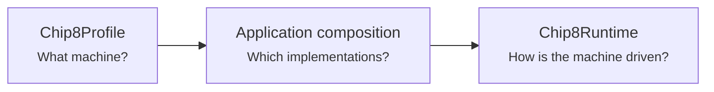
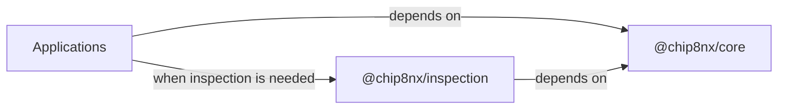
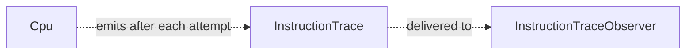
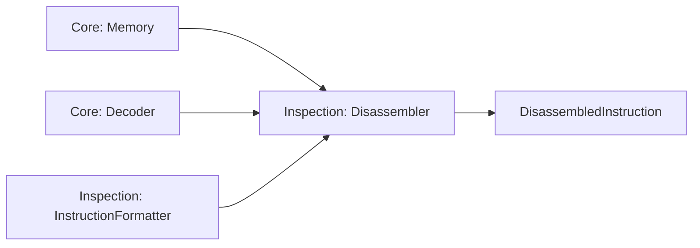
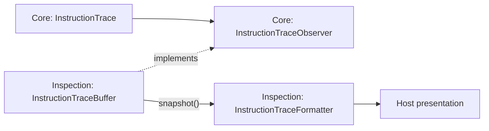
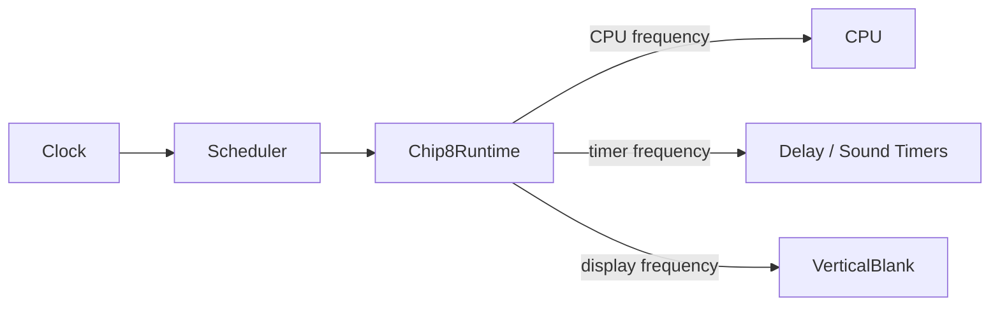
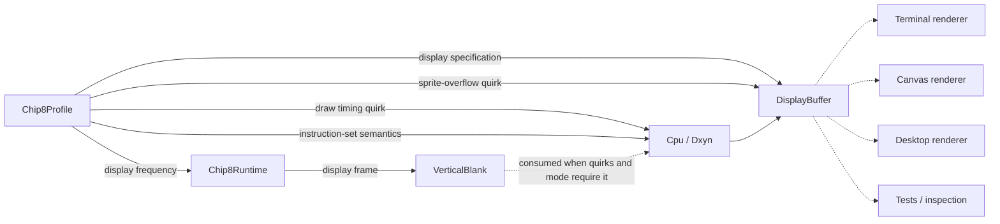

# Chip8NX Architecture Overview

Chip8NX is designed around a reusable CHIP-8 machine Core, complemented by host-independent inspection tooling and applications that provide host-specific behavior.

The package boundary reflects those responsibilities:

- `@chip8nx/core` owns the emulated machine, execution semantics, runtime mechanisms, and the minimal observation signals that only the machine can authoritatively produce;
- `@chip8nx/inspection` owns passive tools that consume Core semantics, including instruction formatting, disassembly, bounded trace history, and trace formatting;
- applications remain composition roots and own host-specific concerns such as rendering, audio output, input adapters, filesystem access, user interfaces, and lifecycle policy.

Core does not depend on Inspection, and neither reusable package assumes a terminal, browser, desktop toolkit, renderer, audio system, filesystem, or host event loop.

Within the machine itself, the architecture distinguishes three concerns:



## Package architecture

Chip8NX separates machine behavior, passive inspection, and host-specific concerns across explicit package boundaries.



The arrows in this diagram represent **dependency direction**, not runtime data flow.

`@chip8nx/core` has no dependency on `@chip8nx/inspection`. Inspection builds on Core's public machine semantics and observation contracts, while applications may compose either Core alone or Core together with Inspection according to their needs.

This keeps the reusable dependency graph acyclic and prevents presentation or inspection concerns from becoming machine requirements.

## Machine profile

`Chip8Profile` is the declarative description of the machine target being emulated.

A profile combines three different kinds of information:

1. **machine characteristics** needed to compose and initialize the machine;
2. **instruction-set identity**, which determines which instruction semantics exist;
3. **quirks**, which describe how instructions shared by supported variants behave differently.

Conceptually:

```text
Chip8Profile
    ├── machine characteristics
    │   ├── memory size
    │   ├── program start address
    │   ├── stack capacity
    │   ├── display specification and refresh frequency
    │   ├── timer frequency
    │   └── fonts
    │       ├── small font image and placement
    │       └── optional large font image and placement
    │
    ├── instructionSet
    │   ├── chip8
    │   └── superchip-1.1
    │
    └── quirks
        ├── shift source
        ├── memory-transfer index behavior
        ├── jump-offset source
        ├── logic-operation flag behavior
        ├── sprite overflow behavior
        ├── sprite draw timing behavior
        └── index-overflow behavior
```

This separation is intentional.

Instruction-set membership answers questions such as whether `00FD`, `Fx30`, `Fx75`, `Fx85`, SUPER-CHIP display-control instructions, and the extended interpretation of `Dxy0` exist. Those are not represented as `"unsupported"` quirk values for machines where the instructions do not exist.

Quirks instead describe demonstrated variation in instructions shared by the supported machine families. For example:

```ts
shiftSource: "vx";
memoryTransferIndex: "increment-by-x";
spriteOverflow: "clip";
```

Using explicit semantic values keeps the selected behavior readable without requiring callers to interpret what an enabled or disabled boolean "quirk" means.

The display specification may describe either fixed geometry or a SUPER-CHIP display with one shared backing store and multiple logical modes. Sprite draw timing may likewise be uniform or depend on the active display mode. These remain declarative machine characteristics and shared-instruction quirks rather than host presentation policy.

Font configuration is grouped as one machine characteristic:

```text
profile.fonts.small
    ├── image
    └── baseAddress

profile.fonts.large
    ├── image
    └── baseAddress

or null when the machine has no large font
```

Chip8NX currently provides three built-in historical profiles:

- `CLASSIC_CHIP8_PROFILE`;
- `CHIP48_PROFILE`, representing CHIP-48 2.25;
- `SUPERCHIP_PROFILE`, representing the project's documented historical SUPER-CHIP 1.1 target.

Classic CHIP-8 and CHIP-48 currently use the `chip8` instruction-set identity and differ through machine characteristics and shared-instruction quirks. SUPER-CHIP uses the `superchip-1.1` instruction-set identity and overrides the shared quirks that differ from CHIP-48 while extending the machine with SUPER-CHIP-specific semantics and resources.

Named historical profiles are coherent presets derived from the behavior of their target interpreters. The same `Chip8Profile` type may also represent deliberate custom combinations when a host or test needs them, but the built-in profiles remain the project's historical reference points.

A profile does not construct components, select host implementations, own mutable machine state, or define resource lifetime. In particular, the availability of SUPER-CHIP RPL instructions comes from the instruction set, while the persistence of the `RplFlags` store is a composition and lifecycle concern outside profile data.

Applications remain composition roots and provide the relevant profile values to the components they construct.

Runtime execution policy such as CPU frequency is intentionally separate from the machine profile. Timer frequency and emulated display timing belong to the profile because they are characteristics of the emulated machine, while CPU execution frequency remains host/runtime policy.

For the canonical profile model and extension rules, see [Machine profiles and variation](./machine-profiles-and-variation.md).

See [Machine state and capabilities architecture](./machine-state-and-capabilities.md) for the detailed state/configuration model and the project's evidence-driven approach to CHIP-8-family variation.

## Core instruction execution overview

One CPU step follows a deliberately small execution pipeline:


`Cpu` owns the sequencing of a single instruction attempt. Before fetching, it first checks `ExitState`; an exited interpreter performs no further CPU work until machine initialization resets that state. Otherwise, the CPU fetches the two opcode bytes from memory, advances the program counter, decodes the opcode into a typed `Instruction`, and delegates execution to `InstructionExecutor`.

The typed `Instruction` is the central boundary between encoded representation and instruction semantics.

`InstructionExecutor` receives the active `Chip8InstructionSet` and `Chip8Quirks`. The instruction set determines which variant-specific semantics are available, while quirks determine the behavior of shared instructions. The executor operates through `ExecutionContext`, which groups the machine state and capabilities required by instruction semantics.

The context does not construct those collaborators or collapse their responsibilities into one machine object; it is an explicit execution boundary.

Control-flow instructions override the already-advanced program counter when required. Retry-style instructions such as Classic `Fx0A` and vblank-gated `Dxyn` restore the current instruction address so the same instruction can be attempted again later.

SUPER-CHIP-only instructions are guarded by instruction-set membership rather than by `"unsupported"` compatibility settings. Historical SUPER-CHIP semantics that are intrinsic to the targeted `superchip-1.1` instruction set, such as `00C0` interpreter exit and the extended `Dxy0` forms, are interpreted from that instruction-set identity. Shared semantics that genuinely vary, such as `Fx1E` index overflow behavior, remain quirks.

SUPER-CHIP interpreter-exit conditions use `ExitState` rather than exceptions or runtime pause. This includes explicit `00FD`, historical `00C0`, and the configured historical `Fx1E` index-overflow behavior. Once one of those conditions marks the interpreter exited, subsequent `Cpu.step()` calls return before fetch, so no additional instruction attempt or trace is produced until initialization resets the exit state.

The draw path is kept inside instruction execution rather than pushed into the display state. `DisplayBuffer` reports draw facts such as collision rows and clipped rows; `InstructionExecutor` resolves timing, sprite form, and the value written to `VF` according to the active instruction set, quirks, and display mode.

This diagram intentionally omits initialization, scheduling, timers, and observation. Those concerns have different lifecycles and are described separately below.

See [Instruction execution architecture](./instruction-execution.md) for the detailed fetch/decode/execute model, typed instruction representation, instruction-set and quirk semantics, invariant ownership, and verification strategy.

## Machine state and capabilities

Core keeps persistent state in focused components such as `Registers`, `Memory`, `Stack`, `ProgramCounter`, `IndexRegister`, `Timer`, `DisplayBuffer`, `VerticalBlank`, `ExitState`, and `RplFlags`.

`DisplayBuffer` owns both framebuffer contents and the current logical display mode when the selected display specification supports multiple modes. `ExitState` records whether an interpreter-level exit condition has ended execution. `RplFlags` models the eight SUPER-CHIP user flags and deliberately has a longer lifecycle than ordinary resettable machine state.

Roles whose implementations genuinely vary are exposed through capability boundaries such as `Keyboard`, `RandomNumberGenerator`, `Font`, and `Memory`.

Interface use and state ownership are independent concerns: for example, `Memory` is both an interface and mutable machine state, while `Keyboard` is a capability whose implementation owns interpreter-relevant state.

Applications construct the object graph explicitly, using profile characteristics where appropriate. Conceptually:

```ts
new Stack(profile.stackCapacity);

new ProgramCounter(profile.programStartAddress);

new DisplayBuffer(profile.display.specification, profile.quirks.spriteOverflow);

const font = profile.fonts.large === null
  ? new ClassicFont(profile.fonts.small.baseAddress)
  : new SuperChipFont(
    profile.fonts.small.baseAddress,
    profile.fonts.large.baseAddress,
  );

new InstructionExecutor(profile.instructionSet, profile.quirks);
```

Most components grouped by `ExecutionContext` belong to one machine initialization lifecycle. `RplFlags` is the deliberate exception: SUPER-CHIP treats those eight user flags as persistent storage, so `MachineInitializer` does not reset them. The composition root therefore decides how long the store lives and may share it across machine-session replacement.

The profile tells the executor that the SUPER-CHIP RPL instructions exist; it does not own or reset the RPL state itself.

See [Machine state and capabilities architecture](./machine-state-and-capabilities.md) for focused invariant ownership, snapshot-based state observation, capability substitution, profiles and runtime configuration, reset semantics, and lifecycle ownership.

## CPU observation

Core exposes instruction execution through a minimal observation seam owned by `Cpu`.



The observation mechanism is optional. When no observer is attached, `Cpu` does not create trace snapshots.

`InstructionTrace` records semantic facts about one CPU instruction attempt, including the before/after CPU state and whether the attempt succeeded or failed. Failed traces preserve the stage reached by the attempt through the presence or absence of the fetched opcode and decoded instruction.

`InstructionTraceObserver` is the minimal consumer port. Core does not retain trace history, format trace output, filter observations, fan them out, or use them to control execution.

Observer failures are isolated from CPU semantics: an observer cannot replace a CPU failure, create a new CPU failure, or change the result of `Cpu.step()`.

Retry-style instructions remain visible as repeated CPU attempts. For example, a vblank-gated `Dxyn` or waiting `Fx0A` may restore its own instruction address and appear multiple times before a later attempt advances.

Passive consumers of this signal belong outside Core. `@chip8nx/inspection` provides reusable tools such as bounded trace history and human-readable trace formatting.

## Inspection

`@chip8nx/inspection` provides host-independent, passive tools for understanding CHIP-8 programs and observed execution.

It depends only on the public API of `@chip8nx/core`; Core has no dependency on Inspection.

Inspection currently supports two complementary views of the machine.

### Static inspection

Static inspection starts with encoded program bytes and uses Core decoding semantics to produce human-readable instruction listings.



`Disassembler` does not implement a second decoder. It reuses Core's `Decoder`, so execution and inspection share the same instruction semantics.

Instruction presentation is delegated to `InstructionFormatter`.

Inspection currently provides two reusable formatter implementations:

- `ClassicInstructionFormatter` presents Classic CHIP-8 instruction semantics and the shared textual forms used by the extended instruction model;
- `Chip48InstructionFormatter` presents CHIP-48-style semantics where the textual representation differs, while delegating unchanged instructions to the Classic formatter.

This distinction matters for instructions such as `Bnnn` and `8xy6` / `8xyE`, whose decoded operands are shared but whose historical interpretation differs between Classic CHIP-8 and CHIP-48-style profiles. The Web host currently reuses `Chip48InstructionFormatter` for SUPER-CHIP because the targeted SUPER-CHIP profile uses those CHIP-48-style shared-instruction interpretations while its additional opcodes use the shared formatter forms.

Formatter selection remains a composition concern. Inspection does not inspect a global machine profile or choose a formatter implicitly. Disassembly is strict over the requested range: invalid complete opcodes remain decoding errors. Policies such as treating unknown bytes as data and continuing through a whole ROM belong to the consuming application rather than the reusable disassembler.

See [Disassembly architecture](./disassembly.md) for the detailed component boundaries, composition model, range semantics, and extension strategy.

### Runtime inspection

Runtime inspection begins with the observation signal emitted by Core during CPU execution.



`InstructionTraceBuffer` is a bounded passive history of observed instruction attempts. It retains traces in chronological order up to its configured capacity, but does not control execution or determine when observations occur.

Trace formatters turn structured Core observations into human-readable representations. They may reuse instruction formatting, but remain independent from storage and host output.

The two inspection paths therefore have the same architectural shape:

```text
Core semantics / signals
        ↓
Inspection tools
        ↓
Host presentation or policy
```

Inspection remains passive. It does not currently provide breakpoints, watchpoints, pause conditions, step-over behavior, step-out behavior, or other debugger execution-control semantics.

See [Tracing architecture](./tracing.md) for the detailed trace data model, failure semantics, retry behavior, formatting boundaries, bounded history, testing strategy, and deliberately deferred debugger features.

## Machine initialization

`MachineInitializer` establishes the defined starting state of an already-composed machine.

```text
ExecutionContext + Chip8Profile + Program MemoryImage
    ↓
validate memory layout
    ↓
reset machine state
    ↓
install fonts + program
```

Known layout errors are rejected before mutation begins. The initializer validates `profile.fonts.small`, optional `profile.fonts.large`, and the program image as non-empty, in-bounds, non-overlapping memory ranges before resetting or loading state.

Initialization resets ordinary machine state, including display state and `ExitState`, and restores the profile-defined initial display mode where applicable. It deliberately does **not** reset `RplFlags`; those flags model persistent SUPER-CHIP storage whose lifetime is owned by host composition rather than by one initialization cycle.

Initialization does not construct components, perform host I/O, control runtime pause/resume, or provide general rollback after mutation has started.

See [Machine initialization architecture](./machine-initialization.md) for binary-image boundaries, half-open memory ranges, reset and ROM-replacement semantics, failure guarantees, and verification strategy.

## Runtime and timing

`Chip8Runtime` maps generic periodic scheduling onto CHIP-8 execution.



The layers have distinct responsibilities:

- `Clock` provides monotonic time;
- `Scheduler` owns exact periodic deadlines, catch-up, suspension, and global chronological ordering;
- `Chip8Runtime` maps those generic deadlines to CPU, timer, and vertical-blank work;
- timed state such as `Timer` and `VerticalBlank` remains independent of scheduling.

When deadlines are equal, runtime registration order makes the result deterministic:

```text
vertical blank
    ↓
timers
    ↓
CPU
```

Pausing suspends scheduled progression without accumulating execution debt. Manual single stepping remains a separate paused operation: it executes one CPU attempt without advancing scheduled timer or display time.

`Chip8Runtime` therefore provides generic execution-control mechanisms such as `pause()`, `resume()`, `step()`, and paused-state inspection. Core does not decide _why_ execution should pause or resume.

Policies such as stopping at a breakpoint, pausing when a watch condition becomes true, or implementing step-over / step-out behavior would belong to a future reusable debugger layer if those needs are demonstrated. Such a layer would use Core runtime mechanisms rather than move debugger policy into `Chip8Runtime`.

See [Runtime and timing architecture](./runtime-and-timing.md) for deadline representation, catch-up, equal-deadline policy, pause/resume rebasing, timed machine state, and single-step semantics.

## Display boundary

`DisplayBuffer` is emulated graphical state.

`VerticalBlank` is emulated display-timing state.

A host renderer is neither of those things.



A renderer observes the buffer and presents it using host-specific technology.

### Logical geometry and backing geometry

Fixed Classic CHIP-8 and CHIP-48 displays have identical logical and backing dimensions. SUPER-CHIP demonstrates why those concepts must be distinct:

```text
                         logical          backing
Classic CHIP-8           64 × 32          64 × 32
CHIP-48                  64 × 32          64 × 32
SUPER-CHIP low           64 × 32         128 × 64
SUPER-CHIP high         128 × 64         128 × 64
```

SUPER-CHIP therefore uses one shared 128×64 backing framebuffer. In low-resolution mode, one logical pixel maps to a 2×2 region of that backing store. In high-resolution mode, logical and backing coordinates correspond one-to-one.

The current display mode is mutable machine state owned by `DisplayBuffer`. `00FE` and `00FF` change that mode without implicitly clearing the shared backing store. `00E0` clears pixels while retaining the active mode. SUPER-CHIP scrolling instructions operate in physical backing-buffer units, so scrolling remains well-defined independently of the logical mode.

Raw framebuffer access is expressed in backing coordinates. That keeps host presentation independent of SUPER-CHIP's logical scaling rules: the Web `CanvasDisplay`, for example, renders the complete backing store rather than reinterpreting low-resolution pixels itself.

### Draw timing, sprite form, and collision semantics

Whether `Dxyn` must consume a vertical-blank opportunity is a shared-instruction quirk supplied by the active profile. A uniform profile may always wait or always draw immediately; SUPER-CHIP uses display-mode-dependent timing:

```text
SUPER-CHIP low
    → vertical-blank gated

SUPER-CHIP high
    → immediate
```

Immediate drawing does not consult or consume a pending `VerticalBlank`. The scheduler remains profile-agnostic: it only produces display opportunities at the configured refresh frequency, while instruction execution decides whether the active quirks and display mode require one.

The extended meaning of `Dxy0` is instead part of the `superchip-1.1` instruction semantics. Under the base `chip8` instruction set, a zero-height draw remains a zero-row draw even if the composed display is capable of SUPER-CHIP modes. Under `superchip-1.1`, `Dxy0` uses mode-sensitive sprite dimensions:

```text
SUPER-CHIP low
    → 16 bytes
    → 8 × 16 logical sprite

SUPER-CHIP high
    → 32 bytes
    → 16 × 16 sprite
```

The executor resolves that sprite form from the instruction-set identity and active display mode before asking `DisplayBuffer` to perform the draw.

`DisplayBuffer` returns structured draw facts, including boolean collision, collision-row count, and rows clipped below the bottom edge. The executor then interprets those facts according to instruction-set semantics and display mode:

```text
Classic / CHIP-48
    → VF = boolean collision

SUPER-CHIP low
    → VF = boolean collision

SUPER-CHIP high
    → VF = collision rows + bottom-clipped rows
```

This prevents a high-resolution-capable display from granting SUPER-CHIP `VF` semantics to a machine whose instruction set is still `chip8`.

Likewise, `DisplayBuffer` owns the selected sprite-overflow behavior without knowing which historical profile selected it.

Host rendering does **not** generate CHIP-8 vertical blank and does not need to run at the exact emulated display refresh frequency.

This separation allows terminal hosts, browser hosts, future desktop hosts, and deterministic tests to share the same display state and timing semantics while historical profiles choose the behavior they require.

## Keyboard boundary

The machine-facing abstraction is `Keyboard`.

The standard mutable Core implementation is `KeyboardState`.

Host adapters translate platform events into state transitions:


`KeyboardState` owns CHIP-8-facing pressed-state behavior and the `Fx0A` press-then-release wait state machine.

The host adapter owns platform-specific concerns such as terminal escape-sequence parsing, browser event handling, or synthetic release behavior.

## Application composition

Applications are the composition roots of Chip8NX.

They construct the machine components required by `@chip8nx/core`, choose the machine profile, connect host-specific adapters, and decide which optional reusable tooling to include.

An application may depend only on Core:

```text
Application
    ↓
@chip8nx/core
```

or compose Core together with passive inspection tooling:

```text
Application
    ├──→ @chip8nx/core
    │
    └──→ @chip8nx/inspection
              ↓
        @chip8nx/core
```

This allows a minimal host to remain minimal while richer hosts can add inspection capabilities without changing the emulated machine.

Current applications demonstrate different composition needs:

- the Terminal host composes Core with selected Inspection formatting tools for optional trace output;
- the disassembler application composes Core decoding and memory semantics with Inspection disassembly and instruction formatting;
- the Web host composes Core execution and CPU observation with Inspection disassembly, bounded trace history, profile-appropriate formatting, and browser-specific presentation.

The Web host also demonstrates two useful lifecycle boundaries without requiring a generic machine/session framework: changing profile recomposes a session around the retained ROM, while host-owned `RplFlags` can outlive an individual session. The exact browser workflow belongs in the [Web application guide](../guides/web-application.md); the architectural evidence is evaluated in [Host composition evaluation](./composition-evaluation.md).

Applications remain responsible for host-specific concerns such as rendering, audio presentation, physical input mapping, filesystem access, DOM or terminal interaction, and lifecycle integration.

The reusable packages do not require a dependency-injection container or a single mandatory machine factory. Different hosts may develop different host-local composition structures around the same reusable boundaries.

Inspection may depend only on Core's public API. Reaching into `packages/core/src/...` would bypass the package boundary and couple Inspection to private implementation details.

Core must remain usable without inspection, formatting, disassembly, trace-history, or host-presentation tooling.

A future reusable debugger layer, if demonstrated by real execution-control needs, would depend inward on Core. Its exact relationship with Inspection should be determined by actual shared behavior rather than imposed in advance.

See:

- [Machine profiles and variation](./machine-profiles-and-variation.md)
- [Terminal composition levels](../guides/terminal-composition-levels.md)
- [Web application](../guides/web-application.md)
- [Host composition evaluation](./composition-evaluation.md)
