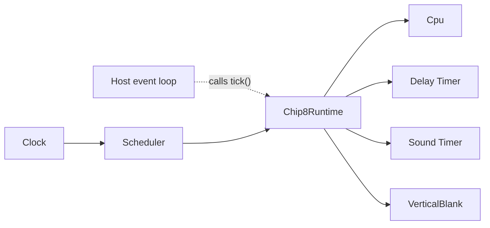

# Runtime and Timing Architecture

Chip8NX separates host time, scheduling, CHIP-8 runtime orchestration, and timed machine state.

At a high level:

```text
Clock
  ↓
Scheduler
  ↓
Chip8Runtime
  ├── CPU task ─────────────→ Cpu.step()
  ├── timer task ───────────→ DelayTimer.tick()
  │                           SoundTimer.tick()
  └── display task ─────────→ VerticalBlank.signal()
```

The central rule is:

> The clock tells us what time it is, the scheduler decides what work is due, the runtime assigns CHIP-8 meaning to that work, and machine components own the resulting state.

This separation lets the same Core run under terminal, browser, desktop, test, or future debugger hosts without coupling CHIP-8 timing semantics to a particular host event loop.

See also:

- [Architecture overview](./overview.md)
- [Instruction execution architecture](./instruction-execution.md)
- [Machine lifecycle](./machine-lifecycle.md)
- [ADR 0006 — Timer boundary](../decisions/0006-timer-boundary.md)
- [ADR 0011 — Global deadline-driven scheduler timeline](../decisions/0011-global-deadline-driven-scheduler-timeline.md)
- [ADR 0013 — Emulated display timing](../decisions/0013-emulated-display-timing.md)

## Responsibility Model

Runtime timing is divided among four layers:

- `Clock` provides monotonic time;
- `Scheduler` owns periodic deadlines and their global ordering;
- `Chip8Runtime` maps scheduled work onto CHIP-8 behavior and lifecycle;
- `Timer` and `VerticalBlank` own machine-visible timed state.

These layers answer different questions.

### `Clock`: what time is it?

`Clock` exposes one operation:

```ts
now(): Timestamp;
```

It does not sleep, schedule work, decrement timers, execute CPU instructions, or own a host loop.

That narrow API is a real substitution seam:

```text
production host
    → monotonic host-backed clock

tests
    → deterministic TestClock
```

The rest of the timing architecture depends on the role, not on a particular time source.

### `Scheduler`: what work is due?

`Scheduler` receives a `Clock` and manages periodic tasks.

It owns:

- task frequencies;
- exact deadlines;
- catch-up;
- chronological ordering;
- deterministic equal-deadline ordering;
- suspension and resumption.

It does not know whether a task represents CPU execution, timer countdown, display timing, tracing, or another domain operation.

```text
Clock
  ↓
Scheduler
  ├── task A
  ├── task B
  └── task C
```

The scheduler owns the shared timeline, not the meaning of the callbacks.

### `Chip8Runtime`: what does scheduled work mean?

`Chip8Runtime` registers three periodic tasks:

```text
display refresh frequency
    → VerticalBlank.signal()

timer frequency
    → DelayTimer.tick()
    → SoundTimer.tick()

CPU frequency
    → Cpu.step()
```

It also exposes the execution lifecycle:

```text
pause()
resume()
tick()
step()
```

The runtime does not initialize the machine, load ROM files, render graphics, produce audio, or own the host event loop.

The host decides when to call:

```ts
runtime.tick();
```

The runtime and scheduler decide which emulated events are due when that happens.

### Timed machine state remains separate

`Timer` and `VerticalBlank` contain no clock or scheduling logic.

A `Timer` owns countdown state.

`VerticalBlank` owns one pending display-synchronization opportunity.

The responsibility split is:

```text
Timer / VerticalBlank
    → state and local transition rules

Scheduler
    → when periodic occurrences are due

Chip8Runtime
    → which machine transition each occurrence means
```

This keeps state components small and independently testable.

## Dependency Direction



The host wakes the runtime, but host wake-up timing does not directly define CHIP-8 event ordering.

A browser may call `runtime.tick()` from `requestAnimationFrame`, while a terminal host may use a different loop and tests may advance a fake clock manually. The same scheduler rules apply in all cases.

## Deadline-Driven Scheduling

`Scheduler` models periodic work as exact deadline sequences on one shared monotonic timeline.

The scheduler repeatedly asks:

> Which due occurrence has the earliest deadline?

It executes that occurrence, advances the task's deadline, then asks again until nothing remains due at the current scheduling horizon.

For example:

```text
current time = 20 ms

CPU deadlines:
2, 4, 6, 8, 10, 12, 14, 16, 18, 20 ms

timer deadline:
16.666... ms

execution order:
2 CPU
4 CPU
6 CPU
8 CPU
10 CPU
12 CPU
14 CPU
16 CPU
16.666... timer
18 CPU
20 CPU
```

The important property is not only that the correct number of callbacks runs. Their relative chronology is preserved.

### Tasks own sequences; the scheduler owns ordering

Each scheduled task stores:

- its callback;
- its exact period;
- its next deadline;
- its suspension state.

A task advances only its own deadline sequence.

`Scheduler` compares those sequences and chooses which occurrence runs next.

```text
ScheduledTask
    → maintain one periodic sequence

Scheduler
    → globally order all due sequences
```

This avoids turning each task into an independent scheduler.

### First occurrence

For a task registered at time `T` with period `P`:

```text
first deadline = T + P
```

Registration does not imply an immediate callback.

For example:

```text
register 100 Hz task at 1.000 s
period = 10 ms

first deadline = 1.010 s
```

This establishes a periodic future sequence from the registration instant.

### Exact rational periods

Some frequencies do not have an integral nanosecond period.

At 60 Hz:

```text
1 second / 60
= 16,666,666.666... ns
```

Repeatedly rounding that period would accumulate drift.

`ScheduledTask` therefore represents periodic deadlines as rational nanosecond values rather than repeated floating-point or rounded integer additions.

For frequency:

```text
p / q Hz
```

the exact period is:

```text
1,000,000,000 × q
-----------------
        p
```

nanoseconds.

Internally, deadlines are compared without converting them to floating point.

For rational deadlines:

```text
a / b
c / d
```

ordering can be determined by comparing:

```text
a × d
c × b
```

Likewise, a deadline is due when its rational value is no later than the integer nanosecond timestamp sampled from the clock.

This gives the scheduler:

```text
integer monotonic timestamps
        +
exact rational deadlines
        =
drift-free ordering
```

### Catch-up preserves the original timeline

The host does not need to wake the scheduler at every deadline.

Suppose a 100 Hz task begins at time zero and the host next calls `tick()` at 50 ms.

The task's deadlines are still:

```text
10
20
30
40
50 ms
```

so five occurrences execute.

Each occurrence advances from its previous exact deadline:

```text
10 → 20 → 30 → 40 → 50 → 60 ms
```

The scheduler does not redefine the next occurrence as:

```text
current host time + period
```

after every delayed wake-up.

That preserves phase and prevents host-loop delays from becoming scheduler drift.

### Catch-up is globally chronological

When several tasks are overdue, the scheduler does not catch up one complete task at a time.

For:

```text
fast = 4 Hz
slow = 2 Hz
now = 1 s
```

the shared deadline timeline is:

```text
fast @ 250 ms
fast @ 500 ms
slow @ 500 ms
fast @ 750 ms
fast @ 1000 ms
slow @ 1000 ms
```

That is also the execution order.

This is the central difference between the global deadline model and independent elapsed-time accumulators.

### Equal deadlines use stable registration order

Exact deadline ties are resolved by task registration order.

If:

```text
register A
register B

A deadline = 1 s
B deadline = 1 s
```

then:

```text
A
B
```

execute in that order.

`Scheduler` does not implement a separate priority system. Stable registration order provides deterministic tie behavior while remaining generic.

`Chip8Runtime` deliberately uses this property for CHIP-8 timer/display/CPU semantics, described below.

### One `tick()` uses one clock sample

`Scheduler.tick()` samples the clock once:

```ts
const currentTimestamp = this.clock.now();
```

That timestamp becomes the scheduling horizon for the entire call.

```text
tick()
  ↓
sample T
  ↓
run all occurrences with deadline <= T
  ↓
return
```

The clock is not resampled after every callback.

Therefore time spent executing callbacks cannot continually move the horizon forward and cause a single `tick()` call to absorb newly due work.

Anything that becomes due after the initial sample belongs to a later `tick()`.

### Deadlines advance before callbacks run

A due occurrence is consumed before its callback executes:

```text
due occurrence
      ↓
advance task deadline
      ↓
invoke callback
```

If the callback throws, the error propagates, but that occurrence is not automatically retried.

For example:

```text
A due @ 1 s
B due @ 1 s

A advances to its next deadline
A callback throws
```

Then:

- A's 1-second occurrence is consumed;
- B's 1-second occurrence is still pending;
- the current `tick()` exits through the error;
- a later `tick()` can run B.

This follows the broader Core rule that exceptions propagate rather than silently become retry behavior.

### Scheduler-owned errors

The scheduler validates only scheduler administration, such as:

- duplicate task IDs;
- suspension/resumption of unknown tasks.

Callback failures are neither caught nor translated.

The scheduler has no domain knowledge that would let it reinterpret a CPU, memory, timer, or other callback error meaningfully.

## Suspension, Resumption, and Execution Debt

Pausing stops scheduled CHIP-8 progression without stopping host time.

`Chip8Runtime.pause()` suspends:

```text
vertical blank
timers
CPU
```

The monotonic `Clock` continues advancing normally.

### Suspended tasks are not due

A suspended task does not participate in due-task selection.

Therefore calling:

```ts
runtime.tick();
```

while the runtime is paused performs no CPU, timer, or display work.

The task configuration still exists, but its old scheduling progress is intentionally abandoned.

### Resume rebases deadlines

When a task resumes at time `T` with period `P`:

```text
next deadline = T + P
```

The old pre-pause deadline is not restored.

Example:

```text
CPU period = 2 ms

pause at 100 ms
resume at 10,000 ms

next CPU deadline = 10,002 ms
```

The ten seconds of host time spent paused do not create thousands of overdue CPU instructions.

### Paused time creates no execution debt

This is an intentional distinction:

| Situation                              | Behavior                                     |
| -------------------------------------- | -------------------------------------------- |
| Host is late while task remains active | catch up every due occurrence                |
| Runtime is explicitly paused           | discard elapsed scheduling progress          |
| Runtime resumes                        | start a fresh deadline one full period later |

So:

```text
running
    → scheduled CHIP-8 time progresses

paused
    → scheduled CHIP-8 progression stops

resumed
    → future scheduling restarts from resume time
```

An intentional pause is not modeled as delayed execution that must later be repaid.

### Lifecycle properties

`pause()` and `resume()` are idempotent.

Calling `resume()` on an already-running runtime does not rebase active deadlines.

A newly constructed `Chip8Runtime` starts paused, which establishes an important lifecycle rule:

> Constructing a runtime does not begin emulation.

Applications can compose, initialize, load a ROM, and wire host adapters before explicitly starting execution.

Pause also does not reset machine state.

Registers, memory, stack, timers, display contents, keyboard state, and any pending vertical blank remain as they were. Reset remains a separate machine-initialization concern.

See [Machine lifecycle](./machine-lifecycle.md) for the broader construction, initialization, pause/resume, and reset model.

## Runtime Ordering at Equal Deadlines

`Chip8Runtime` registers its periodic tasks in this order:

```text
1. vertical blank
2. timers
3. CPU
```

Because `Scheduler` resolves exact ties by registration order, a complete three-way tie executes:

```text
VerticalBlank.signal()
        ↓
DelayTimer.tick()
SoundTimer.tick()
        ↓
Cpu.step()
```

This order is intentional runtime policy.

### Vertical blank before CPU

A Classic `Dxyn` may execute at exactly the same emulated instant as a display boundary.

If CPU ran first:

```text
CPU
  ↓
Dxyn sees no opportunity
  ↓
rewind PC

then display signals vblank
```

the draw would be delayed until another CPU opportunity.

Chip8NX instead makes the display opportunity available first:

```text
display deadline
    ↓
VerticalBlank.signal()
    ↓
CPU deadline
    ↓
Dxyn may consume it
```

This is the policy established by [ADR 0013](../decisions/0013-emulated-display-timing.md).

### Timers before CPU

When a timer deadline and CPU deadline are exactly equal, timer countdown occurs first.

For:

```text
DT = 1
```

an instruction reading `DT` at that same instant observes:

```text
timer boundary: DT 1 → 0
CPU executes
instruction reads 0
```

This gives simultaneous timer/CPU events one deterministic interpretation.

### Registration order is only a tie-breaker

Task category does not override chronology.

If:

```text
CPU deadline     = 15 ms
display deadline = 16 ms
timer deadline   = 16 ms
```

execution is:

```text
CPU @ 15
display @ 16
timer @ 16
```

The rule is:

```text
earlier deadline
    → always first

equal deadline
    → registration order
```

The scheduler remains domain-agnostic; `Chip8Runtime` expresses CHIP-8 same-instant policy by choosing registration order.

An explicit priority abstraction is not needed while these three tasks and their ordering constraints remain simple and visible.

## Timed Machine State

Scheduling determines when events occur. Machine components represent the state those events affect.

### Timers

Classic CHIP-8 has delay and sound timers.

Both use the same `Timer` implementation because their countdown mechanics are identical.

A timer owns one `Byte` value and supports:

```text
getValue()
setValue()
tick()
```

Its transition is:

```text
value > 0
    → value -= 1

value = 0
    → remain 0
```

`Timer` does not know how frequently `tick()` should occur.

The configured timer frequency belongs to the profile/runtime layer:

```text
Chip8Profile.timerFrequency
          ↓
Chip8Runtime
          ↓
Scheduler
          ↓
Timer.tick()
```

Delay and sound timers are separate instances because their semantic use differs even though their mechanics are shared.

The sound timer also does not produce host audio. Host presentation observes machine state and decides how sound is presented.

`Chip8Runtime` uses one scheduled timer task to tick both instances together because the current machine model gives them the same frequency.

### Vertical blank

`VerticalBlank` stores whether one display-synchronized opportunity is pending:

```text
pending = false
or
pending = true
```

Its operations are:

```text
signal()
consume()
reset()
```

`signal()` makes one opportunity available.

A successful `consume()` removes it.

### Vertical blank does not accumulate

Repeated signals before a consume still represent only one pending opportunity:

```text
signal()
signal()
signal()
      ↓
pending = true
```

not:

```text
pending = 3
```

The component models synchronization availability, not stored drawing credit.

Accumulating missed frames could otherwise allow several later draws to occur back-to-back without new display boundaries.

The model is therefore:

```text
one or more signals
      ↓
one pending opportunity
      ↓
one successful consume
      ↓
none pending
```

### `Dxyn` consumes state, not scheduling machinery

Sprite drawing asks:

```text
InstructionExecutor
      ↓
VerticalBlank.consume()
```

The executor does not inspect clocks or scheduler deadlines.

If no opportunity exists, the instruction rewinds its program counter and can be retried at a later CPU opportunity.

The division is:

```text
Scheduler / Runtime
    → produce opportunities

VerticalBlank
    → store availability

InstructionExecutor
    → consume availability as part of Dxyn semantics
```

This keeps execution independent of the scheduler and timing orchestration independent of instruction internals.

### Host rendering is separate from emulated vertical blank

A host may render with:

```text
terminal redraw loop
browser requestAnimationFrame
desktop graphics loop
```

Those mechanisms do not define Core vertical blank.

```text
host render frame
    ≠
emulated display boundary
```

The Core display frequency comes from the machine profile and is scheduled by `Chip8Runtime`.

That separation keeps ROM behavior consistent across different frontends.

### Pause and reset are different

Pausing stops scheduled transitions but preserves current timed state.

Reset restores machine state.

So a paused machine may still contain:

- non-zero timers;
- a pending vertical blank.

Pause does not erase either.

## Single-Step Timing Semantics

`Chip8Runtime.step()` is a paused debugging operation.

Its contract differs deliberately from scheduled execution:

```text
scheduled execution
    → CPU, timers, and display timing advance by deadlines

single step
    → execute exactly one CPU attempt
    → do not advance timers
    → do not advance scheduler deadlines
```

The core rule is:

> Single stepping advances instruction execution, not scheduled emulated time.

### Stepping is only valid while paused

While running, the scheduler owns CPU execution.

Allowing a host to insert arbitrary `Cpu.step()` calls at the same time would create two competing execution sources:

```text
Scheduler
    → CPU

host/debugger
    → CPU
```

Therefore `runtime.step()` while running throws.

The ownership rule is:

```text
running
    → scheduler owns CPU execution

paused
    → one manual CPU attempt may be requested
```

### Timers and scheduler time do not advance

`runtime.step()` calls `Cpu.step()` directly.

It does not call `Scheduler.tick()` and does not tick the delay or sound timers.

For example:

```text
before:
DT = 10
ST = 5

after one ordinary manual step:
DT = 10
ST = 5
```

unless the instruction itself explicitly changes those timer values.

Manual steps also do not consume CPU, timer, or display deadlines.

When the runtime later resumes, its normal resume rule rebases the scheduled tasks from the current clock time.

### Draw instructions require a temporary opportunity

A paused runtime has no scheduled display events.

Without special handling:

```text
step Dxyn
    ↓
no vblank
    ↓
rewind PC
    ↓
step again
    ↓
no vblank
    ↓
rewind forever
```

The debugger could never step past a draw.

`runtime.step()` therefore supplies one temporary vertical-blank opportunity when none was already pending:

```text
no pending vblank
      ↓
signal temporary opportunity
      ↓
Cpu.step()
```

This opportunity is a stepping aid, not a scheduled display event.

It does not advance display time.

### Existing state is preserved

If vertical blank was already pending before the step, the runtime does not create or later discard a replacement.

An ordinary instruction therefore preserves that pre-existing opportunity.

A `Dxyn` may legitimately consume it as part of instruction semantics.

### Unused temporary state is cleaned up

If the runtime created a temporary opportunity and the instruction did not consume it, the runtime removes it afterward.

```text
pending = false
      ↓
temporary signal
      ↓
ordinary instruction
      ↓
still pending
      ↓
reset
      ↓
pending = false
```

Cleanup occurs in `finally`, so a throwing CPU step cannot accidentally leave synthetic display state behind.

The original execution error still propagates.

The runtime cleans up only the temporary state it introduced.

### One CPU attempt is not always one completed instruction

`runtime.step()` invokes `Cpu.step()` exactly once.

For retry-style instructions such as `Fx0A`, that may not complete the instruction.

No synthetic keyboard event is created:

```text
Fx0A
  ↓
no completed key release
  ↓
rewind PC
  ↓
manual step returns
```

The machine remains on the same instruction.

The distinction is deliberate:

```text
condition normally produced by runtime's own suspended timing
    → runtime may supply temporary stepping opportunity

external input not present
    → remain waiting
```

`Dxyn` receives special treatment because its blocking condition comes from the runtime's own suspended display scheduler. `Fx0A` does not because keyboard input is external machine state.

### Stepping does not temporarily resume

An alternative would be:

```text
resume
run until one instruction
pause
```

but this could expose timer deadlines, display deadlines, CPU catch-up, and clock progression.

Chip8NX instead keeps the runtime paused and performs one direct CPU attempt.

That provides a much stronger debugging contract.

## Testing and Verification

Timing behavior is tested at the narrowest layer that owns each guarantee, then composed in runtime integration tests.

```text
Timer / VerticalBlank tests
        ↓
Scheduler tests with TestClock
        ↓
Chip8Runtime integration tests
        ↓
external conformance
```

### Deterministic time

Scheduler tests use `TestClock` rather than wall-clock time.

Tests explicitly advance nanoseconds and then call `Scheduler.tick()`.

This lets boundary behavior be tested precisely.

For example, a 60 Hz task can be checked at:

```text
16,666,666 ns
    → not yet due

16,666,667 ns
    → first occurrence due
```

This verifies that fractional deadlines are not rounded down.

### Scheduler verification

The scheduler suite protects:

- first-deadline behavior;
- exact rational frequencies;
- long-running drift resistance;
- chronological catch-up;
- interleaving across different frequencies;
- registration-order tie-breaking;
- one-time sampling of the scheduling horizon;
- suspension;
- resume rebasing;
- absence of paused execution debt;
- idempotent resume;
- callback error propagation;
- occurrence consumption before callback invocation.

These are generic scheduler guarantees, independent of CHIP-8 semantics.

### Timed-state verification

`Timer` tests cover:

- initial value;
- set/get;
- decrement;
- reaching zero;
- no underflow.

`VerticalBlank` tests cover:

- initial unavailability;
- signaling;
- consuming;
- non-accumulation;
- reset;
- non-destructive observation of pending state.

These tests prove local state transitions without involving time progression.

### Runtime verification is integration-level

`Chip8Runtime` tests live under:

```text
packages/core/tests/integration/
```

because they compose real Core collaborators:

```text
Cpu
Decoder
InstructionExecutor
ExecutionContext
Ram
Registers
Timers
VerticalBlank
Scheduler
TestClock
```

They verify machine-wide timing behavior such as:

- runtime starts paused;
- no scheduled work occurs while paused;
- resumed CPU and timers run at configured frequencies;
- pause freezes progression;
- resume creates no execution debt;
- one manual step advances only CPU execution;
- stepping while running is rejected;
- display opportunities are produced by runtime timing;
- manual `Dxyn` can complete while paused.

### Equal-deadline ordering is verified through machine state

The runtime suite tests timer-before-CPU ordering using observable semantics.

If:

```text
DT = 1
V0 = 5
```

and a timer boundary coincides exactly with:

```text
LD DT, V0
```

then:

```text
timer:
DT 1 → 0

CPU:
LD DT, V0
DT 0 → 5
```

Final:

```text
DT = 5
```

proves timer execution preceded CPU execution at the shared instant.

This verifies runtime policy through the real machine rather than only inspecting callback order.

### Verification rule

The overall rule is:

> Test each timing guarantee at the lowest layer that owns it, then use integration tests to verify the collaboration among those guarantees.

Examples:

```text
timer does not underflow
    → Timer test

vblank does not accumulate
    → VerticalBlank test

fractional deadlines stay exact
    → Scheduler test

global chronological ordering
    → Scheduler test

timer-before-CPU tie
    → Chip8Runtime integration test

manual draw can complete while paused
    → Chip8Runtime integration test
```

## Design Summary

The runtime/timing architecture follows a few stable rules:

1. **Host time and emulated work are separate.**\
   The host wakes the runtime; scheduler deadlines determine what emulated work is due.

2. **The scheduler owns chronology, not CHIP-8 meaning.**\
   Exact periodic deadlines, catch-up, and tie-breaking remain generic.

3. **The runtime owns CHIP-8 timing policy.**\
   It maps scheduler callbacks to CPU, timers, and vertical blank and chooses their equal-deadline registration order.

4. **Timed state does not schedule itself.**\
   `Timer` and `VerticalBlank` own state and local transitions only.

5. **Running and pausing have different time semantics.**\
   Late host ticks catch up; explicit pauses discard scheduling progress.

6. **Equal-deadline behavior is deterministic.**\
   Chronology wins first; registration order resolves exact ties.

7. **Single stepping is not scheduled time.**\
   It performs one CPU attempt while leaving timer and scheduler progression unchanged.

8. **Debugging aids must not become persistent machine state.**\
   Synthetic vertical blank exists only for the lifetime of the manual step that needs it.

Together these rules keep timing deterministic and testable while leaving host applications free to choose their own event-loop and presentation mechanisms.
