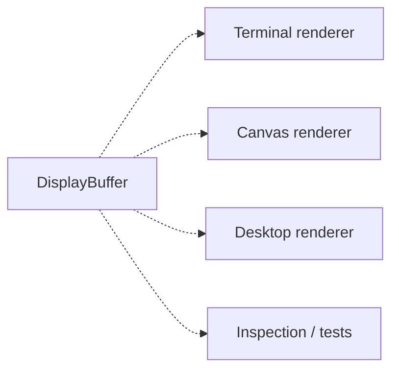

# Embedding the Chip8NX Core

The CHIP-8 Core is designed to be hosted by different applications without depending on a particular UI or platform.

This guide shows the explicit/manual composition path. It intentionally exposes the individual Core pieces so an embedding application can replace components at meaningful boundaries.

An application is responsible for:

1. selecting a machine profile;
2. choosing concrete component implementations;
3. constructing the machine;
4. loading a program;
5. initializing the machine;
6. driving the runtime;
7. presenting display and sound state;
8. translating host input into Core keyboard state.

## Select a profile

For Classic CHIP-8:

```ts
import { CLASSIC_CHIP8_PROFILE } from "@chip8nx/core";

const profile = CLASSIC_CHIP8_PROFILE;
```

The profile supplies the machine characteristics needed by generic components.

For Classic this includes memory layout, display geometry, display refresh frequency, timer frequency, and font placement.

## Construct the machine state

A complete Classic execution context needs explicit display state **and** display-timing state.

```ts
import {
  ClassicFont,
  DefaultRandomNumberGenerator,
  DisplayBuffer,
  IndexRegister,
  KeyboardState,
  ProgramCounter,
  Ram,
  Registers,
  Stack,
  Timer,
  VerticalBlank,
} from "@chip8nx/core";

const registers = new Registers();
const memory = new Ram(profile.memorySize);
const stack = new Stack(profile.stackCapacity);
const programCounter = new ProgramCounter(profile.programStartAddress);
const indexRegister = new IndexRegister();

const delayTimer = new Timer();
const soundTimer = new Timer();

const displayBuffer = new DisplayBuffer(profile.display.width, profile.display.height);

const verticalBlank = new VerticalBlank();
const keyboard = new KeyboardState();

const font = new ClassicFont(profile.fontBaseAddress);

const randomNumberGenerator = new DefaultRandomNumberGenerator();
```

`DisplayBuffer` stores pixels.

`VerticalBlank` stores the emulated display-synchronization opportunity used by Classic `Dxyn`.

They are deliberately separate responsibilities.

## Create the execution context

The machine components used by instruction execution are grouped into an `ExecutionContext`.

```ts
import type { ExecutionContext } from "@chip8nx/core";

const context: ExecutionContext = {
  registers,
  memory,
  stack,
  programCounter,
  indexRegister,
  delayTimer,
  soundTimer,
  displayBuffer,
  verticalBlank,
  keyboard,
  font,
  randomNumberGenerator,
};
```

`ExecutionContext` is an aggregate of dependencies, not a factory and not an ownership container.

## Load a program

External I/O belongs to the application.

For example, a Deno host can read a ROM from the filesystem:

```ts
import { MemoryImage } from "@chip8nx/core";

const bytes = await Deno.readFile(path);
const program = new MemoryImage(bytes);
```

A browser could obtain the same bytes from a file picker, network request, embedded asset, or drag-and-drop operation.

All of those sources ultimately become a `MemoryImage`.

## Initialize the machine

Create a `MachineInitializer`:

```ts
import { MachineInitializer, MemoryImageLoader } from "@chip8nx/core";

const initializer = new MachineInitializer(new MemoryImageLoader());
```

Then initialize:

```ts
initializer.initialize(context, profile, program);
```

Initialization validates the complete memory layout before mutation.

It then resets machine state, including `VerticalBlank` and transient keyboard wait state, installs profile system data, and loads the program.

The random-number generator is not reset by initialization.

## Create the CPU

```ts
import { Cpu, Decoder, InstructionExecutor } from "@chip8nx/core";

const cpu = new Cpu(context, new Decoder(), new InstructionExecutor());
```

The CPU owns one CHIP-8 instruction cycle:

```text
fetch
  ↓
advance normal PC
  ↓
decode
  ↓
execute
```

It does not control real-time scheduling.

## Create the runtime

Choose a CPU execution frequency appropriate for the host:

```ts
import { Frequency } from "@chip8nx/core";

const runtimeConfiguration = {
  cpuFrequency: Frequency.fromInteger(500n),
};
```

Create a scheduler using a monotonic clock:

```ts
import { PerformanceClock, Scheduler } from "@chip8nx/core";

const scheduler = new Scheduler(new PerformanceClock());
```

Then create the runtime:

```ts
import { Chip8Runtime } from "@chip8nx/core";

const runtime = new Chip8Runtime(
  cpu,
  delayTimer,
  soundTimer,
  verticalBlank,
  scheduler,
  runtimeConfiguration,
  profile.timerFrequency,
  profile.display.refreshFrequency,
);
```

The constructor has two distinct profile timing inputs:

- `profile.timerFrequency` controls delay/sound timer countdown;
- `profile.display.refreshFrequency` controls emulated display-frame boundaries.

The runtime starts paused.

## Start execution

```ts
runtime.resume();
```

The host should then call:

```ts
runtime.tick();
```

regularly from its own event loop.

The host does not need to call `tick()` at the CPU frequency or display refresh frequency.

The deadline-driven scheduler determines which display-frame, timer, and CPU events are due and executes them in chronological order.

## Pause and resume

```ts
runtime.pause();
runtime.resume();
```

Pause suspends scheduled:

- display-frame boundaries;
- timer ticks;
- CPU steps.

Host time spent paused is discarded rather than accumulated as execution debt.

## Single-step execution

While paused:

```ts
runtime.step();
```

executes one CPU instruction.

Timers and scheduled time remain unchanged.

For a display-synchronized draw, stepping may use a temporary vertical-blank opportunity so the instruction can complete without advancing emulated time.

## Rendering

`DisplayBuffer` is emulated machine state, not a host renderer.

Applications should observe it and present it independently:



Host presentation frequency is independent of emulated display timing.

In particular, rendering the buffer does **not** signal `VerticalBlank`.

## Keyboard input

The Core-facing state can be a `KeyboardState`:

```ts
const keyboard = new KeyboardState();
```

A host adapter translates platform input events into state transitions:

```ts
keyboard.press(chip8Key);
keyboard.release(chip8Key);
```

`KeyboardState` owns:

- currently pressed CHIP-8 keys;
- the `FX0A` press-then-release state machine;
- transient reset behavior required by machine initialization.

The host adapter owns:

- physical/terminal/browser event collection;
- host key mapping;
- protocol decoding;
- any synthetic release policy needed by the platform.

This keeps platform mechanics out of CHIP-8 instruction semantics.

## Sound

The sound timer is machine state.

Actual audio output is a host concern.

A host can observe the sound timer and produce terminal, browser, desktop, or other audio behavior without making the timer itself responsible for sound generation.

## Application responsibility summary

The application owns:

```text
profile selection
component implementation selection
ROM I/O
composition
host event loop
rendering
sound output
host input translation
```

The reusable Core owns:

```text
CHIP-8 state
instruction semantics
machine initialization
CPU execution
runtime timing coordination
scheduling
```

This separation allows several frontends to share one emulator implementation.

## Why this guide remains explicit

The terminal application is currently experimenting with higher-level standard compositions.

That experiment has not yet been generalized to the Core.

For now, this guide deliberately documents the maximum-control Core assembly path. If a standard Core composition is adopted later, this manual path should remain available as the advanced/customizable level rather than being removed.
