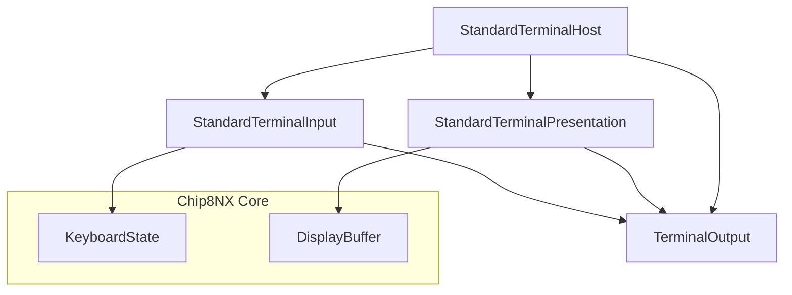
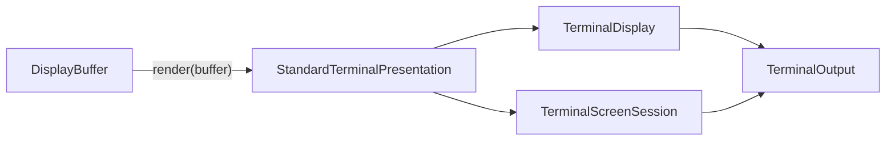
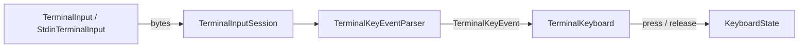
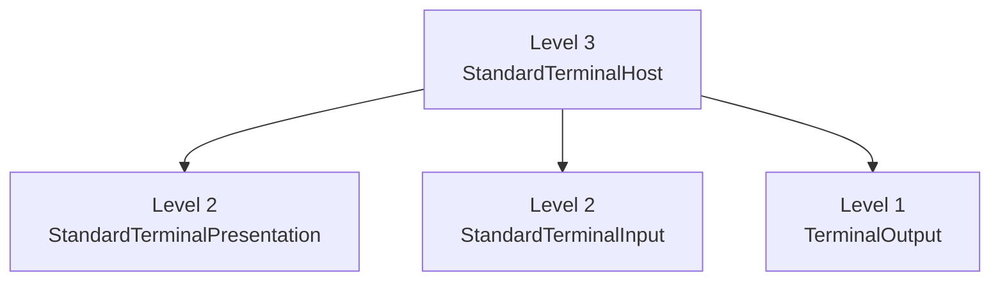

# Terminal Composition Levels

The Terminal application provides three composition depths so applications can trade convenience for control without losing access to the underlying components.

The model is Terminal-specific. The later Web-host evaluation confirmed that it should **not** be generalized into a mandatory Core or project-wide hierarchy.

See [Host composition evaluation](../architecture/composition-evaluation.md).

## The three levels

1. **Components** — assemble Terminal pieces manually.
2. **Standard compositions** — use known-good input/presentation subsystem kits.
3. **Standard host** — use a ready-to-run standard Terminal environment.

Higher levels are built from lower levels; they do not replace them with a separate implementation.

> Customize at the highest meaningful boundary. Descend to a lower level only when that boundary is insufficient.

## Terminal architecture

The Terminal host adapts Core `KeyboardState` and `DisplayBuffer` through Terminal-specific input and presentation components.



The shared `TerminalOutput` is significant: presentation and Terminal input-session protocol negotiation both write to the same host resource. `StandardTerminalHost` is therefore a natural owner of that shared Terminal lifecycle.

## Presentation subsystem

`StandardTerminalPresentation` groups rendering with Terminal screen-session lifecycle:



`TerminalDisplay` remains independently available when an application wants direct control.

A custom renderer can also be injected while retaining the standard presentation lifecycle.

## Input subsystem

Terminal input has more host-specific mechanics than framebuffer presentation:



Responsibilities remain separate:

- `TerminalInput` abstracts the byte source and raw-mode control;
- `TerminalInputSession` owns Terminal input lifecycle and keyboard-protocol negotiation;
- `TerminalKeyEventParser` converts bytes into semantic Terminal key events;
- `TerminalKeyboard` maps Terminal events to CHIP-8 keys;
- `KeyboardState` owns CHIP-8-facing pressed state and `Fx0A` semantics.

### Exact and synthetic key release

Where a terminal supports CSI-u/Kitty-style events, explicit press/repeat/release transitions can be preserved.

Legacy terminal input often reports only press-like bytes. `TerminalKeyboard` therefore uses a short **host-time** synthetic-release deadline for those keys.

That policy belongs to the Terminal adapter, not to Core emulated time.

## Level 1 — Components

Level 1 provides maximum control.

The application assembles pieces such as:

```text
StdoutTerminalOutput
TerminalDisplay
TerminalScreenSession
StdinTerminalInput
TerminalInputSession
TerminalKeyEventParser
TerminalKeyboard
```

Use this level when replacing or configuring individual Terminal components.

Runnable example:

[`apps/terminal/examples/01-components.ts`](../../apps/terminal/examples/01-components.ts)

## Level 2 — Standard compositions

Level 2 groups components that naturally work together:

```text
StandardTerminalPresentation
StandardTerminalInput
```

A typical assembly is:

```ts
const output = new StdoutTerminalOutput();

const presentation = new StandardTerminalPresentation({
  output,
});

const input = new StandardTerminalInput(machine.keyboard, output);
```

Level 2 keeps meaningful subsystem seams available.

For example, retain the standard input stack with a custom key mapping:

```ts
const input = new StandardTerminalInput(machine.keyboard, output, {
  mapKey: myCustomKeyMapping,
});
```

Or retain the standard presentation lifecycle with a custom display:

```ts
const presentation = new StandardTerminalPresentation({
  output,
  createDisplay: (output) => new MyCustomDisplay(output),
});
```

Runnable example:

[`apps/terminal/examples/02-standard-compositions.ts`](../../apps/terminal/examples/02-standard-compositions.ts)

## Level 3 — Standard host

Level 3 provides the ready-to-use standard Terminal environment:

```ts
const terminal = new StandardTerminalHost(machine.keyboard);
```

`StandardTerminalHost` owns the Terminal resource shared by standard input and presentation and coordinates their host-level lifecycle.



Runnable example:

[`apps/terminal/examples/03-standard-host.ts`](../../apps/terminal/examples/03-standard-host.ts)

## Choosing a level

| Example                       | Terminal assembly         | Best for                                             |
| ----------------------------- | ------------------------- | ---------------------------------------------------- |
| `01-components.ts`            | individual components     | maximum control and learning component relationships |
| `02-standard-compositions.ts` | presentation + input kits | normal customization at subsystem boundaries         |
| `03-standard-host.ts`         | one standard host         | quickest standard Terminal integration               |

The observable emulator behavior should remain equivalent; only the Terminal composition burden changes.

## Mixed composition

The levels are not exclusive modes.

An application can use standard input while composing custom presentation, or standard presentation with specialized input.

That flexibility is central to the design:

> A convenience layer may hide complexity, but it must not remove functionality.

## Evaluation result

The Web application provided a second, substantially different host case study.

The comparison confirmed that:

- the standard Terminal path materially reduces composition burden;
- meaningful customization remains available;
- the manual Level-1 path remains intact;
- specialized components remain the implementation foundation;
- the three levels arise from Terminal-specific resource/lifecycle ownership;
- another host need not reproduce the same hierarchy.

The retained project-wide rule is therefore application-owned composition around stable Core boundaries, not a universal three-level host framework.
