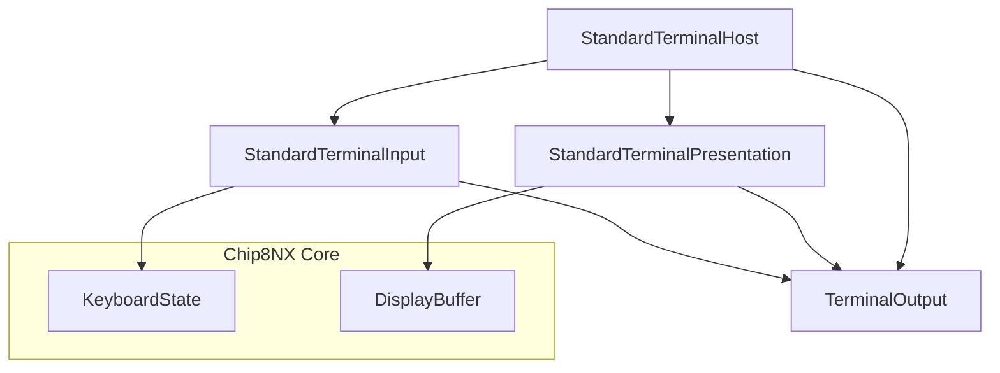
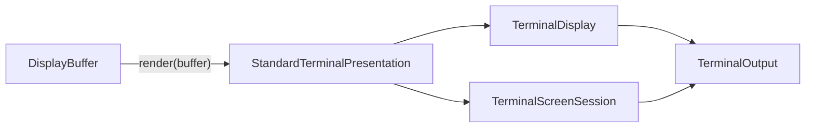
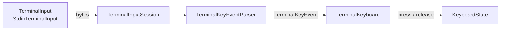
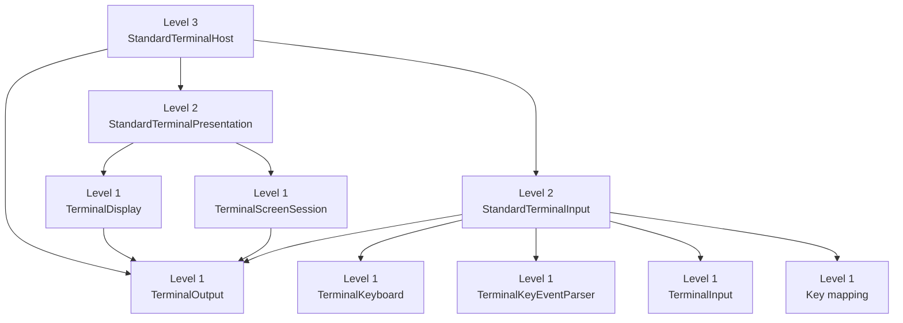
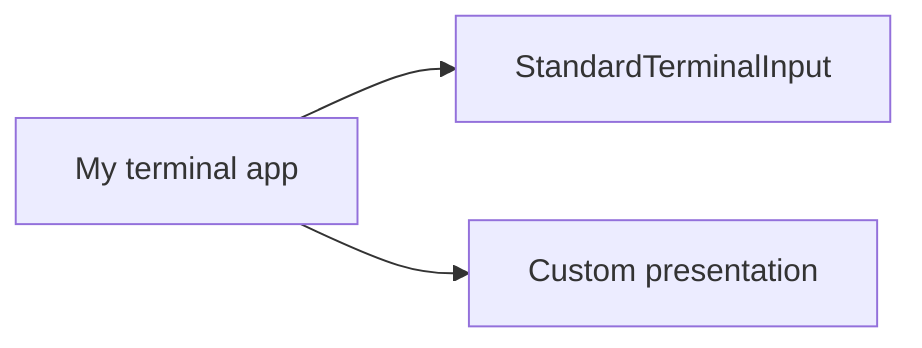

# Terminal Composition Levels

The terminal application is being used as a case study for a layered composition model: provide convenient known-good assemblies without sacrificing the specialized components that make Chip8NX modular and testable.

The experiment currently has three levels:

1. **Components** — assemble individual parts manually.
2. **Standard compositions** — use known-good subsystem kits.
3. **Standard host** — use a ready-to-run terminal environment.

Higher levels are built from lower levels. They do not replace them with a separate simplified implementation.

## Terminal architecture overview

The terminal host adapts Core `KeyboardState` and `DisplayBuffer` to terminal-specific input and presentation.



The shared `TerminalOutput` dependency is significant: both presentation and input-session protocol negotiation write to the same terminal.

The Level-3 host is therefore the natural owner of that shared host resource.

## Presentation subsystem

The standard presentation composition groups the renderer and terminal-screen lifecycle.



`TerminalDisplay` remains independently available for applications that want full control or a custom lifecycle.

A custom renderer can also be injected while retaining the standard presentation lifecycle.

## Input subsystem

Terminal input contains more host-specific mechanics than display presentation.



The responsibilities are intentionally separated:

- `TerminalInput` abstracts the byte source and raw-mode control;
- `TerminalInputSession` owns terminal input lifecycle and keyboard-protocol negotiation;
- `TerminalKeyEventParser` converts bytes into semantic terminal key events;
- `TerminalKeyboard` maps semantic terminal events into CHIP-8 key state;
- `KeyboardState` owns CHIP-8-facing pressed state and `FX0A` semantics.

### Exact and legacy key release

Where the terminal supports CSI-u/Kitty-style events, explicit press/repeat/release transitions can be preserved.

Legacy terminal input generally reports only press-like bytes. `TerminalKeyboard` therefore uses a short host-time synthetic release deadline for those keys.

That host-time policy belongs in the terminal adapter, not in Core emulated time.

## Level 1 — Components

Level 1 provides maximum control.

The terminal application is assembled from individual pieces such as:

- `StdoutTerminalOutput`;
- `TerminalDisplay`;
- `TerminalScreenSession`;
- `StdinTerminalInput`;
- `TerminalInputSession`;
- `TerminalKeyEventParser`;
- `TerminalKeyboard`.

Use this level when an application needs to replace or directly configure individual terminal components.

Runnable example:

[`apps/terminal/examples/01-components.ts`](../../apps/terminal/examples/01-components.ts)

## Level 2 — Standard compositions

Level 2 groups components that naturally work together into known-good subsystem kits.

The terminal application currently provides:

- `StandardTerminalPresentation`;
- `StandardTerminalInput`.

A typical assembly is:

```ts
const output = new StdoutTerminalOutput();

const presentation =
  new StandardTerminalPresentation({
    output,
  });

const input = new StandardTerminalInput(
  machine.keyboard,
  output,
);
```

This level intentionally exposes only meaningful subsystem customization seams.

For example, use the standard input stack with a custom key mapping:

```ts
const input = new StandardTerminalInput(
  machine.keyboard,
  output,
  {
    mapKey: myCustomKeyMapping,
  },
);
```

Or retain standard presentation lifecycle with a custom display implementation:

```ts
const presentation =
  new StandardTerminalPresentation({
    output,
    createDisplay: (output) =>
      new MyCustomDisplay(output),
  });
```

The principle is:

> Customize at the highest meaningful boundary. Descend to a lower level only when that boundary is insufficient.

Runnable example:

[`apps/terminal/examples/02-standard-compositions.ts`](../../apps/terminal/examples/02-standard-compositions.ts)

## Level 3 — Standard host

Level 3 provides a ready-to-use standard terminal environment.

```ts
const terminal = new StandardTerminalHost(
  machine.keyboard,
);
```

`StandardTerminalHost` owns the terminal resource shared by the standard presentation and input subsystems and coordinates their host-level lifecycle.



Runnable example:

[`apps/terminal/examples/03-standard-host.ts`](../../apps/terminal/examples/03-standard-host.ts)

## The three examples

The examples intentionally share the same Classic machine construction.

Only the terminal assembly depth changes.

| Example                       | Terminal assembly         | Best for                                             |
| ----------------------------- | ------------------------- | ---------------------------------------------------- |
| `01-components.ts`            | individual components     | maximum control and learning component relationships |
| `02-standard-compositions.ts` | presentation + input kits | normal customization at subsystem boundaries         |
| `03-standard-host.ts`         | one standard host         | quickest standard terminal integration               |

This makes the examples useful as an architectural experiment: the observable emulator behavior should remain equivalent while composition burden changes.

## Mixed composition

The three levels are not exclusive application modes.

An application can use different depths for different subsystems.



Likewise, an application may use standard presentation while manually composing a specialized input path.

This is central to the experiment: simplification should hide complexity by default, not eliminate capability.

## Current evaluation status

The display and keyboard Level-2 case studies have demonstrated that:

- the standard path can be materially simpler;
- meaningful customization can remain easy;
- the manual Level-1 path remains intact;
- existing specialized components remain the implementation foundation;
- a giant all-purpose options object is not required.

The Level-3 host demonstrates that the two standard subsystems can be composed around shared terminal resources without leaking their internal details back into the application root.

The three terminal composition levels now provide enough implementation evidence to evaluate whether the pattern should be generalized beyond the terminal application.

The result should be evaluated before this model is generalized to Core composition or formalized in a new project-wide ADR.

## Design invariant

The current hypothesis is:

> A convenience layer may hide complexity, but it must not remove functionality.

Higher levels should therefore:

- assemble the same lower-level components;
- provide safe defaults;
- expose only meaningful customization seams;
- reduce normal composition burden;
- allow applications to descend to a lower level when more control is required.
