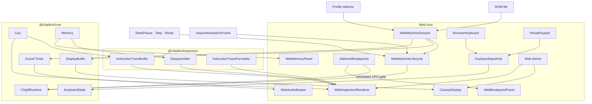
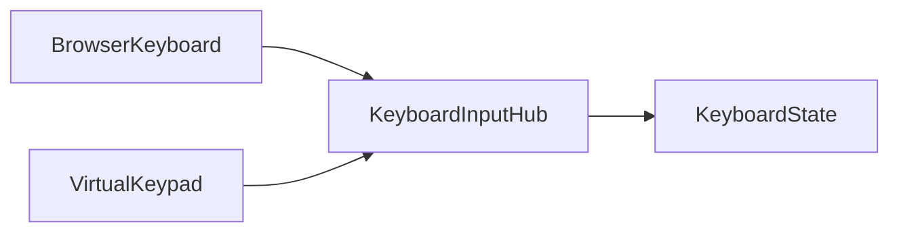

# Web Application

The Web application is Chip8NX's browser-based play, inspection, and bounded debugger host.

It composes the reusable `@chip8nx/core` and `@chip8nx/inspection` packages with browser-specific display, input, audio, execution-control, inspection-presentation, and appearance concerns.

Those host concerns intentionally remain outside the reusable packages:

```text
@chip8nx/core
    machine semantics
    runtime and scheduling
    authoritative CPU observation
          ↓
@chip8nx/inspection
    instruction formatting
    disassembly
    bounded trace history
    trace formatting
          ↓
apps/web
    browser adapters
    host lifecycle
    inspection policy
    address-breakpoint policy
    presentation
```

Core determines what the CHIP-8 machine does. Inspection provides passive, host-independent ways to inspect what Core exposes. The Web application decides how those capabilities are composed and presented in a browser, and owns its bounded debugger policy without moving that policy into Core or Inspection.

## In this document

- [Run the application](#run-the-application)
- [Architecture](#architecture)
- [Web machine session](#web-machine-session)
- [Inspection snapshot](#inspection-snapshot)
- [Input](#input)
- [Display](#display)
- [Sound](#sound)
- [Runtime and host loop](#runtime-and-host-loop)
- [Execution controls and breakpoints](#execution-controls-and-breakpoints)
- [Machine profile selection](#machine-profile-selection)
- [Loading another ROM](#loading-another-rom)
- [Status and machine configuration](#status-and-machine-configuration)
- [Appearance lifecycle](#appearance-lifecycle)
- [Composition lessons](#composition-lessons)

## Run the application

From the repository root:

```bash
deno task web
```

Open the URL reported by Vite and load a CHIP-8 ROM.

The Web host currently provides:

- Canvas framebuffer presentation for Classic CHIP-8 and SUPER-CHIP display geometry;
- selectable Classic CHIP-8, CHIP-48, SUPER-CHIP 1.1, and SUPER-CHIP Modern machine profiles;
- physical keyboard input;
- a virtual 4×4 CHIP-8 keypad;
- explicit physical-keyboard to CHIP-8 keypad mapping;
- unified Start/Pause, single-step, and reset controls;
- simple CHIP-8 sound through Web Audio;
- live CPU-state inspection;
- bounded best-effort disassembly around the current program counter;
- bounded recent CPU instruction-attempt history;
- Web-local address breakpoints with enable/disable/remove controls and nearby-gutter toggles;
- passive memory inspection with exact-address paging and quick PC/I navigation;
- responsive desktop and narrow-screen layouts;
- persistent Retro Green, Retro Amber, Dark, and LCD Calculator appearance themes;
- theme-aware framebuffer and favicon presentation;
- a compact status area that separates transient messages from machine/runtime configuration facts.

Loading a valid ROM creates and initializes a fresh Web session using the currently selected machine profile and starts execution immediately.

## Architecture

The Web application combines machine execution, passive inspection, bounded host-local debugger control, and browser presentation without moving host-specific policy into Core or Inspection.



The diagram shows three different responsibility directions.

Machine execution stays in Core while Web owns host lifecycle policy:

```text
controls / host loop
        ↓
WebMachineLifecycle
        ↓
Chip8Runtime
        ↓
Cpu + timers + display timing
```

Passive machine inspection composes Core state with Inspection tooling:

```text
Cpu.snapshot()
Memory + current PC
InstructionTraceBuffer
        ↓
Web inspection view model
        ↓
WebInspectionRenderer
```

Web-local breakpoint control is a separate policy path:

```text
current PC
    ↓
AddressBreakpoints
    ↓
scheduled CPU execution gate
    ↓
WebMachineLifecycle pause reason
```

Browser presentation observes the resulting state:

```text
DisplayBuffer → CanvasDisplay
Sound Timer   → WebAudioBeeper
inspection    → DOM
Memory        → WebMemoryPanel
```

The Web host may present those values whenever convenient. Browser rendering cadence, DOM updates, appearance themes, memory-view navigation, and debugger policy do not become CHIP-8 machine semantics.

See [Architecture overview](../architecture/overview.md).

## Web machine session

The application retains the currently loaded machine in a small `WebMachineSession` aggregate:

```ts
interface WebMachineSession {
  readonly romName: string;
  readonly program: MemoryImage;
  readonly profile: Chip8Profile;

  readonly lifecycle: WebMachineLifecycle;
  readonly snapshotInspection: () => WebInspectionViewModel;

  readonly memory: Memory;
  readonly displayBuffer: DisplayBuffer;
  readonly soundTimer: Timer;
}
```

This is Web application state, not a generic Core `Chip8Machine` abstraction.

The browser retains only the collaborators it needs after composition:

```text
ROM/profile replacement
    → program
    → profile

host execution lifecycle
    → WebMachineLifecycle

inspection
    → snapshotInspection()
    → memory

presentation
    → displayBuffer
    → soundTimer
```

The lower-level CPU, runtime, scheduler, input adapters, initializer, disassembler, trace buffer, and formatters remain captured by the session's lifecycle or inspection closures rather than becoming public fields of the aggregate. The session therefore remains an application-local composition boundary. Neither Core nor Inspection needs to know that the browser groups these capabilities together.

For explicit Core construction, see [Embedding the Core](./embedding-the-core.md).

## Inspection snapshot

The Web inspector does not read mutable machine components directly from DOM rendering code.

Instead, the session exposes one read operation:

```ts
snapshotInspection(): WebInspectionViewModel
```

Conceptually:

```text
Cpu.snapshot()
      +
Memory around current PC
      +
InstructionTraceBuffer.snapshot()
      ↓
Web inspection composition
      ↓
WebInspectionViewModel
      ↓
WebInspectionRenderer
```

The snapshot operation begins by taking one authoritative `CpuState` snapshot:

```ts
const cpuState = cpu.snapshot();
```

That same snapshot supplies both the CPU-state presentation and the program counter used for nearby disassembly.

This avoids a presentation inconsistency such as:

```text
CPU panel
    PC = 0x260

Nearby instructions
    current row = 0x262
```

which could otherwise occur if independent CPU snapshots were taken while execution continued between them.

### Nearby disassembly

The Web host currently inspects a bounded neighborhood around the actual program counter:

```text
3 instructions before
current instruction
6 instructions after
```

The window is application policy rather than part of Core or `@chip8nx/inspection`.

For each candidate address, the Web host verifies that a complete CHIP-8 instruction can fit within memory and then independently calls:

```ts
disassembler.disassembleAt(memory, sourceAddress);
```

Each address has its own success/failure result.

For example:

```text
  0x25C  6800  LD V8, 0x00
  0x25E        unavailable
▶ 0x260  D9B4  DRW V9, VB, 0x4
  0x262  7904  ADD V9, 0x04
```

An undecodable neighboring value therefore does not discard the rest of the inspection window.

The Web host also calculates neighboring addresses relative to the **actual** program counter. It does not silently force the address onto an even boundary. Each nearby row also carries the current Web-local breakpoint state (`none`, `enabled`, or `disabled`) so the gutter can present breakpoint configuration without teaching the reusable disassembler about debugger policy.

Nearby disassembly answers:

> What do the bytes around the machine's current PC decode as?

It does not claim that every displayed row is executable code. No code/data classification or control-flow analysis is performed.

### Memory inspection

`WebMemoryPanel` provides a passive live view over the active machine memory. It does not mutate memory or influence execution.

The panel reads at most 64 bytes beginning at the **exact** requested address and presents eight bytes per row. The start address is intentionally not aligned, so entering `0x203` starts the view at `0x203`. Near the end of memory, the final page truncates naturally instead of reading past the address space.

Navigation is Web presentation policy:

- Previous / Next move by one bounded page while clamping to valid memory;
- direct address entry accepts the same hexadecimal notation used elsewhere in the debugger;
- PC and I shortcuts use the current CPU snapshot as reference addresses;
- a reference outside the active memory range is shown as unavailable rather than coerced.

Memory inspection therefore answers:

> What bytes are currently stored around this address?

It does not provide editing, searching, watchpoints, or mutation-triggered pause behavior.

### Recent instruction attempts

The CPU receives an `InstructionTraceBuffer` through the public `InstructionTraceObserver` boundary:

```text
Cpu.step()
    ↓
InstructionTraceObserver
    ↓
InstructionTraceBuffer
```

The Web composition root retains the concrete buffer because the application needs to read its bounded history.

The buffer currently retains the latest 32 CPU attempts.

Those attempts may represent:

- successful execution;
- failed execution;
- repeated attempts caused by retry semantics such as key waits or display synchronization.

The Web view model formats those traces through Inspection-owned trace formatting rather than reproducing instruction-formatting logic in the browser presentation layer.

### Passive failure handling

Inspection failure is deliberately distinct from machine failure.

Nearby disassembly is strict at the reusable Inspection boundary, but the Web host catches failures per address and converts them into ordinary unavailable rows.

Likewise, a failed CPU attempt may still leave useful diagnostic information:

```text
failed attempt
    ↓
actual post-failure CpuState
    +
retained failed InstructionTrace
```

When continuous execution or manual Step fails, the Web host renders the resulting machine and inspection state before presenting the error status.

This makes failure observable without giving passive inspection control over execution.

### Reset and inspection history

Reset establishes a new execution epoch for the existing Web session.

After successful machine reinitialization, the host clears the retained trace history:

```text
successful Reset
    ↓
machine state returns to program start
    +
recent instruction history becomes empty
```

Start, Pause, and Step do not clear history.

Loading another ROM or recomposing the machine for another profile creates a new `WebMachineSession`, so the replacement machine naturally receives a new trace buffer. The host-level `RplFlags` store is intentionally separate and survives those replacements.

These lifecycle decisions are Web application policy rather than responsibilities of Core or Inspection.

## Input

The browser has two independent input sources:



Both adapters translate browser interaction into the same Core `KeyboardState`, but each retains ownership only of the keys pressed through its own input source.

### Physical keyboard

`BrowserKeyboard` maps browser `keydown` and `keyup` events to CHIP-8 key transitions.

It uses `KeyboardEvent.code` rather than `KeyboardEvent.key`, so the conventional CHIP-8 layout follows physical keyboard positions independently of Shift, Caps Lock, or the character produced by the user's keyboard layout.

The current mapping is:

```text
Physical keyboard     CHIP-8 keypad

1  2  3  4        →   1  2  3  C
Q  W  E  R        →   4  5  6  D
A  S  D  F        →   7  8  9  E
Z  X  C  V        →   A  0  B  F
```

Browser auto-repeat is ignored because Core needs logical press/release transitions rather than repeated `keydown` notifications for a key that is already held.

The adapter also releases its held keys when it stops or the browser loses focus, preventing a missing `keyup` notification from leaving a CHIP-8 key stuck.

The Web interface presents the same mapping beside the virtual keypad so the physical and on-screen layouts can be understood together.

### Virtual keypad

`VirtualKeypad` maps pointer interaction with the on-screen 4×4 CHIP-8 keypad.

Pointer events provide one browser interaction model for mouse, touch, and pen input.

The virtual keypad uses the native CHIP-8 layout:

```text
1  2  3  C
4  5  6  D
7  8  9  E
A  0  B  F
```

Like `BrowserKeyboard`, it owns only the key presses originating from its own source.

### Why `KeyboardInputHub` exists

Two input sources cannot independently release a shared `KeyboardState` without coordination.

Consider:

```text
physical source presses key 5
virtual source presses key 5
virtual source releases key 5
```

The CHIP-8 key must remain pressed because the physical source still owns it.

`KeyboardInputHub` gives each adapter its own source and updates Core only on first-press and last-release transitions:

```text
first source presses
        ↓
Core key becomes pressed

additional source presses
        ↓
Core state remains pressed

one source releases
        ↓
other source still owns key
        ↓
Core state remains pressed

last source releases
        ↓
Core key becomes released
```

This multi-source ownership policy belongs to the Web host. `KeyboardState` remains unaware of browser input sources.

See [Machine state and capabilities](../architecture/machine-state-and-capabilities.md).

## Display

`CanvasDisplay` presents `DisplayBuffer`; it does not own CHIP-8 drawing semantics, framebuffer state, display-mode semantics, or vertical-blank timing.

The adapter renders the **physical backing framebuffer** exposed by `DisplayBuffer`:

```text
DisplayBuffer backing pixels
          ↓
CanvasDisplay
          ↓
HTML Canvas bitmap
          ↓
CSS-scaled browser presentation
```

For fixed Classic CHIP-8 and CHIP-48 displays, logical and backing geometry are both 64×32.

SUPER-CHIP uses one shared 128×64 backing store for both display modes:

```text
SUPER-CHIP low
    logical 64×32
    backing 128×64

SUPER-CHIP high
    logical 128×64
    backing 128×64
```

In low-resolution mode, Core represents one logical pixel as a 2×2 block in the backing framebuffer. `CanvasDisplay` does not reproduce that rule; it simply renders the resulting 128×64 backing pixels.

This is important because both SUPER-CHIP profiles share the same backing geometry even though their instruction semantics differ: historical mode changes preserve pixels and use physical scroll units, while Modern mode changes clear and Modern scrolling is specified in logical units before Core translates it into backing movement. `CanvasDisplay` only renders the resulting backing framebuffer.

The Canvas backing-store dimensions are adjusted to `DisplayBuffer.backingWidth` and `DisplayBuffer.backingHeight` when necessary. CSS then scales that bitmap for the responsive Web layout.

The host may render whenever convenient. Browser presentation cadence therefore does not alter emulated display timing.

### Appearance palette

`CanvasDisplay` accepts a small presentation palette:

```ts
interface CanvasDisplayPalette {
  readonly background: string;
  readonly foreground: string;
}
```

The adapter knows only which colors to use when presenting off and on pixels. It does not know about Web theme identities such as Retro Green, Retro Amber, or Dark.

Theme ownership remains in the Web application:

```text
Web theme
    ↓
CSS custom properties
    ↓
display foreground / background values
    ↓
CanvasDisplayPalette
    ↓
CanvasDisplay
```

The browser reads the active display colors from CSS custom properties and passes them to `CanvasDisplay`.

When the user changes appearance, the Web host:

1. changes the active Web theme;
2. reads the newly resolved Canvas palette;
3. updates `CanvasDisplay`;
4. redraws the current `DisplayBuffer` when a machine exists.

Changing appearance therefore updates the already-visible framebuffer without resetting or otherwise changing the CHIP-8 machine.

This distinction remains important:

```text
DisplayBuffer
    emulated machine state

CanvasDisplayPalette
    browser presentation state
```

## Sound

CHIP-8 sound follows the same state/presentation split:

```text
Core sound Timer
    ↓ observed by host
WebAudioBeeper
    ↓
Web Audio API
```

The host requests audible output while the sound timer is nonzero:

```ts
beeper.setActive(session.soundTimer.getValue() > 0);
```

`WebAudioBeeper` uses a persistent square-wave oscillator gated through a gain node instead of repeatedly constructing oscillator nodes for every sound-timer transition.

The oscillator belongs to browser presentation. The duration and timing of CHIP-8 sound remain determined by the Core sound timer.

### Browser audio lifecycle

Browsers generally require audio creation or resumption to follow a user gesture.

The host therefore lazily unlocks Web Audio from interactions that can legitimately originate from the user, such as selecting a ROM or starting/resuming execution.

Failure to initialize or resume Web Audio is treated as a host-presentation failure:

```text
audio unavailable
      ≠
CHIP-8 execution unavailable
```

The application logs the audio problem but allows emulation to continue.

When execution is paused, replaced, hidden, reset, or stopped by a runtime failure, the host requests silence independently of the Core timer value.

That browser lifecycle policy remains outside Core.

## Runtime and host loop

The Web host uses `requestAnimationFrame` as its browser service and presentation loop:

```ts
const frame = (): void => {
  const lifecycleState = session.lifecycle.tick();

  beeper.setActive(
    lifecycleState.kind === "running" && session.soundTimer.getValue() > 0,
  );

  renderMachine(session);

  if (lifecycleState.kind === "running") {
    animationFrameId = requestAnimationFrame(frame);
  }
};
```

`renderMachine()` presents both the framebuffer and the current inspection snapshot:

```ts
function renderMachine(session: WebMachineSession): void {
  display.render(session.displayBuffer);

  const inspectionViewModel = session.snapshotInspection();

  inspection.render(inspectionViewModel);
  memoryPanel.setReferenceAddresses({
    programCounter: inspectionViewModel.cpu.programCounterAddress,
    indexRegister: inspectionViewModel.cpu.indexRegisterAddress,
  });
  memoryPanel.render();
}
```

This does **not** make `requestAnimationFrame` the CHIP-8 timing source.

The responsibility split remains:

```text
requestAnimationFrame
    decides when the browser services
    and presents the machine
              ↓
Chip8Runtime.tick()
              ↓
Scheduler
    decides what emulated work
    is due at that point in time
```

`Chip8Runtime` and `Scheduler` continue to own CPU, timer, display-refresh, and vertical-blank timing.

The browser loop is therefore allowed to run at the browser's presentation cadence without redefining CHIP-8 execution frequency.

See [Runtime and timing architecture](../architecture/runtime-and-timing.md).

### SUPER-CHIP interpreter exit

SUPER-CHIP interpreter-exit conditions mark Core's `ExitState` as exited. Both supported SUPER-CHIP profiles provide explicit `00FD`. Historical SUPER-CHIP 1.1 additionally exits for the targeted `00C0` interpretation and for `Fx1E` overflow when its shared-instruction quirk selects interpreter exit; Modern SUPER-CHIP treats `00C0` as a zero-row scroll and selects continued `Fx1E` execution.

Core does not turn interpreter exit into browser lifecycle policy. After each runtime operation, `WebMachineLifecycle` observes `ExitState`; when exit is detected it pauses scheduled runtime work, stops browser inputs, clears transient breakpoint execution state, and enters its explicit `exited` host state. The browser host loop then stops scheduling frames.

This preserves the distinction between the Core exit signal and the Web response to it:

```text
Core ExitState
    authoritative interpreter state
        ↓
WebMachineLifecycle
    host response: pause + stop inputs + exited state
```

Reset reinitializes `ExitState`, restarts input when recovering from exit, and returns the Web lifecycle to an active paused state at program start.

### Stale-frame protection

`runHostLoop()` captures the `WebMachineSession` for which the loop was started.

Before servicing each frame it verifies that:

```text
captured session
      =
currently active Web session
```

and that the captured lifecycle is still in its running state.

This protects the application from an already-scheduled animation frame belonging to a ROM that has since been paused or replaced.

### Runtime failure

Continuous execution is wrapped at the host-loop boundary.

If `WebMachineLifecycle.tick()` propagates an execution failure, the lifecycle has already paused the runtime, stopped physical and virtual input, cleared transient breakpoint execution state, and entered its `failed` state. The host loop then:

1. stops scheduling that host loop;
2. silences browser audio;
3. renders the resulting framebuffer and inspection state;
4. presents the failure through the application status area.

Rendering before reporting the failure is intentional.

The machine may have changed before an instruction attempt failed, and the CPU observer may have retained a failed trace. Presenting the resulting state makes that diagnostic evidence visible instead of pretending the failed attempt never occurred.

The host handles this lifecycle consequence; Core remains responsible for the actual execution semantics and failure.

## Execution controls and breakpoints

The toolbar exposes one Start/Pause control together with Step and Reset.

The enabled state and meaning of those controls are derived from the current `WebMachineSession` and `WebMachineLifecycle.state`.

The application does not maintain a second independent `running` flag. The lifecycle state also distinguishes ordinary user pauses from breakpoint pauses and represents interpreter exit or execution failure explicitly.

Conceptually:

```text
no machine
    Start/Pause disabled
    Step disabled
    Reset disabled

machine running
    Start/Pause = Pause
    Step disabled
    Reset enabled

machine paused
    Start/Pause = Start
    Step enabled
    Reset enabled
```

The same lifecycle state drives the compact machine-state indicator:

```text
no session  → No ROM
running     → Running
paused      → Paused
```

This keeps Web execution state authoritative in `WebMachineLifecycle`, which in turn coordinates the underlying runtime rather than duplicating a separate presentation-only running flag.

### Start / Pause

The unified control changes behavior according to `WebMachineLifecycle.state`.

When paused, Start:

1. requests Web Audio unlock from the user interaction;
2. asks `WebMachineLifecycle` to start scheduled execution;
3. when resuming from a breakpoint, suppresses that stop address until execution actually leaves it;
4. updates the application status and controls;
5. starts the browser host loop.

When running, Pause:

1. asks `WebMachineLifecycle` to pause scheduled execution and clear transient breakpoint execution state;
2. cancels the browser host loop;
3. silences the Web Audio presentation;
4. renders the current framebuffer and inspection state;
5. updates status and controls.

Pausing does not reinitialize the machine or clear recent instruction history.

### Step

Step is available only while the Web lifecycle is paused.

The host calls:

```ts
machine.lifecycle.step();
```

once and then presents the resulting machine state. `WebMachineLifecycle` delegates to `Chip8Runtime.step()` and converts a successful manual step into an ordinary user pause.

One call performs one CPU **attempt**, not necessarily one completed logical instruction.

For example, an instruction waiting for input or display synchronization may deliberately restore its instruction address so that a later CPU attempt retries it.

Manual stepping does not:

- start continuous execution;
- resume the normal browser host loop;
- advance scheduled timer or display time;
- consult the scheduled CPU breakpoint gate.

That final point is intentional: when stopped on a breakpoint, Step executes the stopped instruction directly. If the instruction itself retries and restores the same program counter, another Step performs the next CPU attempt.

If the CPU attempt throws, the Web host still renders the resulting machine and inspection state before reporting the error.

That means a failed trace and any post-failure CPU state remain inspectable.

### Address breakpoints

The current debugger supports address breakpoints as **Web-local execution policy**. `AddressBreakpoints` owns configured breakpoint addresses plus transient hit/suppression state; it is not part of Core or `@chip8nx/inspection`.

During machine composition, the Web host supplies `Chip8Runtime` with a scheduled CPU execution gate:

```ts
(() => breakpoints.shouldExecute(context.programCounter.getValue()));
```

For scheduled execution the flow is:

```text
CPU deadline
    ↓
read current PC
    ↓
AddressBreakpoints.shouldExecute(PC)
    ↓
allowed  → CPU attempt runs
denied   → runtime pauses before CPU execution
           + pending breakpoint hit
    ↓
WebMachineLifecycle.tick()
    ↓
paused(reason = breakpoint address)
```

The breakpoint therefore stops **before** the instruction executes. The Nearby gutter and Breakpoints panel both edit the same `AddressBreakpoints` model; enabled/disabled state is presentation-independent.

Continue from a breakpoint must account for retryable instructions. Vblank-gated `DRW` and waiting `Fx0A`, for example, may legitimately perform several CPU attempts while keeping the same program counter. Resume suppression therefore remains active **while execution stays at the stopped address** and expires only after a different address is observed. If execution later returns to the original address, its breakpoint is armed again.

Configured breakpoints survive ordinary Reset and profile recomposition because they are Web application state above one machine session. Loading another ROM clears them. Transient hit/suppression state is cleared by pause, reset, exit, failure, and session deactivation.

This is deliberately a bounded debugger feature. Conditional breakpoints, watchpoints, step-over/step-out, state editing, and a reusable debugger-session abstraction remain outside the current scope.

### Reset

Reset operates on the existing `WebMachineSession`.

The host first stops the browser host loop and silences audio, then asks `WebMachineLifecycle.reset()` to reset the current session. The lifecycle pauses scheduled execution, runs the retained reset callback, clears transient breakpoint execution state, and restarts browser input when recovering from exit or failure.

The reset callback asks the retained `MachineInitializer` to initialize the existing `ExecutionContext` from the retained program image using the session's retained `profile`, then clears trace history.

After successful initialization:

```text
ordinary resettable machine state
    → profile-defined program start

display
    → cleared and restored to the profile's initial mode

ExitState
    → active again

RplFlags
    → preserved

recent trace history
    → cleared

runtime
    → remains paused
```

Trace history is cleared only after successful initialization.

SUPER-CHIP RPL flags are deliberately different from ordinary resettable state. The application owns one `RplFlags` instance above individual sessions, and `MachineInitializer` does not clear it. Reset therefore preserves `Fx75`/`Fx85` storage while resetting the normal machine execution state.

Reset creates a new execution epoch for the same loaded ROM and profile without constructing a new browser session.

See [Machine initialization architecture](../architecture/machine-initialization.md).

## Machine profile selection

The Web host exposes the built-in machine profiles through a browser selector:

```text
Classic CHIP-8
CHIP-48
SUPER-CHIP 1.1
SUPER-CHIP Modern
```

The selected profile is used whenever a ROM is loaded. A loaded machine also retains its exact `Chip8Profile` in `WebMachineSession`, so Reset always reinitializes with the profile that actually created that session.

The Web host treats the profile as a declarative machine definition with three distinct kinds of input:

```text
machine characteristics
    → memory, stack, display, timing, fonts

instructionSet
    → which instruction semantics exist

quirks
    → how shared instructions vary
```

Those values are consumed during composition rather than copied into independent Web-side feature flags.

### Recomposing a loaded machine

Changing the profile while a ROM is loaded does not mutate the existing machine in place.

Instead, the host composes a replacement session around the same immutable program image:

```text
current ROM image
      +
selected profile
      ↓
create replacement WebMachineSession
      ↓
composition succeeds?
  ├── no  → keep current session
  │         restore selector
  │         report error
  │
  └── yes → stop old session
            install replacement
            preserve paused/running state
```

Constructing the replacement before disturbing the current session makes profile changes safer than ordinary ROM replacement: a composition failure leaves the working machine intact.

The replacement receives profile-specific machine construction, including:

- memory and stack characteristics;
- display specification;
- small-font and optional large-font resources plus the corresponding `Font` capability;
- `profile.instructionSet`, which selects the instruction semantics available to the machine;
- `profile.quirks`, which selects behavioral variation of shared instructions and configures sprite overflow where required;
- timer and display refresh frequencies;
- an inspection formatter appropriate to the selected profile.

Classic uses `ClassicInstructionFormatter`. CHIP-48 and both SUPER-CHIP profiles use the CHIP-48-style formatter for instructions whose presentation follows CHIP-48-style shared semantics, while sharing the common formatting support for SUPER-CHIP instructions.

The Web host does not add a generic profile manager or variant hierarchy. The selector is application policy that chooses an existing `Chip8Profile` and then uses the same explicit composition path as normal ROM loading.

### RPL lifetime across recomposition

The application creates one `RplFlags` store outside `createMachine()`. Every newly composed session receives that same object.

Therefore:

```text
Web application lifetime
        │
        └── RplFlags
              ├── Classic session
              ├── CHIP-48 session
              ├── SUPER-CHIP 1.1 session
              ├── SUPER-CHIP Modern session
              └── later replacements
```

This models the longer-lived storage required by the targeted SUPER-CHIP behavior without making browser-local storage part of Core. The `superchip-1.1` and `superchip-modern` instruction sets determine whether `Fx75` / `Fx85` exist; the host-owned `RplFlags` instance determines how long their stored values live. Reloading the browser still creates a new application-level RPL store.

## Loading another ROM

Loading a ROM establishes a new Web machine session using the profile currently selected in the toolbar.

ROM replacement currently has **replace-first** semantics rather than transactional replacement.

Before reading and constructing the selected ROM, the host:

1. stops the current browser host loop;
2. silences audio;
3. pauses the old runtime;
4. stops physical keyboard input;
5. stops virtual keypad input;
6. releases the reference to the old `WebMachineSession`;
7. clears the rendered inspection state and loaded-ROM label.

It then reads the selected file and attempts to construct and initialize a fresh session for the selected profile.

If successful:

```text
ROM file + selected profile
            ↓
        MemoryImage
            ↓
    fresh WebMachineSession
            ↓
    input adapters start
            ↓
      runtime resumes
            ↓
    machine is presented
            ↓
      host loop starts
```

Loading therefore starts a valid newly selected ROM automatically.

Each replacement session receives fresh ordinary machine state and a fresh trace buffer, but the application-level `RplFlags` instance is reused. SUPER-CHIP RPL values can therefore survive ROM replacement during the current Web application lifetime.

If loading or machine construction fails, the old machine is **not** restored. The Web host remains without an active machine and presents the error through the status area.

This is application policy, not a Core requirement.

Core would also permit initialization of an existing execution context with another program image, and a future host could choose transactional ROM replacement. The current Web application's simpler fresh-session policy is sufficient for its demonstrated lifecycle requirements.

### Reloading the same file

The visible ROM loader is application chrome layered over a hidden native file input.

Before opening the browser file picker, the host clears the native input value.

This allows selecting the same ROM file again to produce a new change event and therefore acts as an explicit reload.

The persistent ROM filename describes the successfully loaded machine; transient loading, running, paused, reset, and failure information belongs to the separate status presentation.

## Status and machine configuration

The footer separates transient application status from stable machine/runtime configuration.

The free-form status area is used for lifecycle and error messages such as loading, running, paused, reset, and failure states. Beside it, a compact definition list presents facts derived from the current profile or composed machine:

```text
profile
CPU host frequency
timer frequency
display refresh frequency
current display resolution / mode
Chip8NX version
```

These values do not all have the same ownership.

```text
profile / timer / refresh / display definition
    → selected Chip8Profile and current DisplayBuffer

CPU frequency
    → Web host/runtime policy

version
    → application/release metadata
```

Before a ROM is loaded, the display entry describes the selected profile's initial display. After composition, it is derived from the live `DisplayBuffer`, so either SUPER-CHIP profile's mode changes are reflected as `LOW` or `HIGH` together with the current logical resolution. Timer and refresh values likewise come from the selected profile: historical SUPER-CHIP 1.1 reports its configured 64 Hz values, while SUPER-CHIP Modern reports 60 Hz.

The status area therefore presents existing configuration/state; it does not introduce a second source of truth for machine semantics.

## Appearance lifecycle

Appearance is Web presentation state and is independent of the loaded CHIP-8 session.

The selected theme is persisted through browser local storage when possible:

```text
Retro Green
Retro Amber
Dark
LCD Calculator
```

Storage failure is non-fatal. A browser that cannot persist the selection can still run the emulator.

Changing theme does not:

- pause execution;
- reset the machine;
- replace the ROM;
- clear trace history;
- alter CHIP-8 framebuffer state.

CSS updates the application interface, while the host updates `CanvasDisplay` with the display colors resolved from the selected theme, redraws the current framebuffer, and regenerates the theme-aware favicon.

Themes select color palettes only. Component structure, layout, spacing, typography, and behavior remain shared across themes rather than becoming theme-specific variants.

This keeps appearance policy entirely outside the emulated machine.

## Composition lessons

The Web application is a useful second host-composition case study alongside the Terminal application.

Both applications depend on stable reusable boundaries, but they compose those boundaries differently according to demonstrated host requirements.

The Web host now demonstrates three architectural layers:

```text
@chip8nx/core
    authoritative machine state
    execution semantics
    runtime mechanisms
    scheduled CPU execution gate
    CPU observation signal
              ↓
@chip8nx/inspection
    passive formatting
    disassembly
    bounded trace retention
              ↓
apps/web
    browser lifecycle
    inspection policy
    address-breakpoint policy
    presentation
    interaction
```

Several design lessons follow from that composition.

### State and presentation remain separate

Examples include:

```text
DisplayBuffer
    ≠
Canvas presentation

sound Timer
    ≠
Web Audio oscillator

KeyboardState
    ≠
browser input sources

CpuState
    ≠
inspection DOM

InstructionTrace
    ≠
trace history or formatting
```

Core state remains authoritative while applications decide how that state is presented and interacted with.

### Capability and policy remain separate

Core exposes the smallest capabilities necessary for the machine to operate or be observed.

Inspection builds passive reusable behavior from those capabilities.

The Web host then owns policies such as:

- how many nearby instructions to inspect;
- how many recent attempts to retain;
- when inspection is rendered;
- how ROM replacement behaves;
- which machine profile is selected;
- how profile recomposition preserves running/paused state;
- how long host-owned RPL storage lives;
- which browser inputs are active;
- how execution controls are presented;
- which addresses are configured as breakpoints and how breakpoint pauses resume;
- which memory range is currently presented by the passive memory inspector;
- which appearance theme is selected.

These policies do not need to become reusable abstractions merely because the Web application has them.

### Profile selection remains composition policy

Multiple supported profiles do not require Core to know which profile a browser user selected.

The Web host resolves that user choice into an existing `Chip8Profile` and composes the appropriate collaborators around it. This keeps the boundary clear:

```text
profile selector
    Web policy
        ↓
Chip8Profile
    machine characteristics
    instructionSet
    quirks
        ↓
explicit component composition
```

SUPER-CHIP also demonstrated that some host-owned state can intentionally outlive a machine session. The shared `RplFlags` instance is one narrow, evidence-driven example; it does not imply a generic persistent-state registry.

### Passive inspection and debugger policy remain separate

The passive inspection path can answer:

```text
What does the CPU contain now?

What do bytes around the current PC decode as?

What CPU attempts recently occurred?

What bytes are stored in this memory range?
```

The Web debugger adds a separate host-local answer to one control question:

```text
Should scheduled execution stop before this address?
```

`AddressBreakpoints` and `WebMachineLifecycle` own that policy. The disassembler, trace buffer, trace formatters, CPU snapshots, and memory inspector remain passive.

The current Web host still does not define reusable semantics for:

```text
conditional breakpoints or watchpoints
step-over / step-out
state editing
mutation-triggered pauses
generic debugger sessions shared by multiple hosts
```

The project continues to follow the same design rule:

> **Abstract demonstrated variation and demonstrated composition pressure, not hypothetical future needs.**

If future Web, desktop, or other host work demonstrates stable shared execution-control semantics, those requirements can then provide evidence for a reusable debugger layer.

### Host composition does not need to be identical

The Terminal and Web hosts both use Core, but their lifecycle and presentation needs differ.

That difference is useful architectural evidence rather than duplication that must immediately be hidden behind a universal machine facade.

The Web host's local `WebMachineSession` remains appropriate until multiple consumers demonstrate a stable shared abstraction worth extracting.

See:

- [Architecture overview](../architecture/overview.md)
- [Host composition evaluation](../architecture/composition-evaluation.md)
- [Terminal composition levels](./terminal-composition-levels.md)
- [Embedding the Core](./embedding-the-core.md)
- [Tracing and observation](../architecture/tracing.md)
- [Disassembly and inspection](../architecture/disassembly.md)
