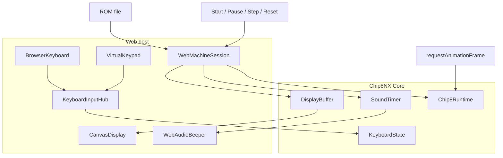
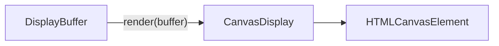
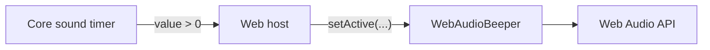

# Web Application

The Web application is the browser host for Chip8NX.

It combines the reusable CHIP-8 Core with browser-specific display, input, audio, and application lifecycle components.

The host intentionally keeps those concerns outside Core.

## Running the application

Start the Vite development server from the repository root:

```bash
deno task web
```

Open the URL reported by Vite, choose a CHIP-8 ROM, and the application will load and run it.

The Web host currently provides:

- Canvas framebuffer presentation;
- physical keyboard input;
- a virtual 4×4 CHIP-8 keypad;
- start/resume, pause, single-step, and reset controls;
- simple CHIP-8 sound through the Web Audio API.

## Architecture overview

The Web host adapts browser-specific mechanisms to the same Core boundaries used by other hosts.



The important boundary is between emulated machine state and host presentation.

Core owns CHIP-8 semantics and timing. The browser host observes or updates Core state through browser-specific adapters.

For the broader Core architecture, see [Architecture overview](../architecture/overview.md).

## Web machine session

The application keeps the currently loaded machine in a small `WebMachineSession` aggregate.

It retains the Core objects and host adapters needed by the Web application's lifecycle:

```ts
interface WebMachineSession {
  readonly romName: string;
  readonly program: MemoryImage;

  readonly context: ExecutionContext;
  readonly initializer: MachineInitializer;

  readonly runtime: Chip8Runtime;
  readonly displayBuffer: DisplayBuffer;
  readonly soundTimer: Timer;

  readonly browserKeyboard: BrowserKeyboard;
  readonly virtualKeypad: VirtualKeypad;
}
```

This is application state, not a generic Core `Chip8Machine` abstraction.

The Web host needs these references because it can replace ROMs, pause and resume execution, step instructions, and reset the current ROM.

Core machine construction remains explicit in the application.

For a detailed example of Core construction and initialization, see [Embedding the Core](./embedding-the-core.md).

## Input

Browser input has two independent sources:

```mermaid
flowchart LR
    Physical["BrowserKeyboard"]
    Virtual["VirtualKeypad"]
    Hub["KeyboardInputHub"]
    State["KeyboardState"]

    Physical --> Hub
    Virtual --> Hub
    Hub --> State
```



Both eventually update the same Core `KeyboardState`, but they must remain independent before that boundary.

### Physical keyboard

`BrowserKeyboard` adapts browser `keydown` and `keyup` events into CHIP-8 key transitions.

It uses `KeyboardEvent.code`, so the mapping follows physical keyboard positions rather than localized character values.

Browser auto-repeat events are ignored because Core needs logical press and release transitions rather than repeated `keydown` events.

The adapter also releases its held keys when the browser window loses focus, preventing keys from becoming stuck when a `keyup` event is lost.

### Virtual keypad

`VirtualKeypad` adapts pointer interaction with the on-screen 4×4 keypad.

Pointer events provide one input model for mouse, touch, and pen devices.

Like the physical keyboard, the virtual keypad owns only its own input state.

### Keyboard input hub

The two sources cannot write directly and independently to `KeyboardState`.

Consider this sequence:

```text
Physical keyboard presses CHIP-8 key 5
Virtual keypad presses CHIP-8 key 5
Virtual keypad releases CHIP-8 key 5
```

The CHIP-8 key must remain pressed because the physical keyboard is still holding it.

`KeyboardInputHub` handles this by giving every input adapter its own source:

```ts
const keyboard = new KeyboardState();

const keyboardInput = new KeyboardInputHub(keyboard);

const browserKeyboard = new BrowserKeyboard(keyboardInput.createSource());

const virtualKeypad = new VirtualKeypad(
  virtualKeypadElement,
  keyboardInput.createSource(),
);
```

Each source tracks the keys it owns.

The hub updates `KeyboardState` only when the first source presses a key or the last source releases it.

This lets the Web host combine independent browser input mechanisms without moving host-specific input composition into Core.

## Display

`CanvasDisplay` adapts the Core framebuffer to an HTML canvas.



Each CHIP-8 framebuffer pixel maps to one canvas backing-store pixel. CSS handles presentation scaling.

Rendering only observes `DisplayBuffer`.

`CanvasDisplay` does not own CHIP-8 display timing or vertical-blank behavior.

A render operation is therefore simply:

```ts
display.render(session.displayBuffer);
```

## Sound

CHIP-8 sound follows the same separation between emulated state and host presentation.



Core owns the sound timer and its 60 Hz behavior.

`WebAudioBeeper` owns only browser sound presentation.

The host observes the timer:

```ts
beeper.setActive(session.soundTimer.getValue() > 0);
```

The beeper uses one square-wave oscillator gated through a gain node rather than creating a new oscillator for every beep.

### Browser audio lifecycle

Browsers generally require audio to be created or resumed from a user gesture.

The Web host therefore unlocks audio from interactions such as ROM selection or pressing Start:

```ts
beeper.unlock();
```

This browser policy remains outside Core.

Audio failure also does not prevent the emulator from running.

## Runtime and host loop

The browser uses `requestAnimationFrame` as its host loop.

This does **not** make the browser responsible for CHIP-8 timing.

`Chip8Runtime` and `Scheduler` continue to own:

- CPU timing;
- delay-timer timing;
- sound-timer timing;
- display refresh and vertical blank.

The browser loop only determines when the host services and observes the emulator:

```ts
const frame = (): void => {
  session.runtime.tick();

  beeper.setActive(session.soundTimer.getValue() > 0);

  display.render(session.displayBuffer);

  animationFrameId = requestAnimationFrame(frame);
};
```

This distinction keeps emulated time independent from browser presentation cadence.

## Execution controls

The Web application provides four basic execution controls.

### Start / resume

Resume `Chip8Runtime` and start the host loop.

### Pause

Pause the runtime, stop the host loop, silence the beeper, and present the current framebuffer.

### Step

While paused, execute one instruction through `Chip8Runtime.step()` and render the resulting framebuffer.

Single-step does not start continuous execution.

### Reset

Pause execution and reinitialize the existing `ExecutionContext` from the originally loaded program.

The machine remains paused at the program start after reset.

## Loading another ROM

Loading a new ROM replaces the current Web machine session.

Before constructing the new session, the host:

- stops the current host loop;
- silences audio;
- pauses the old runtime;
- stops physical keyboard input;
- stops virtual keypad input.

The new Classic machine is then constructed and initialized from the selected ROM.

This lifecycle belongs to the Web application rather than Core.

## Composition lessons

The Web application is the second Chip8NX host and provides a useful contrast with the Terminal application.

Both hosts converge on the same Core boundaries:

- `KeyboardState` for CHIP-8 input state;
- `DisplayBuffer` for framebuffer state;
- Core timers for emulated timer state;
- `Chip8Runtime` for temporal orchestration.

Their host-level composition is deliberately different.

Terminal input and presentation naturally compose around shared terminal resources. The browser instead combines independent input sources, Canvas presentation, Web Audio, DOM controls, and browser lifecycle events.

The result is that host-specific composition remains application-owned rather than being forced into one common hierarchy.

See:

- [Host composition evaluation](../architecture/composition-evaluation.md)
- [Terminal composition levels](./terminal-composition-levels.md)
- [Embedding the Core](./embedding-the-core.md)
