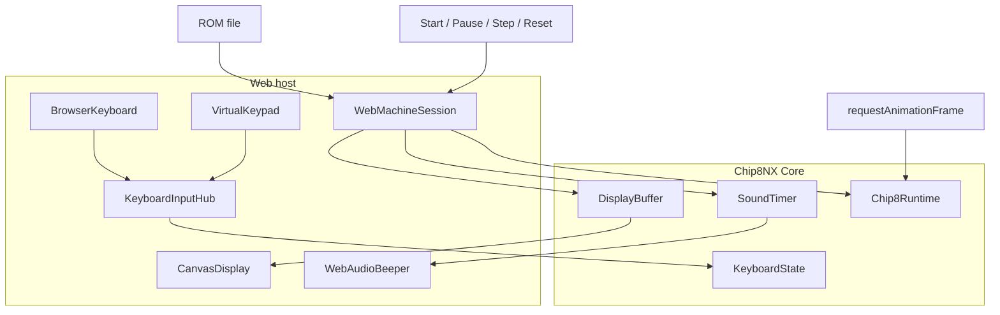
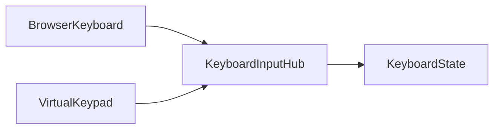

# Web Application

The Web application is the browser host for Chip8NX.

It combines the reusable Core with browser-specific display, input, audio, and session lifecycle components. Those host concerns intentionally remain outside Core.

## Run the application

From the repository root:

```bash
deno task web
```

Open the URL reported by Vite, choose a CHIP-8 ROM, and the application loads and runs it.

The Web host currently provides:

- Canvas framebuffer presentation;
- physical keyboard input;
- a virtual 4×4 CHIP-8 keypad;
- start/resume, pause, single-step, and reset controls;
- simple CHIP-8 sound through Web Audio.

## Architecture



Core owns CHIP-8 semantics and emulated timing. Browser components adapt or present that state.

See [Architecture overview](../architecture/overview.md).

## Web machine session

The application retains the currently loaded machine in a small `WebMachineSession` aggregate:

```ts
interface WebMachineSession {
  readonly romName: string;
  readonly program: MemoryImage;

  readonly context: ExecutionContext;
  readonly initializer: MachineInitializer;

  readonly runtime: Chip8Runtime;
  readonly displayBuffer: DisplayBuffer;
  readonly soundTimer: Timer;

  readonly browserKeyboard: BrowserKeyboard;
  readonly virtualKeypad: VirtualKeypad;
}
```

This is Web application state, not a generic Core `Chip8Machine` abstraction.

The browser needs these references for ROM replacement, runtime controls, rendering, sound, and input lifecycle.

For explicit Core construction, see [Embedding the Core](./embedding-the-core.md).

## Input

The browser has two independent input sources:



### Physical keyboard

`BrowserKeyboard` maps browser `keydown`/`keyup` events to CHIP-8 key transitions.

It uses `KeyboardEvent.code`, so mapping follows physical positions rather than localized character values. Browser auto-repeat is ignored because Core needs logical transitions, not repeated `keydown` notifications.

The adapter releases its held keys when the window loses focus so a missing `keyup` event cannot leave them stuck.

### Virtual keypad

`VirtualKeypad` maps pointer interaction with the on-screen 4×4 keypad. Pointer events provide one model for mouse, touch, and pen input.

Like `BrowserKeyboard`, it owns only its own source state.

### Why `KeyboardInputHub` exists

Two sources cannot independently call release on the shared `KeyboardState` without coordination.

Consider:

```text
physical source presses key 5
virtual source presses key 5
virtual source releases key 5
```

The CHIP-8 key must remain pressed because the physical source still owns it.

`KeyboardInputHub` gives each adapter a source and updates Core only on first-press / last-release transitions.

This multi-source ownership policy belongs to the Web host; `KeyboardState` remains unaware of browser sources.

See [Machine state and capabilities](../architecture/machine-state-and-capabilities.md).

## Display

`CanvasDisplay` presents `DisplayBuffer`; it does not own CHIP-8 drawing semantics or vertical-blank timing.

The host may render whenever convenient. Browser presentation cadence therefore does not alter emulated display timing.

## Sound

CHIP-8 sound follows the same state/presentation split:

```text
Core sound Timer
    ↓ observed by host
WebAudioBeeper
    ↓
Web Audio API
```

The host activates the beeper while the timer is nonzero:

```ts
beeper.setActive(session.soundTimer.getValue() > 0);
```

`WebAudioBeeper` uses a persistent square-wave oscillator gated through a gain node instead of repeatedly constructing oscillators.

### Browser audio lifecycle

Browsers generally require audio creation/resume to follow a user gesture. The host therefore unlocks audio from interactions such as ROM selection or Start.

That browser policy remains outside Core, and audio failure does not prevent emulation from running.

## Runtime and host loop

The Web host uses `requestAnimationFrame` as its service/presentation loop:

```ts
const frame = (): void => {
  session.runtime.tick();

  beeper.setActive(session.soundTimer.getValue() > 0);
  display.render(session.displayBuffer);

  animationFrameId = requestAnimationFrame(frame);
};
```

This does **not** make `requestAnimationFrame` the CHIP-8 timing source.

`Chip8Runtime` and `Scheduler` continue to own CPU, timer, display-frame, and vertical-blank timing.

See [Runtime and timing architecture](../architecture/runtime-and-timing.md).

## Execution controls

### Start / resume

Resume `Chip8Runtime` and start the host loop.

### Pause

Pause the runtime, stop the host loop, silence the beeper, and present the current framebuffer.

### Step

While paused, call `Chip8Runtime.step()` once and render the resulting framebuffer.

One call performs one CPU **attempt**, not necessarily one completed logical instruction: a waiting `Fx0A` or display-synchronized draw may retry.

Single-step does not start continuous execution or advance normal scheduled timer/display time.

### Reset

Pause execution and reinitialize the existing `ExecutionContext` from the retained program image.

The machine remains paused at program start after reset.

See [Machine initialization architecture](../architecture/machine-initialization.md).

## Loading another ROM

Loading another ROM currently replaces the Web machine session.

Before constructing the new session, the host:

- stops the current host loop;
- silences audio;
- pauses the old runtime;
- stops physical keyboard input;
- stops virtual keypad input.

It then constructs and initializes a new Classic machine from the selected ROM.

Core would also permit in-place initialization with another program; choosing a fresh browser session is application policy.

## Composition lessons

The Web application is a useful contrast with the Terminal host.

Both converge on stable Core boundaries such as:

```text
KeyboardState
DisplayBuffer
Timer
Chip8Runtime
```

Their host-level composition is deliberately different.

See:

- [Host composition evaluation](../architecture/composition-evaluation.md)
- [Terminal composition levels](./terminal-composition-levels.md)
- [Embedding the Core](./embedding-the-core.md)
