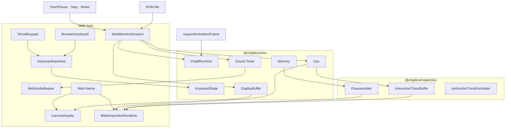
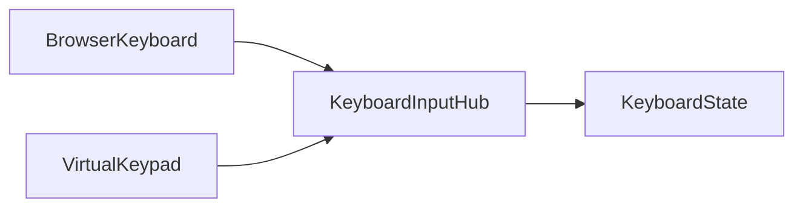

# Web Application

The Web application is Chip8NX's browser-based play and inspection host.

It composes the reusable `@chip8nx/core` and `@chip8nx/inspection` packages with browser-specific display, input, audio, execution-control, inspection-presentation, and appearance concerns.

Those host concerns intentionally remain outside the reusable packages:

```text
@chip8nx/core
    machine semantics
    runtime and scheduling
    authoritative CPU observation
          ↓
@chip8nx/inspection
    instruction formatting
    disassembly
    bounded trace history
    trace formatting
          ↓
apps/web
    browser adapters
    host lifecycle
    inspection policy
    presentation
```

Core determines what the CHIP-8 machine does. Inspection provides passive, host-independent ways to inspect what Core exposes. The Web application decides how those capabilities are composed and presented in a browser.

## Run the application

From the repository root:

```bash
deno task web
```

Open the URL reported by Vite and load a CHIP-8 ROM.

The Web host currently provides:

- Canvas framebuffer presentation;
- physical keyboard input;
- a virtual 4×4 CHIP-8 keypad;
- explicit physical-keyboard to CHIP-8 keypad mapping;
- unified Start/Pause, single-step, and reset controls;
- simple CHIP-8 sound through Web Audio;
- live CPU-state inspection;
- bounded best-effort disassembly around the current program counter;
- bounded recent CPU instruction-attempt history;
- responsive desktop and narrow-screen layouts;
- persistent Retro Green, Retro Amber, and Dark appearance themes;
- theme-aware framebuffer presentation.

Loading a valid ROM creates and initializes a fresh Classic CHIP-8 Web session and starts execution immediately.

## Architecture

The Web application combines machine execution, passive inspection, and browser presentation without moving host-specific policy into Core or Inspection.



The diagram shows three different responsibility directions.

Machine execution stays in Core:

```text
controls / host loop
        ↓
Chip8Runtime
        ↓
Cpu + timers + display timing
```

Passive machine inspection composes Core state with Inspection tooling:

```text
Cpu.snapshot()
Memory + current PC
InstructionTraceBuffer
        ↓
Web inspection view model
        ↓
WebInspectionRenderer
```

Browser presentation observes the resulting state:

```text
DisplayBuffer → CanvasDisplay
Sound Timer   → WebAudioBeeper
inspection    → DOM
```

The Web host may present those values whenever convenient. Browser rendering cadence, DOM updates, appearance themes, and inspection layout do not become CHIP-8 machine semantics.

See [Architecture overview](../architecture/overview.md).

## Web machine session

The application retains the currently loaded machine in a small `WebMachineSession` aggregate:

```ts
interface WebMachineSession {
  readonly romName: string;
  readonly program: MemoryImage;

  readonly context: ExecutionContext;
  readonly initializer: MachineInitializer;

  readonly cpu: Cpu;
  readonly runtime: Chip8Runtime;

  readonly traceHistory: InstructionTraceBuffer;
  readonly snapshotInspection: () => WebInspectionViewModel;

  readonly displayBuffer: DisplayBuffer;
  readonly soundTimer: Timer;

  readonly browserKeyboard: BrowserKeyboard;
  readonly virtualKeypad: VirtualKeypad;
}
```

This is Web application state, not a generic Core `Chip8Machine` abstraction.

The browser retains only the collaborators it actually needs for application behavior:

```text
ROM lifecycle
    → program
    → context
    → initializer

execution
    → cpu
    → runtime

inspection
    → traceHistory
    → snapshotInspection()

presentation
    → displayBuffer
    → soundTimer

input lifecycle
    → browserKeyboard
    → virtualKeypad
```

The session therefore remains an application-local composition boundary. Neither Core nor Inspection needs to know that the browser groups these references together.

For explicit Core construction, see [Embedding the Core](./embedding-the-core.md).

## Inspection snapshot

The Web inspector does not read mutable machine components directly from DOM rendering code.

Instead, the session exposes one read operation:

```ts
snapshotInspection(): WebInspectionViewModel
```

Conceptually:

```text
Cpu.snapshot()
      +
Memory around current PC
      +
InstructionTraceBuffer.snapshot()
      ↓
Web inspection composition
      ↓
WebInspectionViewModel
      ↓
WebInspectionRenderer
```

The snapshot operation begins by taking one authoritative `CpuState` snapshot:

```ts
const cpuState = cpu.snapshot();
```

That same snapshot supplies both the CPU-state presentation and the program counter used for nearby disassembly.

This avoids a presentation inconsistency such as:

```text
CPU panel
    PC = 0x260

Nearby instructions
    current row = 0x262
```

which could otherwise occur if independent CPU snapshots were taken while execution continued between them.

### Nearby disassembly

The Web host currently inspects a bounded neighborhood around the actual program counter:

```text
2 instructions before
current instruction
4 instructions after
```

The window is application policy rather than part of Core or `@chip8nx/inspection`.

For each candidate address, the Web host verifies that a complete CHIP-8 instruction can fit within memory and then independently calls:

```ts
disassembler.disassembleAt(memory, sourceAddress);
```

Each address has its own success/failure result.

For example:

```text
  0x25C  6800  LD V8, 0x00
  0x25E        unavailable
▶ 0x260  D9B4  DRW V9, VB, 0x4
  0x262  7904  ADD V9, 0x04
```

An undecodable neighboring value therefore does not discard the rest of the inspection window.

The Web host also calculates neighboring addresses relative to the **actual** program counter. It does not silently force the address onto an even boundary.

Nearby disassembly answers:

> What do the bytes around the machine's current PC decode as?

It does not claim that every displayed row is executable code. No code/data classification or control-flow analysis is performed.

### Recent instruction attempts

The CPU receives an `InstructionTraceBuffer` through the public `InstructionTraceObserver` boundary:

```text
Cpu.step()
    ↓
InstructionTraceObserver
    ↓
InstructionTraceBuffer
```

The Web composition root retains the concrete buffer because the application needs to read its bounded history.

The buffer currently retains the latest 32 CPU attempts.

Those attempts may represent:

- successful execution;
- failed execution;
- repeated attempts caused by retry semantics such as key waits or display synchronization.

The Web view model formats those traces through Inspection-owned trace formatting rather than reproducing instruction-formatting logic in the browser presentation layer.

### Passive failure handling

Inspection failure is deliberately distinct from machine failure.

Nearby disassembly is strict at the reusable Inspection boundary, but the Web host catches failures per address and converts them into ordinary unavailable rows.

Likewise, a failed CPU attempt may still leave useful diagnostic information:

```text
failed attempt
    ↓
actual post-failure CpuState
    +
retained failed InstructionTrace
```

When continuous execution or manual Step fails, the Web host renders the resulting machine and inspection state before presenting the error status.

This makes failure observable without giving passive inspection control over execution.

### Reset and inspection history

Reset establishes a new execution epoch for the existing Web session.

After successful machine reinitialization, the host clears the retained trace history:

```text
successful Reset
    ↓
machine state returns to program start
    +
recent instruction history becomes empty
```

Start, Pause, and Step do not clear history.

Loading another ROM creates an entirely new `WebMachineSession`, so the replacement machine naturally receives a new trace buffer.

These lifecycle decisions are Web application policy rather than responsibilities of Core or Inspection.

## Input

The browser has two independent input sources:



Both adapters translate browser interaction into the same Core `KeyboardState`, but each retains ownership only of the keys pressed through its own input source.

### Physical keyboard

`BrowserKeyboard` maps browser `keydown` and `keyup` events to CHIP-8 key transitions.

It uses `KeyboardEvent.code` rather than `KeyboardEvent.key`, so the conventional CHIP-8 layout follows physical keyboard positions independently of Shift, Caps Lock, or the character produced by the user's keyboard layout.

The current mapping is:

```text
Physical keyboard     CHIP-8 keypad

1  2  3  4        →   1  2  3  C
Q  W  E  R        →   4  5  6  D
A  S  D  F        →   7  8  9  E
Z  X  C  V        →   A  0  B  F
```

Browser auto-repeat is ignored because Core needs logical press/release transitions rather than repeated `keydown` notifications for a key that is already held.

The adapter also releases its held keys when it stops or the browser loses focus, preventing a missing `keyup` notification from leaving a CHIP-8 key stuck.

The Web interface presents the same mapping beside the virtual keypad so the physical and on-screen layouts can be understood together.

### Virtual keypad

`VirtualKeypad` maps pointer interaction with the on-screen 4×4 CHIP-8 keypad.

Pointer events provide one browser interaction model for mouse, touch, and pen input.

The virtual keypad uses the native CHIP-8 layout:

```text
1  2  3  C
4  5  6  D
7  8  9  E
A  0  B  F
```

Like `BrowserKeyboard`, it owns only the key presses originating from its own source.

### Why `KeyboardInputHub` exists

Two input sources cannot independently release a shared `KeyboardState` without coordination.

Consider:

```text
physical source presses key 5
virtual source presses key 5
virtual source releases key 5
```

The CHIP-8 key must remain pressed because the physical source still owns it.

`KeyboardInputHub` gives each adapter its own source and updates Core only on first-press and last-release transitions:

```text
first source presses
        ↓
Core key becomes pressed

additional source presses
        ↓
Core state remains pressed

one source releases
        ↓
other source still owns key
        ↓
Core state remains pressed

last source releases
        ↓
Core key becomes released
```

This multi-source ownership policy belongs to the Web host. `KeyboardState` remains unaware of browser input sources.

See [Machine state and capabilities](../architecture/machine-state-and-capabilities.md).

## Display

`CanvasDisplay` presents `DisplayBuffer`; it does not own CHIP-8 drawing semantics, framebuffer state, or vertical-blank timing.

Each CHIP-8 framebuffer pixel maps to one Canvas backing-store pixel:

```text
DisplayBuffer
     ↓
CanvasDisplay
     ↓
HTML Canvas bitmap
     ↓
CSS-scaled browser presentation
```

CSS scales the Canvas for the responsive Web layout while the backing store remains aligned with the CHIP-8 framebuffer dimensions.

The host may render whenever convenient. Browser presentation cadence therefore does not alter emulated display timing.

### Appearance palette

`CanvasDisplay` accepts a small presentation palette:

```ts
interface CanvasDisplayPalette {
  readonly background: string;
  readonly foreground: string;
}
```

The adapter knows only which colors to use when presenting off and on pixels. It does not know about Web theme identities such as Retro Green, Retro Amber, or Dark.

Theme ownership remains in the Web application:

```text
Web theme
    ↓
CSS custom properties
    ↓
display foreground / background values
    ↓
CanvasDisplayPalette
    ↓
CanvasDisplay
```

The browser reads the active display colors from CSS custom properties and passes them to `CanvasDisplay`.

When the user changes appearance, the Web host:

1. changes the active Web theme;
2. reads the newly resolved Canvas palette;
3. updates `CanvasDisplay`;
4. redraws the current `DisplayBuffer` when a machine exists.

Changing appearance therefore updates the already-visible framebuffer without resetting or otherwise changing the CHIP-8 machine.

This distinction remains important:

```text
DisplayBuffer
    emulated machine state

CanvasDisplayPalette
    browser presentation state
```

## Sound

CHIP-8 sound follows the same state/presentation split:

```text
Core sound Timer
    ↓ observed by host
WebAudioBeeper
    ↓
Web Audio API
```

The host requests audible output while the sound timer is nonzero:

```ts
beeper.setActive(session.soundTimer.getValue() > 0);
```

`WebAudioBeeper` uses a persistent square-wave oscillator gated through a gain node instead of repeatedly constructing oscillator nodes for every sound-timer transition.

The oscillator belongs to browser presentation. The duration and timing of CHIP-8 sound remain determined by the Core sound timer.

### Browser audio lifecycle

Browsers generally require audio creation or resumption to follow a user gesture.

The host therefore lazily unlocks Web Audio from interactions that can legitimately originate from the user, such as selecting a ROM or starting/resuming execution.

Failure to initialize or resume Web Audio is treated as a host-presentation failure:

```text
audio unavailable
      ≠
CHIP-8 execution unavailable
```

The application logs the audio problem but allows emulation to continue.

When execution is paused, replaced, hidden, reset, or stopped by a runtime failure, the host requests silence independently of the Core timer value.

That browser lifecycle policy remains outside Core.

## Runtime and host loop

The Web host uses `requestAnimationFrame` as its browser service and presentation loop:

```ts
const frame = (): void => {
  session.runtime.tick();

  beeper.setActive(session.soundTimer.getValue() > 0);

  renderMachine(session);

  animationFrameId = requestAnimationFrame(frame);
};
```

`renderMachine()` presents both the framebuffer and the current inspection snapshot:

```ts
function renderMachine(session: WebMachineSession): void {
  display.render(session.displayBuffer);
  inspection.render(session.snapshotInspection());
}
```

This does **not** make `requestAnimationFrame` the CHIP-8 timing source.

The responsibility split remains:

```text
requestAnimationFrame
    decides when the browser services
    and presents the machine
              ↓
Chip8Runtime.tick()
              ↓
Scheduler
    decides what emulated work
    is due at that point in time
```

`Chip8Runtime` and `Scheduler` continue to own CPU, timer, display-refresh, and vertical-blank timing.

The browser loop is therefore allowed to run at the browser's presentation cadence without redefining CHIP-8 execution frequency.

See [Runtime and timing architecture](../architecture/runtime-and-timing.md).

### Stale-frame protection

`runHostLoop()` captures the `WebMachineSession` for which the loop was started.

Before servicing each frame it verifies that:

```text
captured session
      =
currently active Web session
```

and that the captured runtime is still running.

This protects the application from an already-scheduled animation frame belonging to a ROM that has since been paused or replaced.

### Runtime failure

Continuous execution is wrapped at the host-loop boundary.

If `runtime.tick()` fails, the Web host:

1. stops scheduling that host loop;
2. pauses the runtime;
3. stops physical and virtual input;
4. silences browser audio;
5. renders the resulting framebuffer and inspection state;
6. presents the failure through the application status area.

Rendering before reporting the failure is intentional.

The machine may have changed before an instruction attempt failed, and the CPU observer may have retained a failed trace. Presenting the resulting state makes that diagnostic evidence visible instead of pretending the failed attempt never occurred.

The host handles this lifecycle consequence; Core remains responsible for the actual execution semantics and failure.

## Execution controls

The toolbar exposes one Start/Pause control together with Step and Reset.

The enabled state and meaning of those controls are derived from the current `WebMachineSession` and `Chip8Runtime.isPaused`.

The application does not maintain a second independent `running` flag.

Conceptually:

```text
no machine
    Start/Pause disabled
    Step disabled
    Reset disabled

machine running
    Start/Pause = Pause
    Step disabled
    Reset enabled

machine paused
    Start/Pause = Start
    Step enabled
    Reset enabled
```

The same runtime state drives the compact machine-state indicator:

```text
no session  → No ROM
running     → Running
paused      → Paused
```

This keeps execution state authoritative in the runtime rather than duplicating it in presentation state.

### Start / Pause

The unified control changes behavior according to `runtime.isPaused`.

When paused, Start:

1. requests Web Audio unlock from the user interaction;
2. resumes `Chip8Runtime`;
3. updates the application status and controls;
4. starts the browser host loop.

When running, Pause:

1. pauses `Chip8Runtime`;
2. cancels the browser host loop;
3. silences the Web Audio presentation;
4. renders the current framebuffer and inspection state;
5. updates status and controls.

Pausing does not reinitialize the machine or clear recent instruction history.

### Step

Step is available only while the runtime is paused.

The host calls:

```ts
machine.runtime.step();
```

once and then presents the resulting machine state.

One call performs one CPU **attempt**, not necessarily one completed logical instruction.

For example, an instruction waiting for input or display synchronization may deliberately restore its instruction address so that a later CPU attempt retries it.

Manual stepping does not:

- start continuous execution;
- resume the normal browser host loop;
- advance scheduled timer or display time.

If the CPU attempt throws, the Web host still renders the resulting machine and inspection state before reporting the error.

That means a failed trace and any post-failure CPU state remain inspectable.

### Reset

Reset operates on the existing `WebMachineSession`.

The host first:

```text
pauses runtime
    ↓
stops host loop
    ↓
silences audio
```

and then asks the retained `MachineInitializer` to initialize the existing `ExecutionContext` from the retained program image using the Classic CHIP-8 profile.

After successful initialization:

```text
machine state
    → program start

recent trace history
    → cleared

runtime
    → remains paused
```

Trace history is cleared only after successful initialization.

Reset therefore creates a new execution epoch for the same loaded ROM without constructing a new browser session.

See [Machine initialization architecture](../architecture/machine-initialization.md).

## Loading another ROM

Loading a ROM establishes a new Web machine session.

ROM replacement currently has **replace-first** semantics rather than transactional replacement.

Before reading and constructing the selected ROM, the host:

1. stops the current browser host loop;
2. silences audio;
3. pauses the old runtime;
4. stops physical keyboard input;
5. stops virtual keypad input;
6. releases the reference to the old `WebMachineSession`;
7. clears the rendered inspection state and loaded-ROM label.

It then reads the selected file and attempts to construct and initialize a fresh Classic CHIP-8 session.

If successful:

```text
ROM file
    ↓
MemoryImage
    ↓
fresh WebMachineSession
    ↓
input adapters start
    ↓
runtime resumes
    ↓
machine is presented
    ↓
host loop starts
```

Loading therefore starts a valid newly selected ROM automatically.

If loading or machine construction fails, the old machine is **not** restored. The Web host remains without an active machine and presents the error through the status area.

This is application policy, not a Core requirement.

Core would also permit initialization of an existing execution context with another program image, and a future host could choose transactional ROM replacement. The current Web application's simpler fresh-session policy is sufficient for its demonstrated lifecycle requirements.

### Reloading the same file

The visible ROM loader is application chrome layered over a hidden native file input.

Before opening the browser file picker, the host clears the native input value.

This allows selecting the same ROM file again to produce a new change event and therefore acts as an explicit reload.

The persistent ROM filename describes the successfully loaded machine; transient loading, running, paused, reset, and failure information belongs to the separate status presentation.

## Appearance lifecycle

Appearance is Web presentation state and is independent of the loaded CHIP-8 session.

The selected theme is persisted through browser local storage when possible:

```text
Retro Green
Retro Amber
Dark
```

Storage failure is non-fatal. A browser that cannot persist the selection can still run the emulator.

Changing theme does not:

- pause execution;
- reset the machine;
- replace the ROM;
- clear trace history;
- alter CHIP-8 framebuffer state.

CSS updates the application interface, while the host updates `CanvasDisplay` with the display colors resolved from the selected theme and redraws the current framebuffer.

This keeps appearance policy entirely outside the emulated machine.

## Composition lessons

The Web application is a useful second host-composition case study alongside the Terminal application.

Both applications depend on stable reusable boundaries, but they compose those boundaries differently according to demonstrated host requirements.

The Web host now demonstrates three architectural layers:

```text
@chip8nx/core
    authoritative machine state
    execution semantics
    runtime mechanisms
    CPU observation signal
              ↓
@chip8nx/inspection
    passive formatting
    disassembly
    bounded trace retention
              ↓
apps/web
    browser lifecycle
    inspection policy
    presentation
    interaction
```

Several design lessons follow from that composition.

### State and presentation remain separate

Examples include:

```text
DisplayBuffer
    ≠
Canvas presentation

sound Timer
    ≠
Web Audio oscillator

KeyboardState
    ≠
browser input sources

CpuState
    ≠
inspection DOM

InstructionTrace
    ≠
trace history or formatting
```

Core state remains authoritative while applications decide how that state is presented and interacted with.

### Capability and policy remain separate

Core exposes the smallest capabilities necessary for the machine to operate or be observed.

Inspection builds passive reusable behavior from those capabilities.

The Web host then owns policies such as:

- how many nearby instructions to inspect;
- how many recent attempts to retain;
- when inspection is rendered;
- how ROM replacement behaves;
- which browser inputs are active;
- how execution controls are presented;
- which appearance theme is selected.

These policies do not need to become reusable abstractions merely because the Web application has them.

### Passive inspection remains passive

The Web inspector can answer:

```text
What does the CPU contain now?

What do bytes around the current PC decode as?

What CPU attempts recently occurred?
```

It does not currently answer:

```text
When should execution stop?

Which address is a breakpoint?

Should a memory change trigger a pause?

What constitutes step-over or step-out?
```

Those are active debugger concerns.

No debugger abstraction is introduced merely because the browser now has an inspection interface.

The project continues to follow the same design rule:

> **Abstract demonstrated variation and demonstrated composition pressure, not hypothetical future needs.**

If future Web or desktop work demonstrates reusable execution-control semantics, those requirements can then provide evidence for a debugger layer.

### Host composition does not need to be identical

The Terminal and Web hosts both use Core, but their lifecycle and presentation needs differ.

That difference is useful architectural evidence rather than duplication that must immediately be hidden behind a universal machine facade.

The Web host's local `WebMachineSession` remains appropriate until multiple consumers demonstrate a stable shared abstraction worth extracting.

See:

- [Architecture overview](../architecture/overview.md)
- [Host composition evaluation](../architecture/composition-evaluation.md)
- [Terminal composition levels](./terminal-composition-levels.md)
- [Embedding the Core](./embedding-the-core.md)
- [Tracing and observation](../architecture/tracing-and-observation.md)
- [Disassembly and inspection](../architecture/disassembly-and-inspection.md)
